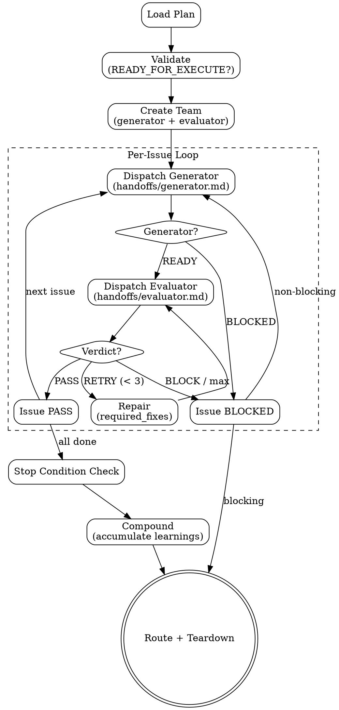

# pge-exec

Execute a plan produced by `pge-plan`. Orchestrates Generator and Evaluator agents per issue.

This is an orchestration skill. It does not implement code itself.

## Execution Flow



## Anti-Patterns

- **"Replan While Executing"** — Plan is frozen. If wrong, route back to pge-plan.
- **"Fix Everything I See"** — Stay inside issue scope. Unrelated bugs → deferred items.
- **"Repair Forever"** — Max 3 attempts per issue. Then BLOCKED.
- **"Skip Evaluator"** — Every issue gets independent evaluation. No exceptions.

---

## Phase 1: Load & Validate

Read plan from `.pge/tasks-<slug>/plan.md` (preferred) or `.pge/plans/<plan_id>.md` (legacy). If argument is `test`, use inline smoke plan.

**Task directory resolution:** If plan is at `.pge/tasks-<slug>/plan.md`, all run output goes to `.pge/tasks-<slug>/runs/<run_id>/`. This keeps the full pipeline (research → plan → exec) under one task directory. pge-exec never creates the task directory itself — it expects pge-research or pge-plan to have created it. If the directory doesn't exist, create only the `runs/<run_id>/` subdirectory.

Validate:
- `plan_route` = `READY_FOR_EXECUTE`
- ≥1 issue with `State: READY_FOR_EXECUTE`
- Stop Condition present

**Rollback point:** Before execution starts, create a git tag `pge-exec-pre-<run_id>`. If exec routes BLOCKED or PARTIAL after modifying files, the user can rollback with `git reset --hard pge-exec-pre-<run_id>`. Record the tag in state.json and manifest.

If invalid: route BLOCKED, report what's missing.

Extract issues from `## Slices`. Filter READY_FOR_EXECUTE. Order by ID.

**Resume support:** If `runs/<run_id>/state.json` exists for this plan, read it. Skip issues already marked PASS. Resume from the first non-PASS issue. This enables recovery from context overflow or session loss.

---

## Phase 2: Execute (Per-Issue Loop)

### Create Team

Two teammates only:
- `generator` — implements issues (read `handoffs/generator.md` for dispatch protocol)
- `evaluator` — validates independently (read `handoffs/evaluator.md` for dispatch protocol)

No Planner. The plan IS the frozen contract.

### State Persistence

After each issue verdict (PASS or BLOCKED), write/update `runs/<run_id>/state.json`:

```json
{
  "run_id": "<run_id>",
  "plan_id": "<plan_id>",
  "issues": {
    "1": {"status": "PASS", "attempts": 1},
    "2": {"status": "BLOCKED", "reason": "...", "attempts": 2},
    "3": {"status": "PENDING"}
  },
  "last_completed_issue": 1,
  "next_issue": 3,
  "route": "IN_PROGRESS"
}
```

This is written after EVERY issue verdict — not batched at the end. If the session dies, the next invocation reads this file and resumes.

### Per-Issue Protocol

For each issue in order:

1. **Dependency check**: if depends on BLOCKED issue → skip, mark BLOCKED.
2. **Dispatch Generator**: issue context (Action, Deliverable, Target Areas, Test Expectation, Required Evidence, Repo Context). Wait for `generator_completion`.
3. **Gate**: Deliverable exists? Evidence produced? BLOCKED → mark and continue.
4. **Dispatch Evaluator**: issue criteria (Acceptance Criteria, Required Evidence, Verification Hint, Verification Type) + Generator evidence. Wait for `evaluator_verdict`.
5. **Verdict**:
   - PASS → mark done, next issue
   - RETRY → send `required_fixes` to Generator (max 3 per issue), re-evaluate
   - BLOCK → mark BLOCKED, record reason
6. **No-change guard**: repair with zero file changes = same-failure. Do not re-evaluate.

### HITL Issues

Handle by subtype:
- `HITL:verify` → after Generator completes, ask user to confirm visual/functional correctness. In headless mode: auto-approve (assume correct).
- `HITL:decision` → after Generator completes, present options to user, wait for choice. In headless mode: pick first option, record as LOW-confidence assumption.
- `HITL:action` → pause execution, tell user what manual action is needed (e.g., 2FA, external service config). Cannot auto-approve even in headless mode.

Legacy `HITL` (no subtype) → treat as `HITL:decision`.

### Generator Rules (summary — full in `references/generator-rules.md`)

- Analysis paralysis guard: 5+ reads without edit → act or BLOCKED
- Deviation classification: auto-fix-local / auto-fix-critical / stop-for-architectural
- Never retry with no changes
- Destructive git prohibition
- Package install safety (slopsquat protection)
- Scope boundary: only fix what the issue Action specifies

### Evaluator Rules (summary — full in `references/evaluator-thresholds.md`)

- Required Evidence missing → RETRY
- Verification Hint fails → RETRY
- Any Acceptance Criterion unmet → RETRY with specific feedback
- Deliverable doesn't exist → BLOCK
- Scope drift (files outside Target Areas) → BLOCK
- Hard threshold: if Generator self-reports BLOCKED, Evaluator must not override to PASS
- Adversarial mode: for Security + DEEP issues, actively construct failure scenarios
- Structured verdict output: machine-parseable format with confidence score
- Confidence anchors: 100 (mechanical) / 75 (traceable) / 50 (conditional) / below 50 (suppress)

### Reviewer Agent (optional, DEEP tasks)

For DEEP tasks (>3 files, cross-module), orchestrator MAY spawn a separate `reviewer` agent after Evaluator PASS to do a final code-quality review over the entire implementation. This is the CE/Superpowers "final reviewer" pattern.

When to spawn reviewer:
- All issues PASS + plan has 3+ issues + any issue touches shared interfaces
- Reviewer is read-only — cannot change verdict, only surface advisory findings
- Reviewer findings go to learnings.md (compound), not back to repair loop
- Reviewer does NOT block SUCCESS route — it's advisory for future improvement

This is optional and not part of the core G+E loop. It's a quality signal, not a gate.

---

## Phase 3: Verify & Route

### Stop Condition

After all issues processed, check plan's Stop Condition:
- Passes → SUCCESS
- Fails but all issues passed → PARTIAL (integration gap)
- Not all issues passed → PARTIAL or BLOCKED

**Integration verification:** If the plan touches 3+ files across 2+ modules, run an integration-level check beyond individual issue verification (full test suite, app startup, or plan-specified integration command). Record result in manifest.

**Regression check:** After all per-issue evaluations pass, re-run Verification Hints from prior PASS issues to confirm they still pass. If any regressed (a later issue broke an earlier issue's deliverable), route PARTIAL with the regression evidence. This catches cross-issue side effects that per-issue evaluation misses.

### Compound (Accumulate Learnings)

After execution completes (any route), record what was learned. This is mandatory — even trivial runs record "No significant learnings — execution matched plan expectations." Empty learnings.md is a protocol violation.

Write to task directory: `.pge/tasks-<slug>/runs/<run_id>/learnings.md`

```markdown
# Learnings: <run_id>

## Patterns Discovered
- <pattern> — source: <file:line> — confidence: HIGH|MEDIUM

## Deviations from Plan
- <what differed> — why: <root cause> — impact: <what it means for future>

## Repair Insights
- <what failed> → <what fixed it> — generalizable: yes|no

## Verification Gaps
- <what the plan's Verification Hint missed> — suggest: <better verification>

## Conventions Confirmed
- <convention the plan assumed correctly> — now verified in code

## Feedback to Config
- <learning significant enough to add to repo-profile.md>
```

**Feedback loop:**
1. If any learning under "Feedback to Config" exists AND `.pge/config/repo-profile.md` exists: append it.
2. If `.pge/config/repo-profile.md` doesn't exist but learnings are significant: create it with the learnings as seed content.
3. Tag each appended learning with `[from: <run_id>, date: <ISO>]` so future runs know the source.
4. **Confidence decay:** learnings older than 30 days should be treated as "verify before relying on" by downstream skills. pge-research should re-check old learnings against current code before using them as facts.

### Route

- `SUCCESS`: all issues PASS + Stop Condition passes
- `PARTIAL`: some progress, some blocked
- `BLOCKED`: no issues could complete
- `NEEDS_HUMAN`: HITL decision required

### Teardown

Request shutdown → delete team → write manifest.

---

## Smoke Test

Argument `test` uses inline plan:
```
Issue 1: Write smoke file
- Action: Create .pge/runs/<run_id>/deliverables/smoke.txt with content "pge smoke"
- Deliverable: smoke.txt
- Acceptance Criteria: file exists, content = "pge smoke"
- Verification Type: AUTOMATED
- Execution Type: AFK
- Required Evidence: file content output
- Stop Condition: smoke.txt exists with correct content
```

For test: minimal dispatch, no handoff file reads.

---

## Output

```text
.pge/tasks-<slug>/              (preferred — full pipeline in one directory)
├── research.md                 (from pge-research)
├── plan.md                     (from pge-plan)
└── runs/
    └── <run_id>/
        ├── manifest.md         — run metadata + issue results
        ├── evidence/           — per-issue evidence
        ├── deliverables/       — actual deliverables
        └── learnings.md        — compound learnings

Legacy fallback: .pge/runs/<run_id>/ (when plan is at .pge/plans/)
```

## Final Response

```md
## PGE Exec Result
- status: SUCCESS | PARTIAL | BLOCKED | NEEDS_HUMAN
- run_id: <run_id>
- plan_id: <plan_id>
- issues_passed: N
- issues_blocked: N
- issues_total: N
- stop_condition: passed | failed | not_checked
- learnings_recorded: yes | no
- artifacts: .pge/runs/<run_id>/
- next: done | pge-plan (if blocked) | user decision (if HITL)
```

## Guardrails

Do not:
- Modify the plan
- Write business code in orchestrator
- Skip Evaluator
- Retry > 3 per issue
- Retry with no code changes
- Allow destructive git
- Auto-retry failed package installs
- Simulate Generator/Evaluator in main
- Output PASS/MERGED/SHIPPED as route
- Advance from idle_notification
