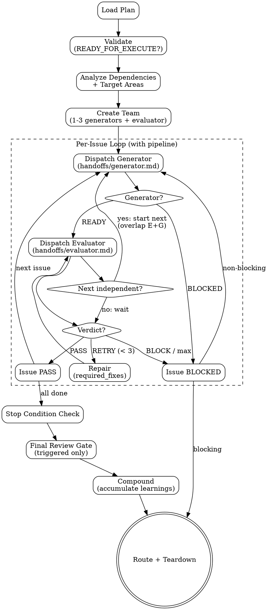

# pge-exec

Execute a plan produced by `pge-plan`. Orchestrates Generator and Evaluator agents per issue.

This is an orchestration skill. It executes the plan by coordinating Generator and Evaluator agents. The stage is expected to produce real code changes through Generator output, not chat-only summaries or ad-hoc pseudocode.

## External Dependencies

This skill references agent definitions outside its own directory:
- `agents/pge-code-reviewer.md` — spawned by Final Review Gate
- `agents/pge-code-simplifier.md` — spawned by Final Review Gate (conditional)

These files must be present at the repo root for the Final Review Gate to function. If missing, skip the review gate and log "reviewer agent spec not found."

## Execution Flow



## Anti-Patterns

- **"Replan While Executing"** — Plan is frozen. If wrong, route back to pge-plan.
- **"Fix Everything I See"** — Stay inside issue scope. Unrelated bugs → deferred items.
- **"Repair Forever"** — Max 3 attempts per issue. Then BLOCKED.
- **"Skip Evaluator"** — Every issue gets independent evaluation. No exceptions.

---

## Phase 1: Load & Validate

If `ARGUMENTS:` explicitly names a task slug, plan path, or other execution target, treat that as the user's selected source and use it without asking again. Otherwise, on a bare `pge-exec` invocation, discover `.pge/tasks-<slug>/plan.md` but do not silently select one. Ask the user to confirm a single discovered plan, choose among multiple plans, or choose between a discovered plan and current conversation context. Only fall back to conversation context when no plan artifact exists and the context already contains an executable plan contract. If argument is `test`, use an inline smoke plan bound to a dedicated task directory.

**Task directory resolution:** All run output goes to `.pge/tasks-<slug>/runs/<run_id>/`. This keeps the full pipeline (research → plan → exec) under one task directory. These `.pge/` paths are canonical. Notes or summaries outside `.pge/` are non-authoritative and must not replace the required run artifacts. pge-exec never creates the task directory itself — it expects pge-research or pge-plan to have created it, except for the dedicated smoke-test task directory. Before writing run output, create only the run parent explicitly:

```bash
mkdir -p .pge/tasks-<slug>/runs/<run_id>/
```

Validate:
- `plan_route` = `READY_FOR_EXECUTE`
- ≥1 issue with `State: READY_FOR_EXECUTE`
- Stop Condition present
- Bare invocation source selection follows the confirmation rules above before execution starts
- If both a discovered plan artifact and the current conversation look like valid upstream sources, ask the user whether to execute the plan artifact or continue from the current context
- If an explicit continuation target is named but the corresponding `.pge/tasks-<slug>/plan.md` is missing, report a broken handoff instead of silently pretending the plan artifact exists
- If multiple plausible plan artifacts exist and no explicit selector is given, ask the user which task to continue instead of guessing

**Rollback point:** Before execution starts, create a git tag `pge-exec-pre-<run_id>`. If exec routes BLOCKED or PARTIAL after modifying files, the user can rollback with `git reset --hard pge-exec-pre-<run_id>`. Record the tag in state.json and manifest.

If invalid: route BLOCKED, report what's missing.

Extract issues from `## Slices`. Filter READY_FOR_EXECUTE. Order by ID.

Issues with state NEEDS_INFO, BLOCKED, or NEEDS_HUMAN are skipped — they are not dispatched to Generator. Record skipped issues and their states in the run manifest. If ALL issues are non-READY, route BLOCKED immediately.

**Resume support:** If `runs/<run_id>/state.json` exists for this plan, read it. Skip issues already marked PASS. Resume from the first non-PASS issue. This enables recovery from context overflow or session loss.

---

## Phase 2: Execute

### Create Team

Default team composition:
- `generator` — implements issues (read `handoffs/generator.md` for dispatch protocol)
- `evaluator` — validates independently (read `handoffs/evaluator.md` for dispatch protocol)

**Adaptive scaling** (when READY issue count ≥ 6 AND independent issues exist):
- Add `generator-2` (same protocol as generator, independent context)
- At 12+ independent issues: add `generator-3`
- Cap: max 3 generators. Each generator claims issues from the plan; main assigns non-overlapping issue sets at dispatch time.
- Only scale when issues have no dependency AND no Target Areas overlap between assigned sets.
- If scaling conditions are not met: stay with 1 generator (default behavior).
- **Deviation under scaling**: if a generator needs to touch a file outside its assigned Target Areas, it must report BLOCKED with reason "cross-assignment deviation needed: <file>" rather than proceeding. Main reassigns the issue to the generator that owns that file's Target Areas, or queues it for serial execution after the current wave.
- **Evaluation ordering**: evaluate in issue-ID order regardless of generator completion order. This keeps the evaluation sequence deterministic and debuggable.

No Planner. The plan IS the frozen contract.

### Pipeline Parallelism

Default execution is serial: dispatch Generator, wait for completion, dispatch Evaluator, wait for verdict, then next issue. Pipeline parallelism overlaps evaluation with the next generation when safe.

**Activation conditions** (ALL must be true for the next issue):
- Next issue has NO dependency on current issue
- Next issue's Target Areas do NOT overlap with current issue's Target Areas
- Current issue's Generator completed successfully (status READY, not BLOCKED)

**When activated:**
- After Generator completes issue N, dispatch Evaluator for N and simultaneously dispatch Generator for N+1.
- This overlaps E(N) with G(N+1) — evaluator checks N while generator works on N+1.
- Generator does NOT need to be paused. If E(N) returns PASS: continue normally. If E(N) returns RETRY: let G(N+1) finish naturally, hold its result, repair N, re-evaluate N, then evaluate N+1's held result.
- If E(N) returns BLOCK: let G(N+1) finish. If N+1 does not depend on N, evaluate N+1 normally. If N+1 depends on N, mark N+1 BLOCKED.

**When NOT activated:**
- Next issue depends on current issue → wait for E(N) PASS before dispatching G(N+1)
- Next issue's Target Areas overlap with current issue → wait (file safety)
- Current issue BLOCKED → skip to next eligible issue

This eliminates evaluator wait time (~30-60s per issue) for independent issues without requiring pause/interrupt semantics.

### State Persistence

After each issue verdict (PASS or BLOCKED), write/update `runs/<run_id>/state.json`:

```json
{
  "run_id": "<run_id>",
  "plan_id": "<plan_id>",
  "generators": ["generator"],
  "issues": {
    "1": {"status": "PASS", "attempts": 1},
    "2": {"status": "EVALUATING", "attempts": 1, "generator": "generator"},
    "3": {"status": "GENERATING", "attempts": 0, "generator": "generator"},
    "4": {"status": "PENDING", "attempts": 0},
    "5": {"status": "BLOCKED", "reason": "...", "attempts": 2}
  },
  "route": "IN_PROGRESS"
}
```

Status values: `PENDING`, `GENERATING`, `EVALUATING`, `PASS`, `BLOCKED`, `HELD` (pipelined, waiting for prior issue verdict).

This is written after EVERY state transition — not batched at the end. If the session dies, the next invocation reads this file. In-flight issues (`GENERATING`, `EVALUATING`, `HELD`) are treated as `PENDING` on resume (work is re-executed from scratch — safe but costs one re-run).

### Session Hygiene

Context budget defaults are operational guidance, not model facts. Use them to protect judgment on intelligence-sensitive work:
- **Normal:** keep the active session below roughly 30-40% context when possible.
- **Warning:** if the session is around 50%, finish the current issue, persist state, and avoid starting a new issue in the same context.
- **Stop:** if the session is around 60% or shows degradation, write state/handoff, include a compact restart hint, and resume from artifacts in a fresh session.

Treat these symptoms as degradation even if exact token use is unknown: repeated rereads of already-summarized files, forgotten Stop Condition, P1/P2 work leaking into the current issue, contradictory facts, no-change repair loops, or evaluator misses of explicit Acceptance Criteria.

When checkpointing, preserve only durable facts: current issue, plan path, state.json path, changed files, unresolved blockers, user decisions not yet in artifacts, and next command. Drop raw greps, dead-end hypotheses, and failed attempts already superseded by the latest evidence.

### Per-Issue Protocol

For each issue in order:

1. **Dependency check**: if depends on BLOCKED issue → skip, mark BLOCKED.
2. **Build execution pack**: include only this issue's Action, Deliverable, Target Areas, Acceptance Criteria, Test Expectation, Required Evidence, relevant assumptions, dependencies, and directly needed repo context. Do not send whole research logs or unrelated prior issue evidence.
3. **Dispatch Generator**: send the execution pack. Wait for `generator_completion`.
4. **Gate**: Deliverable exists? Evidence produced? BLOCKED → mark and continue.
5. **Dispatch Evaluator + Pipeline check**: dispatch Evaluator with issue criteria + Generator evidence. If pipeline conditions are met for the next issue (no dependency, no Target Areas overlap): dispatch Generator for next issue simultaneously. Otherwise: wait for `evaluator_verdict` before proceeding.
6. **Verdict**:
   - PASS → mark done. If next issue already generating (pipelined): continue to its evaluation when ready. Otherwise: dispatch next issue.
   - RETRY → send `required_fixes` to Generator (max 3 per issue), re-evaluate. If next issue was pipelined: let it finish, hold its result until current issue resolves.
   - BLOCK → mark BLOCKED, record reason. If pipelined next issue does not depend on this: evaluate it normally when ready. If it depends: mark BLOCKED.
7. **No-change guard**: repair with zero file changes = same-failure. Do not re-evaluate.

### Rewind-Style Retry

If a Generator attempt used the wrong approach, do not keep correcting through a long polluted thread. Record the learned constraint, return to the clean issue execution pack, and redispatch a fresh attempt with:
- what the failed attempt proved
- what path must not be repeated
- the unchanged Action and Acceptance Criteria
- the smallest allowed repair direction

This consumes the next normal retry attempt. It never resets or expands the per-issue max of 3 attempts.

Failed raw attempts belong in run evidence. Only confirmed root cause, final repair insight, or a dead end worth avoiding belongs in `learnings.md`.

### HITL Issues

Handle by subtype:
- `HITL:verify` → after Generator completes, ask user to confirm visual/functional correctness. In headless mode: auto-approve (assume correct).
- `HITL:decision` → after Generator completes, present options to user, wait for choice. In headless mode: pick first option, record as LOW-confidence assumption.
- `HITL:action` → pause execution, tell user what manual action is needed (e.g., 2FA, external service config). Cannot auto-approve even in headless mode.

Legacy `HITL` (no subtype) → treat as `HITL:decision`.

### Generator Rules (summary — full in `references/generator-rules.md`)

- Analysis paralysis guard: 5+ reads without edit → act or BLOCKED
- Context quarantine: consider helpers only for broad read-only exploration when they reduce main-context noise
- Deviation classification: auto-fix-local / auto-fix-critical / stop-for-architectural
- Never retry with no changes
- Wrong approach → fresh execution pack with learned constraint, not incremental correction drift
- Destructive git prohibition
- Package install safety (slopsquat protection)
- Scope boundary: only fix what the issue Action specifies

### Evaluator Rules (summary — full in `references/evaluator-thresholds.md`)

- Required Evidence missing → RETRY
- Verification Hint fails → RETRY
- Any Acceptance Criterion unmet → RETRY with specific feedback
- Deliverable doesn't exist → BLOCK
- Scope drift (files outside Target Areas) → BLOCK
- Hard threshold: if Generator self-reports BLOCKED, Evaluator must not override to PASS
- Adversarial mode: for Security + DEEP issues, actively construct failure scenarios
- Simplification pressure: deep nesting, generic names, dead code, unnecessary abstractions in new code → RETRY
- Structured verdict output: machine-parseable format with confidence score
- Confidence anchors: 100 (mechanical) / 75 (traceable) / 50 (conditional) / below 50 (suppress)

### Final Review Gate (triggered)

Evaluator validates each issue against its acceptance criteria. The final review gate reviews the whole diff and cross-issue integration after all issue Evaluator verdicts pass.

Run the final review gate when any trigger is true:
- Plan has 3+ issues
- The run changes 4+ files or 2+ modules
- Any issue touches shared/public interfaces, schemas, build config, CI, auth, permissions, data access, or secrets
- Any issue has `Security: yes`
- The user explicitly requested review

Skip the gate for LIGHT runs when all are true: 1-2 files changed, no shared interface, no security-sensitive surface, automated verification passed, and no justified drift.

Review shape:
- Default: spawn `pge-code-reviewer` (read `agents/pge-code-reviewer.md`) over the final diff, run artifacts, and plan stop condition.
- For runs with 4+ files changed or any issue touching complex logic: spawn `pge-code-simplifier` (read `agents/pge-code-simplifier.md`) in parallel with the code reviewer.
- For security-sensitive or test-heavy DEEP runs, main MAY additionally fan out to at most one specialist read-only reviewer (`security` or `test`) only when its report can run in parallel and be synthesized compactly.
- Do not run broad multi-agent review for simple diffs; review overhead must buy real risk reduction.
- Maximum 3 review agents total per run. Typical: 1-2.

Review axes:
- Correctness: behavior still satisfies the plan after all issues compose.
- Test adequacy: required happy/edge/error paths were verified; bug fixes have regression coverage when applicable.
- Scope and reviewability: diff is explainable, bounded, and free of unrelated churn.
- Maintainability: implementation follows existing repo patterns without speculative abstractions.
- Security: only when the change touches trust boundaries, data access, secrets, auth, permissions, or external input.
- Performance/reliability: only when the plan or changed surface makes it relevant.

Finding handling:
- **Critical:** real bug, security risk, data loss risk, broken build/test, or stop-condition failure. Do not route SUCCESS. If repair is inside the same plan and retry budget remains, send a bounded repair request; otherwise route PARTIAL/BLOCKED with evidence.
- **Important:** likely reviewer-blocking issue or missing required regression test. Repair if it is inside the same plan and bounded; otherwise route PARTIAL with a follow-up.
- **Advisory:** improvement, naming, style, or future cleanup. Do not block SUCCESS; record in `learnings.md`.

Write the synthesized review to `.pge/tasks-<slug>/runs/<run_id>/review.md` when the gate runs. The report should include trigger, files reviewed, verdict (`PASS | REPAIR_REQUIRED | ADVISORY_ONLY | BLOCKED`), findings by severity, and exact file/line evidence.

---

## Phase 3: Verify & Route

### Stop Condition

After all issues processed, check plan's Stop Condition:
- Passes → SUCCESS
- Fails but all issues passed → PARTIAL (integration gap)
- Not all issues passed → PARTIAL or BLOCKED

**Integration verification:** If the plan touches 3+ files across 2+ modules, run an integration-level check beyond individual issue verification (full test suite, app startup, or plan-specified integration command). Record result in manifest.

**Regression check:** After all per-issue evaluations pass, re-run Verification Hints from prior PASS issues to confirm they still pass. If any regressed (a later issue broke an earlier issue's deliverable), route PARTIAL with the regression evidence. This catches cross-issue side effects that per-issue evaluation misses.

### Final Review

After Stop Condition, integration verification, and regression checks pass, run the Final Review Gate if triggered. `SUCCESS` requires the gate to be skipped or to return PASS / ADVISORY_ONLY. REPAIR_REQUIRED must either be repaired inside the current bounded plan or route PARTIAL. BLOCKED prevents SUCCESS. Do not auto-invoke `pge-review` or `pge-challenge`; those are explicit next-stage skills for the user to run after `pge-exec` completes.

### Compound (Accumulate Learnings)

After execution completes (any route), record what was learned. This is mandatory — even trivial runs record "No significant learnings — execution matched plan expectations." Empty learnings.md is a protocol violation.

Write to task directory: `.pge/tasks-<slug>/runs/<run_id>/learnings.md`

```markdown
# Learnings: <run_id>

## Patterns Discovered
- <pattern> — source: <file:line> — confidence: HIGH|MEDIUM

## Deviations from Plan
- <what differed> — why: <root cause> — impact: <what it means for future>

## Repair Insights
- <what failed> → <what fixed it> — generalizable: yes|no

## Verification Gaps
- <what the plan's Verification Hint missed> — suggest: <better verification>

## Conventions Confirmed
- <convention the plan assumed correctly> — now verified in code

## Feedback to Config
- <learning significant enough to add to repo-profile.md>
```

**Feedback loop:**
1. If any learning under "Feedback to Config" exists AND `.pge/config/repo-profile.md` exists: append it.
2. If `.pge/config/repo-profile.md` doesn't exist but learnings are significant: create it with the learnings as seed content.
3. Tag each appended learning with `[from: <run_id>, date: <ISO>]` so future runs know the source.
4. **Confidence decay:** learnings older than 30 days should be treated as "verify before relying on" by downstream skills. pge-research should re-check old learnings against current code before using them as facts.
5. **Inline doc updates** (matt-skill grill-with-docs pattern): if execution discovered a domain term mismatch, naming convention, or architectural decision not captured in project docs — update `CONTEXT.md` or create an ADR in `docs/adr/` immediately. Don't batch these; capture as they happen.

### Route

- `SUCCESS`: all issues PASS + Stop Condition passes + final review skipped/PASS/ADVISORY_ONLY
- `PARTIAL`: some progress, some blocked, or final review found bounded unresolved issues
- `BLOCKED`: no issues could complete
- `NEEDS_HUMAN`: HITL decision required

### Completion gate

Do NOT declare execution complete, summarize completion, or change routes until BOTH are true:

1. The run artifacts have been written under `.pge/tasks-<slug>/runs/<run_id>/`, including manifest and learnings
2. You are about to output the Final Response block exactly once

If the user redirects the work mid-run, or the session needs to stop early, persist the current run state and artifacts first, then route as `PARTIAL`, `BLOCKED`, or `NEEDS_HUMAN` instead of silently exiting.

### Teardown

Request shutdown → delete team → write manifest.

---

## Smoke Test

Argument `test` uses an inline smoke plan bound to a dedicated task directory:
```
Task directory: .pge/tasks-smoke-test/
Issue 1: Write smoke file
- Action: Create .pge/tasks-smoke-test/runs/<run_id>/deliverables/smoke.txt with content "pge smoke"
- Deliverable: smoke.txt
- Target Areas: Create: .pge/tasks-smoke-test/runs/<run_id>/deliverables/smoke.txt
- Acceptance Criteria: file exists, content = "pge smoke"
- Verification Type: AUTOMATED
- Verification Hint: cat .pge/tasks-smoke-test/runs/<run_id>/deliverables/smoke.txt
- Test Expectation: none (smoke test)
- Required Evidence: file content output
- Execution Type: AFK
- Stop Condition: smoke.txt exists with correct content
```

For test: minimal dispatch, no handoff file reads. Create `.pge/tasks-smoke-test/` and write all artifacts under that task directory. Rollback tag is skipped for smoke.

---

## Output

```text
.pge/tasks-<slug>/
├── research.md                 (from pge-research)
├── plan.md                     (from pge-plan)
└── runs/
    └── <run_id>/
        ├── manifest.md         — run metadata + issue results
        ├── evidence/           — per-issue evidence
        ├── deliverables/       — actual deliverables
        ├── review.md           — final review report when review gate runs
        └── learnings.md        — compound learnings
```

## Final Response

```md
## PGE Exec Result
- status: SUCCESS | PARTIAL | BLOCKED | NEEDS_HUMAN
- run_id: <run_id>
- plan_id: <plan_id>
- issues_passed: N
- issues_blocked: N
- issues_total: N
- stop_condition: passed | failed | not_checked
- final_review: skipped | pass | advisory_only | repair_required | blocked
- learnings_recorded: yes | no
- artifacts: .pge/tasks-<slug>/runs/<run_id>/
- next: done | pge-review <task-slug> | pge-challenge <task-slug> | pge-plan (if blocked) | user decision (if HITL)
```

## Guardrails

Do not:
- Modify the plan
- Write business code in orchestrator instead of dispatching Generator
- Use chat-only implementation summaries or pseudocode as a stand-in for generator output and run artifacts
- Skip Evaluator
- Retry > 3 per issue
- Retry with no code changes
- Allow destructive git
- Auto-retry failed package installs
- Simulate Generator/Evaluator in main
- Output PASS/MERGED/SHIPPED as route
- Advance from idle_notification
