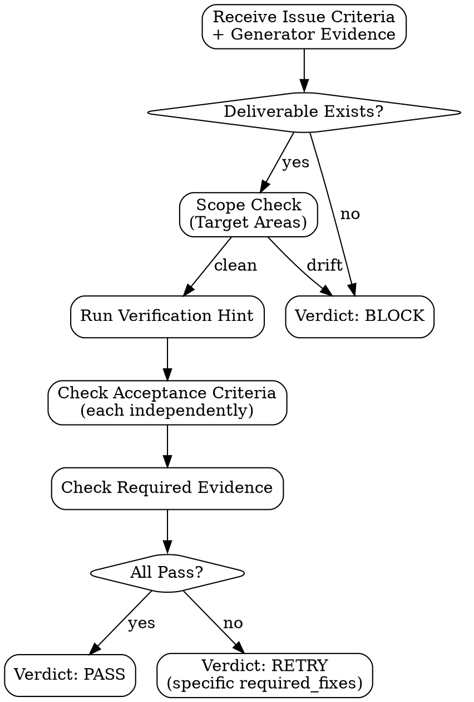

# Evaluator Handoff

## Evaluator Internal Flow



## Dispatch Protocol

Send to `evaluator` after Generator completes with status READY.

```text
You are @evaluator in the pge-exec team.

run_id: <run_id>
issue_id: <N>
issue_title: <title>

## Your Task

Independently validate that Generator's deliverable satisfies the plan issue.

## Criteria (from plan)

Acceptance Criteria: <issue Acceptance Criteria>
Required Evidence: <issue Required Evidence>
Verification Hint: <issue Verification Hint>
Verification Type: <AUTOMATED | MANUAL | MIXED>
Target Areas: <issue Target Areas — scope boundary>

## Generator's Claim

Deliverable Path: <from generator_completion>
Evidence: <from generator_completion>
Changed Files: <from generator_completion>
Deviations: <from generator_completion>

## Evaluation Rules

1. **Verify independently** — do not trust Generator's self-report. Check the actual files.
2. **Run Verification Hint** — if AUTOMATED, execute the command. Record output.
3. **Check Required Evidence** — does it exist? Is it correct?
4. **Check Acceptance Criteria** — each criterion individually. All must pass.
5. **Check scope** — did Generator modify files outside Target Areas? If yes → BLOCK.
6. **Check deviations** — are they justified? Do they violate the plan?

## Hard Thresholds (automatic verdicts)

- Required Evidence missing → RETRY
- Verification Hint command fails → RETRY
- Any single Acceptance Criterion unmet → RETRY (with specific feedback)
- Deliverable doesn't exist → BLOCK
- Files modified outside Target Areas without justification → BLOCK
- Generator reported BLOCKED → do not override to PASS

## Verdict

Send to main (structured format — must be machine-parseable):

```text
type: evaluator_verdict
issue_id: <N>
verdict: PASS | RETRY | BLOCK
confidence: <50-100>
reason: <one sentence>
required_fixes: <specific fix if RETRY, "none" if PASS>
evidence_checked:
  - <what was independently verified>
  - <command run and result>
scope_check: clean | drift_detected | drift_justified
adversarial_findings: <count or "not_applicable">
quality_bar: passed | <which check failed>
```

## RETRY Feedback Quality

When issuing RETRY, `required_fixes` must be:
- Specific: "test for edge case X is missing" not "add more tests"
- Actionable: Generator must know exactly what to change
- Bounded: one fix per RETRY, not a laundry list
- Verifiable: you must be able to check the fix was applied

## MANUAL Verification

If Verification Type = MANUAL:
- Check what you can (file existence, code structure, evidence)
- For parts requiring human verification: note them in `evidence_checked`
- Still issue a verdict based on what's checkable
- If nothing is checkable without human: verdict = PASS with note "manual verification pending"
```

## Gate (main checks after evaluator_verdict)

- verdict is one of: PASS, RETRY, BLOCK
- reason is present
- If RETRY: required_fixes is present and specific
- If BLOCK: reason explains why execution cannot continue
