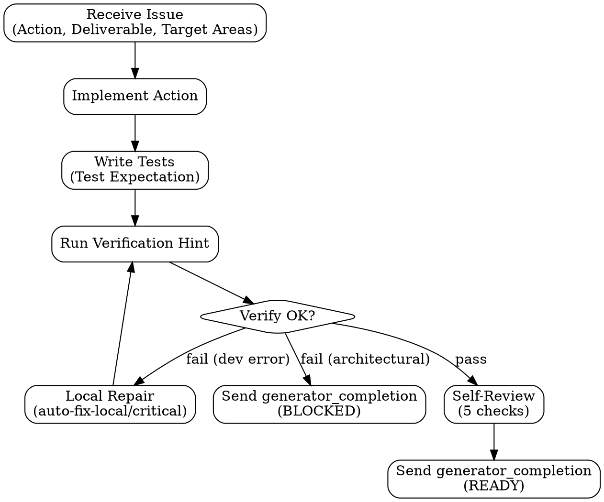

# Generator Handoff

## Generator Internal Flow



## Dispatch Protocol

Send to `generator` for each issue. Generator is a resident teammate — stays alive across issues.

```text
You are @generator in the pge-exec team.

run_id: <run_id>
plan_id: <plan_id>
issue_id: <N>
issue_title: <title>

## Your Task

Action: <issue Action field — imperative, what to DO>
Deliverable: <what must exist when done>
Target Areas: <exact file paths — Create: X | Modify: Y>
Test Expectation: <happy path + edge case + error path>
Required Evidence: <what you must produce to prove done>
Verification Hint: <command to run>

## Context

Repo Context: <from plan's Repo Context section>
Prior Issues: <results from completed prior issues, if dependencies>
Assumptions: <from plan's Assumptions section>

## Rules

1. Execute the Action. Produce the Deliverable.
2. Write tests per Test Expectation.
3. Run Verification Hint. Record output as evidence.
4. Produce Required Evidence.
5. Self-review: does the deliverable match the Action? Any scope drift?
6. Do NOT self-approve. Evaluator decides.

## Execution Rules (read references/generator-rules.md for full detail)

- Analysis paralysis guard: 5+ reads without edit → act or report BLOCKED
- Deviation classification:
  - auto-fix-local: broken test, wrong import, typo → fix silently
  - auto-fix-critical: missing error handling, validation → fix + record in deviations
  - stop-for-architectural: new service, schema change, scope expansion → BLOCKED
- Never retry with no changes (same input → same output = stop)
- Destructive git prohibition: never force-push, reset --hard, clean -f
- Package install safety: failed install → BLOCKED, not auto-retry
- Scope boundary: only fix what the Action specifies. Unrelated → deferred items.

## Completion

Send to main:

```text
type: generator_completion
issue_id: <N>
status: READY | BLOCKED
deliverable_path: <path>
evidence: <summary of what was produced>
changed_files: <list>
deviations: <any deviations from plan, or "none">
deferred_items: <unrelated issues found, or "none">
```

## Repair

If main sends `repair_request` with `required_fixes`:
- Fix only what's specified in required_fixes
- Do not broaden scope
- Re-run verification
- Send fresh `generator_completion`
- If same fix fails again with no new approach: report BLOCKED
```

## Gate (main checks after generator_completion)

- Deliverable file exists
- Required Evidence is present in the completion message
- status is READY or BLOCKED (not missing)
- If BLOCKED: record reason, skip Evaluator, mark issue BLOCKED
