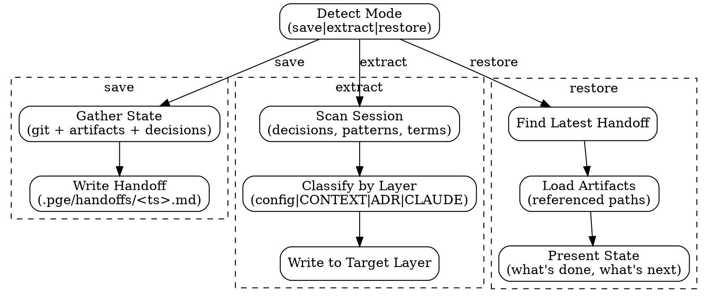

# PGE Handoff

General-purpose state persistence and knowledge extraction. Bridges volatile conversation context to durable repo knowledge.

## Execution Flow



---

## Mode: save

Capture current working state for session continuity.

### What to capture

1. **Git state**: branch, status, recent commits, dirty files
2. **Pipeline state** (if PGE): which stage, which issue, state.json path
3. **Decisions made in conversation**: not in any artifact yet
4. **Assumptions agreed with user**: context that only exists in chat
5. **Current blockers**: what's preventing progress
6. **Next steps**: what the next session should do
7. **Compact restart hint**: what to keep/drop if the conversation is compacted or resumed

### Where to write

`.pge/handoffs/<YYYYMMDD-HHMMSS>-<slug>.md`

### Template

```markdown
---
status: in-progress | blocked | done
branch: <current branch>
timestamp: <ISO-8601>
---

# Handoff: <title>

## State
- Working on: <one sentence>
- Pipeline stage: <research|plan|exec|none>
- Task directory: <path or "none">

## Artifacts (read these, don't duplicate)
- <path> — <what it contains>

## Decisions (not in artifacts)
- <decision> — reason: <why>

## Assumptions
- <assumption> — context: <what user said>

## Blockers
- <blocker or "none">

## Next
<what to do, which skill to invoke>

## Compact Restart Hint
Keep: <task dir, current issue, plan/stop condition, blockers, user decisions not in artifacts>
Drop: <raw greps, superseded failed attempts, dead-end hypotheses, unrelated exploration>
```

### Core rule

**Reference, never duplicate.** If it's on disk, point to it. Only write what exists ONLY in conversation.

When saving because context quality is degrading, finish the current small step first if practical, then checkpoint. Do not start a new PGE issue in a context that already shows drift, repeated rereads, forgotten constraints, or long correction chains.

---

## Mode: extract

Extract valuable knowledge from the session into the repo knowledge layer.

### Knowledge Layers (volatile → durable)

```
Conversation (dies with session)
  ↓
.pge/handoffs/ (session state, ephemeral)
  ↓
.pge/config/repo-profile.md (repo conventions, cross-task)
  ↓
CONTEXT.md (domain model, permanent)
  ↓
docs/adr/ (architectural decisions, permanent)
  ↓
CLAUDE.md (agent behavior rules, permanent)
```

### Classification Rules

| Discovery | Target | Example |
|-----------|--------|---------|
| Task progress, blockers | `.pge/handoffs/` | "Issue 3 blocked on Redis" |
| Repo conventions, patterns, toolchain | `.pge/config/repo-profile.md` | "Tests use vitest" |
| Domain terms, business concept mappings | `CONTEXT.md` | "'Order' = 'Purchase' in UI" |
| Architectural trade-offs with rationale | `docs/adr/` | "Chose Redis over Memcached because..." |
| Agent behavior rules for this project | `CLAUDE.md` | "Always run lint before commit" |

### Process

1. **Scan**: review conversation for decisions, patterns, terms, conventions discovered
2. **Classify**: for each finding, determine which layer it belongs to
3. **Deduplicate**: check if already captured in target file
4. **Write**: append to target file (or create if doesn't exist)
5. **Tag**: mark each extraction with `[extracted: <ISO date>]`

### What NOT to extract

- Ephemeral task state (belongs in handoff, not knowledge layer)
- Implementation details (belongs in code, not docs)
- Speculative ideas not confirmed (only extract confirmed decisions)
- Content already in artifacts (don't duplicate)

### Memory → Repo bridge

If `~/.claude/projects/<project>/memory/` contains knowledge that should be in the repo:
- `project` type memories → check if belongs in `CONTEXT.md` or `docs/adr/`
- `feedback` type memories → check if belongs in `CLAUDE.md`
- `reference` type memories → check if belongs in `.pge/config/`

Only extract if: (1) not already in repo, (2) useful beyond this agent's sessions, (3) confirmed/verified.

---

## Mode: restore

Resume from a saved handoff.

### Process

1. Find most recent `.pge/handoffs/*.md` (or user-specified one)
2. Read the handoff file
3. Load all referenced artifacts (paths in the Artifacts section)
4. Present: what was being worked on, what's done, what's next, any blockers
5. Suggest the next skill to invoke

---

## Guardrails

- Do not duplicate artifact content
- Do not invent decisions that weren't made
- Do not extract unconfirmed speculation to knowledge layers
- Keep handoff files under 50 lines
- Keep extractions atomic (one concept per write)
- Tag all extractions with date for confidence decay
