# PGE HTML

Compose self-contained HTML artifacts for human reading and judgment. Standalone utility — not a pipeline stage.

For canonical PGE artifacts, `pge-html` has two command families that must stay distinct:

1. **Faithful rendering mode**: render canonical Markdown/JSON/evidence into a single-file HTML page without reinterpreting the content.
2. **Decision-board mode**: derive a high-density view model from canonical artifacts, then render that view model into an HTML board for fast human judgment.

For current-session or mixed-source material, `pge-html` also has **context intake mode**: build a source packet from the current conversation, recent tool observations, generated artifacts, and local files before choosing the artifact shape.

For non-PGE source material, `pge-html` may still produce cognition, design, presentation, preservation, or local-editor artifacts using the template system below. Source material can be a file, task directory, current conversation context, command output, generated report, browser observation, screenshot notes, or a mixed source packet; do not force the user to first convert context into a Markdown file.

HTML is for human understanding, participation, and decision-making, not for skill-to-skill contracts. Keep canonical PGE artifacts in Markdown/JSON/evidence files. Compose HTML only when the user benefits from an artifact, not when the source merely needs a prettier rendering.

HTML is never a new fact source. A decision board may aggregate and derive, but every derived conclusion must point back to canonical artifacts or evidence. If the HTML says `GO`, `RETRY`, `BLOCK`, or `ESCALATE`, the board must show which canonical state, review finding, acceptance criterion, or evidence item supports that conclusion.

When decision-board mode needs an intermediate model, treat it as a derived view model, for example:

```text
canonical artifacts
  - research.md
  - plan.md
  - state.json
  - runs/<run_id>/*
  - review.md
  - challenge.md
  - evidence/*

        -> extract / normalize

pge-html-view.json
  - task_summary
  - phase
  - verdict
  - issue_cards
  - acceptance_matrix
  - evidence_map
  - risk_list
  - human_attention
  - next_action

        -> render

single-file HTML
```

`pge-html-view.json` is a derived view, not a runtime contract. It can be exported for inspection or copy/prompt workflows, but the SSOT remains the original Markdown/JSON/evidence artifacts until an owning PGE stage updates them.

For non-render modes, do not translate Markdown or agent output into HTML section-by-section. Build a semantic model first, then design the page around that model. Source headings are evidence labels, not the default page outline. If the input is a generated report made of multiple subreports, collapse it into a coherent model instead of preserving each subreport's title, order, and repeated overview/summary sections.

Treat HTML as a visual output medium, not a text container. Prefer layouts, diagrams, motion-lite interactions, spatial grouping, and visual comparison when they let the reader grasp structure faster than prose.

HTML is also a working surface. When the human needs to tune, rank, annotate, configure, compare, or choose, make the page a small local editor with an explicit export such as copy-as-prompt, copy-as-Markdown, copy-as-JSON, or copy-diff. The export is how the human's decision returns to Claude Code or to the repo.

## Core Rule

First classify the command family:

- `render`: faithful artifact rendering; preserve source meaning and structure, improve readability, and do not add conclusions.
- `board`: derived decision surface; aggregate canonical artifacts into a view model, then render issue/evidence/risk/gate views with provenance.
- `context`: build from the current conversation, recent tool observations, pasted notes, generated reports, screenshots, command output, or other non-file context supplied or authorized by the user.
- default source mode: non-PGE cognition, design, presentation, preservation, or editor artifact.

Do not blur the modes. Faithful rendering may reformat but must not reinterpret. Decision boards and context artifacts may aggregate and derive, but derived conclusions require visible source support.

Before writing HTML, state the cognitive job the artifact performs:
- read/share a canonical artifact faithfully
- choose between approaches
- understand code structure
- understand runtime/execution semantics
- review a diff
- inspect run status
- decide whether to GO, RETRY, BLOCK, or ESCALATE
- explain a concept
- present a PR
- turn an approved design/mockup/product description into production-quality HTML
- tune a prompt/config
- let a human compare, annotate, reorder, tune, or export a decision

If the output does not make that job faster than reading the source material, repair it before returning.

In `render` mode, the source order and wording are part of the contract. Preserve them except for safe visual affordances: table styling, heading anchors, table of contents, code highlighting, collapses, local links, and single-file packaging.

In `board` mode, never mechanically translate or copy source material into HTML. Source material is evidence and raw material; the board must be a redesigned artifact with a new information architecture. Treat input documents as source material, not as page structure. Rebuild the content model from facts and relationships; do not preserve weak headings, long note order, or repetitive tables just because the source used them.

In every non-render mode, preserve **source facts**, not source structure. Optimization means regrouping, prioritizing, visualizing, and adding progressive disclosure; it does not mean dropping inconvenient details. If a detail is too dense for the first screen, move it to a drilldown, evidence panel, table, tooltip, appendix, or exportable payload.

Default to an artifact, not a document, except in `render` mode where preserving the document is the point. A good non-render page should help the user inspect or manipulate the work: compare options, follow a path, expose evidence, adjust parameters, copy an edited prompt/config, or share a readable review surface.

Prefer HTML most strongly when the output is likely to exceed what a human will actually read in raw Markdown. Long plans, multi-source research, complex reviews, feature explainers, and run summaries should become scannable visual artifacts with progressive disclosure rather than longer Markdown reports.

## Artifact Mode

Before composing the artifact, classify the mode. This determines how much of the source structure may survive. The default mode is **Cognition Artifact** unless the user explicitly asks for `render` or the task is a canonical PGE artifact that only needs faithful sharing.

| Level | Meaning | Allowed source-order reuse | Use when |
|---|---|---|---|
| **Faithful Render** | Same facts and structure, improved HTML reading/sharing | required | `render plan.md`, `render research.md`, `render review.md`, `render runs/<run_id>/`; user asks to preserve or share a canonical artifact |
| **Cognition Artifact** | New information architecture around the reader's task | low | default; required for technical chains, execution semantics, architecture, code review, multi-source reports, design exploration, or anything over about 100 lines |
| **Decision Board** | Derived view model for a judgment/action | low | `board plan`, `board run`, `board gate`, `board handoff`; user needs status, gaps, risks, attention, or route |
| **Design HTML** | Approved design, mockup, screenshot, or product description implemented as production-quality HTML | low | user asks for a page/prototype/mockup/design-to-HTML artifact |
| **Presentation Artifact** | Same core argument, redesigned for sharing/presentation | medium | user needs a shareable artifact and the source is already well-structured |
| **Translation / Preservation** | Same structure, different language or wording | high | user explicitly asks to translate or preserve the document |

Use **Cognition Artifact** for `execution-semantics`, `code-understanding`, complex explainers, long plans, and review artifacts. In this mode, source headings are evidence labels at most; they must not become the page outline unless that outline is demonstrably the best cognitive structure.

Use **Design HTML** when the source is an approved visual direction, screenshot, product description, or design brief. This mode implements the intended experience, not the literal document structure. Preserve requirements, states, copy, constraints, and visual intent; optimize layout, responsiveness, interaction, and implementation quality. Do not invent product facts or remove required content to make the page cleaner.

Use **Decision Board** for PGE judgment surfaces. A board is not a prose summary. It should compress artifacts into decision structures:

```text
Decision Summary:
GO / RETRY / BLOCK / ESCALATE

Acceptance Matrix:
Acceptance -> Covered? -> Evidence -> Confidence -> Gap

Issue Board:
Issue -> Status -> Evidence -> Risk -> Next Action

Human Attention:
Only these decisions require human judgment
```

Board outputs should prioritize:

1. Acceptance -> Evidence Matrix
2. Issue / Slice Cards
3. Risk / Unknown Board
4. Review / Challenge Findings Board
5. Human Attention

Mechanical-output warning signs:
- the generated page has nearly the same major section order as the source
- most source headings have a direct `<section>` counterpart
- the reader must still read top-to-bottom to understand the main model
- the primary HTML additions are cards, chips, styling, or collapses around unchanged prose
- interactions hide/show existing sections but do not answer a concrete question faster

These warning signs apply to non-render modes. In `render` mode, source order and source headings are expected; judge the page on faithful preservation, readability, navigation, and SSOT safety instead.

If two or more warning signs are present in a non-render mode, stop and redesign around the cognition task before writing the final file.

## Semantic Model And Coverage

Before selecting a template for any non-render or context mode, build a semantic inventory. This is a thinking artifact; it may be internal, but the resulting HTML must reflect it.

Minimum inventory:

```text
source_inventory:
  intake:
    - source_ref
      type: markdown | json | code | diff | command_output | conversation_context | generated_html | browser_observation | screenshot_note | other
      role: canonical | evidence | observation | user_intent | generated_draft | raw_detail
      trust: confirmed | inferred | unverified
  facts:
    - id
      statement
      source_ref
      importance: primary | supporting | detail
  entities:
    - issue, module, file, actor, concept, state, command, evidence item
  relationships:
    - depends_on | implements | verifies | blocks | risks | changes | compares_to
  claims:
    - derived statement
      source_refs
      confidence
  gaps:
    - missing evidence, unresolved decision, unknown confidence, manual check
  raw_details:
    - dense data that must remain available but can move to drilldown
```

For context intake, first write a compact source packet before designing:

```text
source_packet:
  user_goal: <what the user wants this HTML to help with>
  available_context:
    - <conversation correction, artifact path, command observation, screenshot note, generated output, or source file>
  canonical_sources:
    - <files or artifacts that remain source of truth>
  observations:
    - <runtime/render/source observations with evidence>
  constraints:
    - <privacy, sharing, output location, fidelity, interaction, or style constraints>
  gaps:
    - <missing source or unverified assumption>
```

If the user says "use this context", "use the current thread", "turn the PGE output into HTML", or points at a generated artifact, consume the relevant conversation and observations as source context. Do not ask for a Markdown file unless the missing source is actually required for correctness.

Then build the view model from this inventory:

```text
semantic inventory
  -> group by reader task
  -> choose primary cognition object
  -> map every primary/supporting fact to a visible module or drilldown
  -> attach provenance near each derived claim
  -> render HTML
```

Coverage requirements:

- Every primary fact must be visible without opening an appendix.
- Every supporting fact must be visible either in the main page, a table, a tab, a details block, a tooltip, or an evidence panel.
- Dense raw details may be collapsed, but they must remain reachable when they are part of the source's meaning.
- Every derived status, risk, confidence, recommendation, or next action must cite source references.
- If a source fact is intentionally omitted because it is duplicate, obsolete, or irrelevant to the cognitive job, record that in the self-check summary.
- If completeness cannot be established, return `coverage: incomplete` and name the missing source area instead of silently shipping the HTML.
- If source context is conversation-only, cite it as `conversation:<short label>` and separate user-stated facts from assistant observations and inferences.

The right failure mode is not a prettier incomplete page. The right failure mode is an explicit coverage gap.

## When To Use

- Rendering `plan.md`, `research.md`, `review.md`, `state.json`, or a run directory into a faithful single-file HTML page for local reading or sharing
- Sharing a plan or research brief with teammates who will not read raw Markdown
- Generating a high-density PGE decision board for plan, run, gate, or handoff judgment
- Reviewing a long document that benefits from visual hierarchy
- Generating a run dashboard from exec artifacts
- Creating an interactive view with tabs, collapsible sections, or diagrams
- Turning an approved mockup, screenshot, product brief, or design description into a self-contained HTML prototype/page
- Presenting options side-by-side for decision-making
- Turning review output into annotated findings with severity tags and jump links
- Presenting a PR with motivation, file-by-file tour, and review focus areas
- Turning repo/code summaries into module maps, execution maps, or feature explainers
- Building one-off editors for prompts, flags, ticket ranking, datasets, annotations, or structured config with copy/export output
- Synthesizing multiple local sources into a visual report or gallery
- Creating a small "copy as prompt" panel that exports the user's chosen option back to Markdown
- Creating a purpose-built one-off editor where text prompts are a poor control surface: feature flags, prompts, ticket buckets, dataset curation, annotations, crop/position values, colors, easing curves, schedules, or regexes
- Producing a gallery or map from many local files, git history entries, browser observations, or MCP-provided records

## When Not To Use

- Pipeline artifacts that other skills consume directly
- Any situation where the HTML would become the only place a verdict, requirement, acceptance criterion, or risk exists
- Quick notes or scratch files
- Files that need version-control-friendly diffs
- Long-lived canonical truth that should remain greppable Markdown

## Execution Flow

```dot
digraph pge_html {
  rankdir=TB;
  node [shape=box, style=rounded];

  subgraph cluster_input {
    label="Phase 1: Input";
    style=dashed;
    read_source [label="Read source(s):\nfile(s), repo context,\ngit, browser, MCP"];
    classify_command [label="Classify command family:\nrender, board,\ncontext, or default source mode"];
    classify_level [label="Classify artifact mode:\nfaithful, cognition,\ndecision board,\ndesign, presentation,\npreservation, or editor"];
    define_job [label="Define cognitive job\n(one sentence)"];
    semantic_inventory [label="Build semantic inventory:\nfacts, entities,\nrelationships, claims,\ngaps, raw details"];
    extract_model [label="Build content/view model\nfrom semantic inventory\n(grouped by reader task\nwith provenance)"];
    read_source -> classify_command -> classify_level -> define_job -> semantic_inventory -> extract_model;
  }

  subgraph cluster_select {
    label="Phase 2: Template Selection";
    style=dashed;
    explicit_check [label="--style explicit?", shape=diamond];
    score_templates [label="Score each template\n(structure + reader-task\n+ content-density, 0-3 each)"];
    pick_winner [label="Pick highest total\n= main template"];
    explicit_check -> score_templates [label="no"];
    score_templates -> pick_winner;
  }

  use_explicit [label="Use explicit template"];
  explicit_check -> use_explicit [label="yes"];
  use_explicit -> read_template;

  subgraph cluster_structure {
    label="Phase 3: Per-Module Structure";
    style=dashed;
    read_template [label="Read main template\nfrom templates/"];
    design_surface [label="Design primary surface\naround reader question"];
    segment_content [label="Map source facts into\nartifact modules,\nnot source sections"];
    per_module [label="For each module:\nselect sub-template\nfrom 20 templates", shape=box];
    has_flow [label="Has execution flow\nor call chain?", shape=diamond];
    use_svg [label="Hand-write inline SVG\n(13-flowchart style:\nboxes + arrows + labels)"];
    has_code [label="Has dense code?", shape=diamond];
    use_details [label="Wrap in <details>\n(04 snippet style)"];
    has_compare [label="Has comparison?", shape=diamond];
    use_table [label="Use compare table\n(01 tradeoffs style)"];
    assemble [label="Assemble all modules\ninto page skeleton"];

    read_template -> design_surface -> segment_content -> per_module;
    per_module -> has_flow;
    has_flow -> use_svg [label="yes"];
    has_flow -> has_code [label="no"];
    use_svg -> has_code;
    has_code -> use_details [label="yes"];
    has_code -> has_compare [label="no"];
    use_details -> has_compare;
    has_compare -> use_table [label="yes"];
    has_compare -> assemble [label="no"];
    use_table -> assemble;
  }

  subgraph cluster_output {
    label="Phase 4: Generate & Verify";
    style=dashed;
    generate [label="Generate HTML\n(inline CSS, no external deps)"];
    evaluate [label="Self-check:\njob fit, first viewport,\nno content loss, no card soup"];
    pass_check [label="Pass?", shape=diamond];
    revise [label="Revise once"];
    write_file [label="Write to output location"];
    open_browser [label="Open in browser\n(if --open)"];

    generate -> evaluate -> pass_check;
    pass_check -> write_file [label="yes"];
    pass_check -> revise [label="no"];
    revise -> evaluate;
    write_file -> open_browser;
  }

  subgraph cluster_reshape {
    label="Phase 5: Reshape";
    style=dashed;
    check_density [label="Scan for density issues:\ncrowded sections,\nwall-of-text, card soup"];
    check_hierarchy [label="Check visual hierarchy:\nfirst viewport dominance,\nprogressive disclosure"];
    check_completeness [label="Verify coverage:\nprimary/supporting facts,\nraw details, gaps"];
    check_mechanical [label="Check mechanical-output\nwarning signs"];
    reshape_fix [label="Restructure:\ncollapse dense blocks,\npromote key info,\nadjust grid/spacing"];
    reshape_pass [label="Reshape pass?", shape=diamond];
    final_write [label="Final write"];

    check_density -> check_hierarchy -> check_completeness -> check_mechanical -> reshape_pass;
    reshape_pass -> final_write [label="yes"];
    reshape_pass -> reshape_fix [label="no"];
    reshape_fix -> check_density;
  }

  extract_model -> explicit_check;
  pick_winner -> read_template;
  assemble -> generate;
  open_browser -> check_density;
}
```



## Output Location

- Default local output: write next to the source as `<filename>.html`.
- Shareable or durable output: if the user asks to share, publish, send, attach, or keep the HTML for others, write under `docs/html/<topic>.html`.
- Temporary/session output: if the artifact is only for current-session inspection, write under `.pge/html/<topic>.html`.
- Do not put shareable artifacts under `.pge/`; that directory is for ignored local workflow state.
- All HTML outputs must remain self-contained with no external assets or network calls.

## Source Ingestion

Use all relevant local context the user authorizes or provides:
- source files and existing PGE artifacts
- git diff, history, PR notes, and review output
- current conversation corrections, decisions, and produced context
- generated HTML, Markdown drafts, pasted notes, command output, logs, and terminal snippets
- browser observations or screenshots when the user asks for UI/prototype inspection
- MCP/app context such as issue trackers or team notes when explicitly available in the session

Do not assume HTML input must start from one Markdown file. When multiple sources are involved, synthesize the facts into one designed information model and keep provenance visible near the claim it supports.

### Context Intake Protocol

Use context intake when the source is not a single clean file, including:
- the current thread or a recent PGE run result
- a generated report that needs repair or redesign
- several research notes, command outputs, screenshots, or browser observations
- a user correction such as "this output feels bad" or "make the artifact explain X instead"
- a task directory plus fresh conversation context that changes what the page should emphasize

Context intake steps:
1. **Gather** only the relevant context: user goal, explicit corrections, source artifact paths, observations, and constraints.
2. **Classify authority** for each item: user intent, canonical artifact, evidence, observation, generated draft, or raw detail.
3. **Normalize** into a source packet before template selection. The packet, not the original Markdown/HTML heading order, drives the page.
4. **Design** around the reader's job: architecture comprehension, decision, review, status, explanation, editor, or shareable presentation.
5. **Preserve provenance** near claims. Conversation-derived facts must be labeled as user-stated, observed, or inferred.

Generated HTML can be inspected as evidence of output quality, but it is rarely a good canonical source. If the generated HTML contains malformed markup, raw Markdown markers, duplicated report titles, or table/list damage, use it to diagnose the generator and rebuild the page from underlying facts where available.

For PGE artifacts, treat these as canonical inputs:

- `.pge/tasks-<slug>/research.md`
- `.pge/tasks-<slug>/plan.md`
- `.pge/tasks-<slug>/state.json`
- `.pge/tasks-<slug>/runs/<run_id>/*`
- `.pge/tasks-<slug>/review.md`
- `.pge/tasks-<slug>/challenge.md`
- evidence files, command output, screenshots, and changed-file lists recorded by the owning stage

Decision boards may normalize these into a `pge-html-view.json`-shaped model, but that model must preserve provenance for each status, confidence, risk, gap, and recommended next action.

## Template Source

All templates come from `templates/` — the full set from [html-effectiveness](https://github.com/ThariqS/html-effectiveness). Do not invent new templates. Use these directly as the structure and visual quality bar.

## Template Selection

If `--style` is explicit, use that template directly. Otherwise, score the source against each template category and pick the highest.

### Scoring dimensions

For each candidate template, score 0-3 on these dimensions:

| Dimension | 0 | 1 | 2 | 3 |
|---|---|---|---|---|
| **Structure match** | No useful semantic fit | Minor semantic overlap | Major semantic modules fit | Template naturally expresses the semantic model |
| **Reader task** | Reader task doesn't match | Partially serves the task | Serves the primary task | Serves primary + secondary tasks |
| **Content density** | Template can't hold this much content | Awkward fit | Comfortable fit | Natural fit with room to breathe |

Pick the template with the highest total. On ties, prefer the template that serves more of the reader's tasks (dimension 2).

### Template categories and what scores high

| Template | Scores high when... |
|---|---|
| `01-exploration-code-approaches` | Multiple parallel branches/paths/approaches with code; comparison table; "X vs Y vs Z" structure; reader needs to understand differences |
| `02-exploration-visual-designs` | Visual options to compare side-by-side |
| `03-code-review-pr` | Diff hunks, inline annotations, file-by-file review |
| `04-code-understanding` | ONE linear path through code; callstack; request → middleware → handler → store; no branching |
| `11-status-report` | Metrics, pass/fail, run status, progress tracking |
| `12-incident-report` | Timeline, root cause, impact, remediation |
| `13-flowchart-diagram` | Process flow, architecture boxes-and-arrows, state machine |
| `14-research-feature-explainer` | How a concrete feature works; domain-anchored with code references |
| `15-research-concept-explainer` | Abstract concept; theory; no specific code path |
| `16-implementation-plan` | Slices, issues, dependencies, timeline, action items |
| `17-pr-writeup` | Motivation + file tour + before/after; PR description |
| `18-editor-triage-board` | Ranking, prioritization, drag-to-reorder |
| `19-editor-feature-flags` | Toggle states, config switches |
| `20-editor-prompt-tuner` | Editable text with live preview, parameter tuning |

### Example: listwise-feature-execution.md

Source has: execution chain (process_listwise → modules → generate_input), three feature types executed sequentially in the same request, comparison with pointwise, code anchors.

- `04-code-understanding`: structure=3 (linear execution path with branching steps), reader-task=3 (understand runtime behavior of one system), density=2 → **total 8**
- `01-exploration-code-approaches`: structure=1 (not mutually exclusive choices), reader-task=1 (reader doesn't need to pick one), density=2 → **total 4**
- `14-research-feature-explainer`: structure=2 (has explanatory sections), reader-task=2 (explains but misses execution detail), density=2 → **total 6**

Winner: `04-code-understanding`

Key distinction: 01 is for "which approach should we choose?" — mutually exclusive alternatives. When multiple things are parts of the same system executing together (User + Item + Seq in one request), that's 04 (understanding one path through code).

## Content Rules

1. **Mode boundary** — `render` preserves source content and source order; non-render modes preserve source facts through a semantic model. Do not mix faithful rendering and derived judgment without labeling the derived area.
2. **保真模式不丢内容** — In `render` mode, the source file's information must appear in the HTML. The template decides presentation, not meaning.
3. **非 render 模式不漏事实** — In cognition, board, presentation, design, editor, and context modes, build a source packet, source inventory, and coverage map. Reorganize the structure, but preserve primary/supporting facts and reachable raw details.
4. **决策板不造事实** — In `board` mode, compress rather than summarize. Derived statuses, confidence, gaps, risk, and next action must cite canonical artifacts or evidence. If support is missing, show `Evidence: none` or `Confidence: unknown` rather than filling the gap with prose.
5. **Human Attention is mandatory for boards** — Every decision board must include a compact section listing only the decisions that require human judgment.
6. **No HTML-only verdicts** — New verdicts, changed acceptance criteria, and changed risk decisions must be exported back as a prompt, Markdown patch, JSON patch, or explicit human instruction; they are not authoritative until the owning PGE stage updates canonical artifacts.
7. **子结构混合** — 主模板决定页面骨架，但子区域可以从其他模板选择最合适的组件表达：
   - 需要流程图/调用链/执行链路 → 手写 inline SVG，视觉风格参考 `13-flowchart-diagram`（boxes + arrows + labels + 可点击节点）
   - 需要线性步骤 walkthrough → 用 `04-code-understanding` 的 `.step` 结构
   - 需要折叠代码 → 用 `04-code-understanding` 的 `<details class="snippet">`
   - 需要 metrics strip → 用 `11-status-report` 的 metric cards
   - 需要参与者/组件表 → 用 `14-research-feature-explainer` 的 panel + list
   - 如果没有合适的子模板 → 从 20 个模板中选最接近的组件，不要自造新结构
8. **密集内容用折叠** — 完整代码块、详细参数列表、长表格用 `<details>` 折叠，保持页面呼吸感。摘要/关键行在外面，完整内容折叠内。
9. **HTML-native before prose** — 如果信息天然是流程、空间、差异、状态、层级、时间线、可调参数或可编辑结构，优先用 SVG、表格、网格、tabs、filters、sliders、toggles、drag/reorder、copy/export 等浏览器原生表达，不要退回长段落。
10. **Share-ready by default** — 面向他人阅读的产物要能脱离当前对话理解：顶部说明目的、来源、更新时间、如何阅读，以及哪些结论是 confirmed / inferred / unresolved。不要依赖会话上下文。
11. **No raw Markdown leakage** — Outside escaped code/detail blocks, generated HTML must not show unrendered Markdown syntax such as `**bold**`, backtick code markers, fenced code fences, Markdown table pipes, horizontal-rule `---`, or list bullets wrapped as plain paragraphs.
12. **One document hierarchy** — A generated page gets one `<h1>`. Subreport titles become sections, tabs, timeline labels, or evidence entries. Do not paste multiple standalone report documents into one page.

## Generated HTML Evaluation

After generation, inspect the HTML as an artifact, not only as source text.

Required self-check:
- **Job fit**: name the cognitive job and confirm the selected template is the best fit. If the page is about one behavior path, it should not look like a broad module inventory.
- **Mode fit**: confirm whether this is `render` or `board`. `render` must preserve source structure; `board` must expose provenance for every derived judgment.
- **Semantic model fit**: for non-render modes, confirm the page is generated from facts, entities, relationships, claims, and gaps rather than Markdown heading order.
- **First viewport**: the primary cognition object is visible near the top: diagram, execution surface, comparison, diff, dashboard, or walkthrough entry.
- **Information architecture**: in `render`, the page preserves source structure with better navigation; in non-render modes, the page reorganizes source facts around the job instead of preserving Markdown order.
- **Coverage**: primary facts are visible, supporting facts and raw details are reachable, and any omitted source area is explicitly named with a reason.
- **SSOT safety**: no verdict, acceptance criterion, requirement, or risk exists only in HTML.
- **Template contract**: every required component in `references/template-contracts.md` is present.
- **Markup integrity**: one `<h1>`, valid table structure, no raw Markdown leakage, no nested `<thead>/<tbody>` row damage, no unclosed code/pre blocks, and no copied subreport document shells.
- **Evidence**: important claims carry compact source paths, commands, confidence, or provenance.
- **Interaction**: tabs, filters, collapses, copy/export, or local controls change what the reader can inspect or reuse when the job needs participation.
- **Shareability**: teammate-facing artifacts include enough provenance, orientation, and durable links/paths to be understandable outside the current chat.
- **Visual failure scan**: no card soup, placeholder residue, text overflow, file-path dump sidebars, or prose-only first screen.
- **Safety**: source-derived text is escaped or inserted with `textContent`; generated JavaScript does not use source-derived `innerHTML`.

If the self-check finds a failure, repair the HTML and rerun the checklist. Markup integrity failures are blocking; do not return the page as "good enough". If a failure remains, return `required_components: failed` and state the unresolved item.

## Required Template Contracts

Every style has required components. Read `references/template-contracts.md` before generating and satisfy the selected style's contract. Missing required components are a generation failure, not optional polish.

Common requirements:
- top-level cognitive job statement
- at least one visual structure that is not just a long prose column for non-render modes; render mode may use TOC, anchors, collapses, tables, and code styling as its structure
- "start here" or equivalent orientation when the source is code/domain knowledge
- verification/evidence surface when the source is plan, review, execution, or code semantics
- decision boards include Decision Summary, Acceptance Matrix, Issue Board, Risk/Unknowns, Review/Challenge Findings when present, Human Attention, and Next Action
- context-friction or gotchas when the page is meant to guide future agents
- copy/export panel only when it has a useful downstream prompt or action

## Safety And Escaping

Treat source Markdown and agent output as untrusted text.

- Escape all source text before inserting into HTML.
- Put code, paths, diff lines, review findings, and prompt exports into text nodes or escaped markup.
- Do not use `innerHTML` for user/source-derived content.
- Do not include CDN links, external scripts, remote fonts, `fetch()`, or network resources.
- Inline JavaScript is allowed only for local UI state: tabs, filters, copy buttons, and collapsible sections.
- Generated HTML must work offline as a single file.

## Design Principles

- **Cognition first** — structure replaces a thinking task, not just a reading surface.
- **Design-to-HTML fidelity** — for approved mockups, screenshots, product briefs, or design descriptions, preserve required states, copy, visual hierarchy, interaction intent, and constraints while improving responsive implementation quality.
- **Composition over cards** — avoid page-long stacks of bordered panels. Use one strong primary visual, compact rails, bands, tables, or drilldowns only where they reduce effort.
- **Reference palette by default** — use the html-effectiveness visual system unless the user explicitly asks for another style: ivory page background, white paper panels, near-black slate text, clay accent, oat borders/fills, olive secondary accent, restrained gray scale. Do not introduce rainbow stage colors, saturated blue dashboards, or cold gray app chrome for ordinary PGE HTML.
- **Self-contained** — single file, no external dependencies.
- **Progressive disclosure** — summary first, details on demand.
- **Evidence-visible** — important claims point to source paths, commands, or confidence.
- **Agent-useful** — for repo knowledge, include what future agents should start with, avoid, and verify.
- **Responsive** — no desktop-only grids; collapse dense maps on narrow screens.
- **Copy-friendly** — code blocks and prompts are selectable; copy buttons are optional.
- **Participation** — when the artifact invites a choice or edit, include a local export path such as copy-as-Markdown, copy-as-JSON, copy-diff, or copy-prompt.
- **Taste calibration** — if a repo/product design system, prior good HTML artifact, or visual reference exists, inspect it before generating a new style. For this skill, `https://thariqs.github.io/html-effectiveness/` is the default taste reference for color, typography, density, borders, and page rhythm.
- **Visual-first HTML output** — when prose, Markdown tables, or code blocks are not the fastest path, use browser-native diagrams, layouts, SVG, small animations, slides, or local controls to expose structure.

Default visual tokens:

```css
:root {
  --ivory:#FAF9F5;
  --paper:#FFFFFF;
  --slate:#141413;
  --clay:#D97757;
  --clay-d:#B85C3E;
  --oat:#E3DACC;
  --olive:#788C5D;
  --g100:#F0EEE6;
  --g200:#E6E3DA;
  --g300:#D1CFC5;
  --g500:#87867F;
  --g700:#3D3D3A;
}
```

Use these tokens semantically:
- page background: `--ivory`
- content panels: `--paper`
- primary text and dark headers: `--slate`
- primary accent / hot path / selected state: `--clay`
- secondary accent / safe path: `--olive`
- borders and quiet fills: `--oat`, `--g100`, `--g200`, `--g300`
- muted labels: `--g500`
- body copy: `--g700`

## Visual Failure Modes

Regenerate before returning if the page has:
- card soup: most sections are boxed panels with similar weight
- inline-style sprawl that prevents a coherent design system
- a first viewport dominated by prose, metrics, and small cards instead of the primary cognition object
- large empty vertical whitespace caused by forced viewport-height panels or sparse dashboard layouts
- a sidebar filled with long file paths instead of navigation/orientation
- beige/cream monotone with weak contrast and no clear visual hierarchy
- blue/purple/teal rainbow stage coloring when the default html-effectiveness palette would be calmer and more coherent
- tables where a flow, dependency map, or annotated diagram would answer faster
- Markdown shape preserved even though the visual job needs a different information model
- no interaction/export even though the page asks the user to decide, rank, tune, or annotate
- multiple pasted reports with repeated "Overview", "Summary", "Conclusion", "References", or "Version" sections instead of one integrated artifact
- broken HTML semantics: repeated top-level `<h1>`, table rows emitted as headers, raw Markdown markers visible as prose, or code fences rendered as paragraph text

## Templates

All templates in `templates/` are from [html-effectiveness](https://github.com/ThariqS/html-effectiveness). Read the selected template before generating — match its structure, spacing, and visual quality exactly.

| Template | Cognitive job |
|---|---|
| `01-exploration-code-approaches.html` | Compare multiple approaches/branches/paths with code + tradeoffs |
| `02-exploration-visual-designs.html` | Compare visual design directions |
| `03-code-review-pr.html` | Review a diff with inline annotations |
| `04-code-understanding.html` | Follow one linear path through code (callstack walkthrough) |
| `11-status-report.html` | Dashboard: run status, metrics, pass/fail |
| `12-incident-report.html` | Postmortem / incident timeline |
| `13-flowchart-diagram.html` | Architecture flow / process diagram |
| `14-research-feature-explainer.html` | How a feature works (domain-anchored) |
| `15-research-concept-explainer.html` | Abstract concept explanation |
| `16-implementation-plan.html` | Plan with slices, issues, timeline |
| `17-pr-writeup.html` | PR description / branch summary |
| `18-editor-triage-board.html` | Triage / ranking / prioritization board |
| `19-editor-feature-flags.html` | Toggle / config editing surface |
| `20-editor-prompt-tuner.html` | Prompt / config tuning with live preview |

## Examples

```text
/pge-html render .pge/tasks-auth/plan.md --style 16-implementation-plan
/pge-html render .pge/tasks-auth/research.md
/pge-html render .pge/tasks-auth/runs/run-001/
/pge-html board plan .pge/tasks-auth/
/pge-html board run .pge/tasks-auth/runs/run-001/
/pge-html board gate .pge/tasks-auth/
/pge-html docs/domain-knowledge/listwise-feature-execution.md --open
/pge-html docs/domain-knowledge/auth-flow.md --style 04-code-understanding --open
/pge-html docs/research/ref-superpowers.md --style 14-research-feature-explainer --open
/pge-html render .pge/tasks-auth/runs/run-001/review.md --style 03-code-review-pr
/pge-html docs/pr-auth-rewrite.md --style 17-pr-writeup --open
/pge-html context "use the current thread and the generated report at /tmp/report.html to make a diagnostic board"
/pge-html context "turn the PGE output we just discussed into a shareable architecture explainer"
```

## Output

```md
## PGE HTML Result
- source: <input file | directory | none for current-thread context>
- input_context: <file | directory | current thread | source packet | mixed>
- output: <output .html file>
- mode: render | board | context | cognition | design | presentation | preservation
- style: minimal | rich | dashboard | comparison | review | explainer | code-understanding | module-map | execution-semantics | code-review | pr-writeup
- cognitive_job: <what this page helps the reader do faster>
- canonical_sources: <source artifacts used as SSOT>
- view_model: none | <derived pge-html-view.json path or inline summary>
- coverage: complete | incomplete | render-preserved
- coverage_summary: primary=<n>, supporting=<n>, raw_details=<n>, omitted=<n or none>, missing=<areas or none>
- required_components: pass | repaired | failed
- evaluation: <one-line result of mode fit, context intake, markup integrity, SSOT safety, and generated HTML self-check>
- opened: yes | no
```
