# PGE HTML

Compose self-contained HTML cognition artifacts. Standalone utility — not a pipeline stage.

`pge-html` is not a Markdown-to-HTML converter. Input is source material. Output is a task-specific cognition surface: a visual, navigable, interactive, or shareable artifact that helps a human understand, judge, review, tune, or decide faster.

HTML is for human understanding, participation, and decision-making, not for skill-to-skill contracts. Keep canonical PGE artifacts in Markdown. Compose HTML only when the user benefits from an artifact, not when the source merely needs a prettier rendering.

Treat HTML as a visual output medium, not a text container. Prefer layouts, diagrams, motion-lite interactions, spatial grouping, and visual comparison when they let the reader grasp structure faster than prose.

HTML is also a working surface. When the human needs to tune, rank, annotate, configure, compare, or choose, make the page a small local editor with an explicit export such as copy-as-prompt, copy-as-Markdown, copy-as-JSON, or copy-diff. The export is how the human's decision returns to Claude Code or to the repo.

## Core Rule

Do not just make source material prettier. Before writing HTML, state the cognitive job the artifact performs:
- choose between approaches
- understand code structure
- understand runtime/execution semantics
- review a diff
- inspect run status
- explain a concept
- present a PR
- tune a prompt/config
- let a human compare, annotate, reorder, tune, or export a decision

If the output does not make that job faster than reading the source material, repair it before returning.

Never mechanically translate or copy source material into HTML. Source material is evidence and raw material; the HTML must be a redesigned artifact with a new information architecture.

Treat input documents as source material, not as page structure. Rebuild the content model from facts and relationships; do not preserve weak headings, long note order, or repetitive tables just because the source used them.

Default to an artifact, not a document. A good page should help the user inspect or manipulate the work: compare options, follow a path, expose evidence, adjust parameters, copy an edited prompt/config, or share a readable review surface.

Prefer HTML most strongly when the output is likely to exceed what a human will actually read in raw Markdown. Long plans, multi-source research, complex reviews, feature explainers, and run summaries should become scannable visual artifacts with progressive disclosure rather than longer Markdown reports.

## Artifact Mode

Before composing the artifact, classify the mode. This determines how much of the source structure may survive. The default mode is **Cognition Artifact**.

| Level | Meaning | Allowed source-order reuse | Use when |
|---|---|---|---|
| **Cognition Artifact** | New information architecture around the reader's task | low | default; required for technical chains, execution semantics, architecture, code review, multi-source reports, design exploration, or anything over about 100 lines |
| **Presentation Artifact** | Same core argument, redesigned for sharing/presentation | medium | user needs a shareable artifact and the source is already well-structured |
| **Translation / Preservation** | Same structure, different language or wording | high | user explicitly asks to translate or preserve the document |

Use **Cognition Artifact** for `execution-semantics`, `code-understanding`, complex explainers, long plans, and review artifacts. In this mode, source headings are evidence labels at most; they must not become the page outline unless that outline is demonstrably the best cognitive structure.

Mechanical-output warning signs:
- the generated page has nearly the same major section order as the source
- most source headings have a direct `<section>` counterpart
- the reader must still read top-to-bottom to understand the main model
- the primary HTML additions are cards, chips, styling, or collapses around unchanged prose
- interactions hide/show existing sections but do not answer a concrete question faster

If two or more warning signs are present, stop and redesign around the cognition task before writing the final file.

## When To Use

- Sharing a plan or research brief with teammates who will not read raw Markdown
- Reviewing a long document that benefits from visual hierarchy
- Generating a run dashboard from exec artifacts
- Creating an interactive view with tabs, collapsible sections, or diagrams
- Presenting options side-by-side for decision-making
- Turning review output into annotated findings with severity tags and jump links
- Presenting a PR with motivation, file-by-file tour, and review focus areas
- Turning repo/code summaries into module maps, execution maps, or feature explainers
- Building one-off editors for prompts, flags, ticket ranking, datasets, annotations, or structured config with copy/export output
- Synthesizing multiple local sources into a visual report or gallery
- Creating a small "copy as prompt" panel that exports the user's chosen option back to Markdown
- Creating a purpose-built one-off editor where text prompts are a poor control surface: feature flags, prompts, ticket buckets, dataset curation, annotations, crop/position values, colors, easing curves, schedules, or regexes
- Producing a gallery or map from many local files, git history entries, browser observations, or MCP-provided records

## When Not To Use

- Pipeline artifacts that other skills consume directly
- Quick notes or scratch files
- Files that need version-control-friendly diffs
- Long-lived canonical truth that should remain greppable Markdown

## Execution Flow

```dot
digraph pge_html {
  rankdir=TB;
  node [shape=box, style=rounded];

  subgraph cluster_input {
    label="Phase 1: Input";
    style=dashed;
    read_source [label="Read source(s):\nfile(s), repo context,\ngit, browser, MCP"];
    classify_level [label="Classify artifact mode:\ncognition, presentation,\nor preservation"];
    define_job [label="Define cognitive job\n(one sentence)"];
    extract_model [label="Extract content model\n(entities, relationships,\ntransformations, decisions)"];
    read_source -> classify_level -> define_job -> extract_model;
  }

  subgraph cluster_select {
    label="Phase 2: Template Selection";
    style=dashed;
    explicit_check [label="--style explicit?", shape=diamond];
    score_templates [label="Score each template\n(structure + reader-task\n+ content-density, 0-3 each)"];
    pick_winner [label="Pick highest total\n= main template"];
    explicit_check -> score_templates [label="no"];
    score_templates -> pick_winner;
  }

  use_explicit [label="Use explicit template"];
  explicit_check -> use_explicit [label="yes"];
  use_explicit -> read_template;

  subgraph cluster_structure {
    label="Phase 3: Per-Module Structure";
    style=dashed;
    read_template [label="Read main template\nfrom templates/"];
    design_surface [label="Design primary surface\naround reader question"];
    segment_content [label="Map source facts into\nartifact modules,\nnot source sections"];
    per_module [label="For each module:\nselect sub-template\nfrom 20 templates", shape=box];
    has_flow [label="Has execution flow\nor call chain?", shape=diamond];
    use_svg [label="Hand-write inline SVG\n(13-flowchart style:\nboxes + arrows + labels)"];
    has_code [label="Has dense code?", shape=diamond];
    use_details [label="Wrap in <details>\n(04 snippet style)"];
    has_compare [label="Has comparison?", shape=diamond];
    use_table [label="Use compare table\n(01 tradeoffs style)"];
    assemble [label="Assemble all modules\ninto page skeleton"];

    read_template -> design_surface -> segment_content -> per_module;
    per_module -> has_flow;
    has_flow -> use_svg [label="yes"];
    has_flow -> has_code [label="no"];
    use_svg -> has_code;
    has_code -> use_details [label="yes"];
    has_code -> has_compare [label="no"];
    use_details -> has_compare;
    has_compare -> use_table [label="yes"];
    has_compare -> assemble [label="no"];
    use_table -> assemble;
  }

  subgraph cluster_output {
    label="Phase 4: Generate & Verify";
    style=dashed;
    generate [label="Generate HTML\n(inline CSS, no external deps)"];
    evaluate [label="Self-check:\njob fit, first viewport,\nno content loss, no card soup"];
    pass_check [label="Pass?", shape=diamond];
    revise [label="Revise once"];
    write_file [label="Write to output location"];
    open_browser [label="Open in browser\n(if --open)"];

    generate -> evaluate -> pass_check;
    pass_check -> write_file [label="yes"];
    pass_check -> revise [label="no"];
    revise -> evaluate;
    write_file -> open_browser;
  }

  subgraph cluster_reshape {
    label="Phase 5: Reshape";
    style=dashed;
    check_density [label="Scan for density issues:\ncrowded sections,\nwall-of-text, card soup"];
    check_hierarchy [label="Check visual hierarchy:\nfirst viewport dominance,\nprogressive disclosure"];
    check_completeness [label="Verify no content lost\nvs source file"];
    check_mechanical [label="Check mechanical-output\nwarning signs"];
    reshape_fix [label="Restructure:\ncollapse dense blocks,\npromote key info,\nadjust grid/spacing"];
    reshape_pass [label="Reshape pass?", shape=diamond];
    final_write [label="Final write"];

    check_density -> check_hierarchy -> check_completeness -> check_mechanical -> reshape_pass;
    reshape_pass -> final_write [label="yes"];
    reshape_pass -> reshape_fix [label="no"];
    reshape_fix -> check_density;
  }

  extract_model -> explicit_check;
  pick_winner -> read_template;
  assemble -> generate;
  open_browser -> check_density;
}
```



## Output Location

- Default local output: write next to the source as `<filename>.html`.
- Shareable or durable output: if the user asks to share, publish, send, attach, or keep the HTML for others, write under `docs/html/<topic>.html`.
- Temporary/session output: if the artifact is only for current-session inspection, write under `.pge/html/<topic>.html`.
- Do not put shareable artifacts under `.pge/`; that directory is for ignored local workflow state.
- All HTML outputs must remain self-contained with no external assets or network calls.

## Source Ingestion

Use all relevant local context the user authorizes or provides:
- source files and existing PGE artifacts
- git diff, history, PR notes, and review output
- browser observations or screenshots when the user asks for UI/prototype inspection
- MCP/app context such as issue trackers or team notes when explicitly available in the session

Do not assume HTML input must start from one Markdown file. When multiple sources are involved, synthesize the facts into one designed information model and keep provenance visible near the claim it supports.

## Template Source

All templates come from `templates/` — the full set from [html-effectiveness](https://github.com/ThariqS/html-effectiveness). Do not invent new templates. Use these directly as the structure and visual quality bar.

## Template Selection

If `--style` is explicit, use that template directly. Otherwise, score the source against each template category and pick the highest.

### Scoring dimensions

For each candidate template, score 0-3 on these dimensions:

| Dimension | 0 | 1 | 2 | 3 |
|---|---|---|---|---|
| **Structure match** | No structural overlap | Minor overlap | Major sections fit | Document structure maps 1:1 |
| **Reader task** | Reader task doesn't match | Partially serves the task | Serves the primary task | Serves primary + secondary tasks |
| **Content density** | Template can't hold this much content | Awkward fit | Comfortable fit | Natural fit with room to breathe |

Pick the template with the highest total. On ties, prefer the template that serves more of the reader's tasks (dimension 2).

### Template categories and what scores high

| Template | Scores high when... |
|---|---|
| `01-exploration-code-approaches` | Multiple parallel branches/paths/approaches with code; comparison table; "X vs Y vs Z" structure; reader needs to understand differences |
| `02-exploration-visual-designs` | Visual options to compare side-by-side |
| `03-code-review-pr` | Diff hunks, inline annotations, file-by-file review |
| `04-code-understanding` | ONE linear path through code; callstack; request → middleware → handler → store; no branching |
| `11-status-report` | Metrics, pass/fail, run status, progress tracking |
| `12-incident-report` | Timeline, root cause, impact, remediation |
| `13-flowchart-diagram` | Process flow, architecture boxes-and-arrows, state machine |
| `14-research-feature-explainer` | How a concrete feature works; domain-anchored with code references |
| `15-research-concept-explainer` | Abstract concept; theory; no specific code path |
| `16-implementation-plan` | Slices, issues, dependencies, timeline, action items |
| `17-pr-writeup` | Motivation + file tour + before/after; PR description |
| `18-editor-triage-board` | Ranking, prioritization, drag-to-reorder |
| `19-editor-feature-flags` | Toggle states, config switches |
| `20-editor-prompt-tuner` | Editable text with live preview, parameter tuning |

### Example: listwise-feature-execution.md

Source has: execution chain (process_listwise → modules → generate_input), three feature types executed sequentially in the same request, comparison with pointwise, code anchors.

- `04-code-understanding`: structure=3 (linear execution path with branching steps), reader-task=3 (understand runtime behavior of one system), density=2 → **total 8**
- `01-exploration-code-approaches`: structure=1 (not mutually exclusive choices), reader-task=1 (reader doesn't need to pick one), density=2 → **total 4**
- `14-research-feature-explainer`: structure=2 (has explanatory sections), reader-task=2 (explains but misses execution detail), density=2 → **total 6**

Winner: `04-code-understanding`

Key distinction: 01 is for "which approach should we choose?" — mutually exclusive alternatives. When multiple things are parts of the same system executing together (User + Item + Seq in one request), that's 04 (understanding one path through code).

## Content Rules

1. **不丢内容** — 源文件的所有信息必须出现在 HTML 中。模板决定结构和表现形式，不决定内容取舍。
2. **子结构混合** — 主模板决定页面骨架，但子区域可以从其他模板选择最合适的组件表达：
   - 需要流程图/调用链/执行链路 → 手写 inline SVG，视觉风格参考 `13-flowchart-diagram`（boxes + arrows + labels + 可点击节点）
   - 需要线性步骤 walkthrough → 用 `04-code-understanding` 的 `.step` 结构
   - 需要折叠代码 → 用 `04-code-understanding` 的 `<details class="snippet">`
   - 需要 metrics strip → 用 `11-status-report` 的 metric cards
   - 需要参与者/组件表 → 用 `14-research-feature-explainer` 的 panel + list
   - 如果没有合适的子模板 → 从 20 个模板中选最接近的组件，不要自造新结构
3. **密集内容用折叠** — 完整代码块、详细参数列表、长表格用 `<details>` 折叠，保持页面呼吸感。摘要/关键行在外面，完整内容折叠内。
4. **HTML-native before prose** — 如果信息天然是流程、空间、差异、状态、层级、时间线、可调参数或可编辑结构，优先用 SVG、表格、网格、tabs、filters、sliders、toggles、drag/reorder、copy/export 等浏览器原生表达，不要退回长段落。
5. **Share-ready by default** — 面向他人阅读的产物要能脱离当前对话理解：顶部说明目的、来源、更新时间、如何阅读，以及哪些结论是 confirmed / inferred / unresolved。不要依赖会话上下文。

## Generated HTML Evaluation

After generation, inspect the HTML as an artifact, not only as source text.

Required self-check:
- **Job fit**: name the cognitive job and confirm the selected template is the best fit. If the page is about one behavior path, it should not look like a broad module inventory.
- **First viewport**: the primary cognition object is visible near the top: diagram, execution surface, comparison, diff, dashboard, or walkthrough entry.
- **Information architecture**: the page reorganizes source facts around the job instead of preserving Markdown order.
- **Template contract**: every required component in `references/template-contracts.md` is present.
- **Evidence**: important claims carry compact source paths, commands, confidence, or provenance.
- **Interaction**: tabs, filters, collapses, copy/export, or local controls change what the reader can inspect or reuse when the job needs participation.
- **Shareability**: teammate-facing artifacts include enough provenance, orientation, and durable links/paths to be understandable outside the current chat.
- **Visual failure scan**: no card soup, placeholder residue, text overflow, file-path dump sidebars, or prose-only first screen.
- **Safety**: source-derived text is escaped or inserted with `textContent`; generated JavaScript does not use source-derived `innerHTML`.

If the self-check finds a failure, repair the HTML and rerun the checklist. If a failure remains, return `required_components: failed` and state the unresolved item.

## Required Template Contracts

Every style has required components. Read `references/template-contracts.md` before generating and satisfy the selected style's contract. Missing required components are a generation failure, not optional polish.

Common requirements:
- top-level cognitive job statement
- at least one visual structure that is not just a long prose column
- "start here" or equivalent orientation when the source is code/domain knowledge
- verification/evidence surface when the source is plan, review, execution, or code semantics
- context-friction or gotchas when the page is meant to guide future agents
- copy/export panel only when it has a useful downstream prompt or action

## Safety And Escaping

Treat source Markdown and agent output as untrusted text.

- Escape all source text before inserting into HTML.
- Put code, paths, diff lines, review findings, and prompt exports into text nodes or escaped markup.
- Do not use `innerHTML` for user/source-derived content.
- Do not include CDN links, external scripts, remote fonts, `fetch()`, or network resources.
- Inline JavaScript is allowed only for local UI state: tabs, filters, copy buttons, and collapsible sections.
- Generated HTML must work offline as a single file.

## Design Principles

- **Cognition first** — structure replaces a thinking task, not just a reading surface.
- **Composition over cards** — avoid page-long stacks of bordered panels. Use one strong primary visual, compact rails, bands, tables, or drilldowns only where they reduce effort.
- **Reference palette by default** — use the html-effectiveness visual system unless the user explicitly asks for another style: ivory page background, white paper panels, near-black slate text, clay accent, oat borders/fills, olive secondary accent, restrained gray scale. Do not introduce rainbow stage colors, saturated blue dashboards, or cold gray app chrome for ordinary PGE HTML.
- **Self-contained** — single file, no external dependencies.
- **Progressive disclosure** — summary first, details on demand.
- **Evidence-visible** — important claims point to source paths, commands, or confidence.
- **Agent-useful** — for repo knowledge, include what future agents should start with, avoid, and verify.
- **Responsive** — no desktop-only grids; collapse dense maps on narrow screens.
- **Copy-friendly** — code blocks and prompts are selectable; copy buttons are optional.
- **Participation** — when the artifact invites a choice or edit, include a local export path such as copy-as-Markdown, copy-as-JSON, copy-diff, or copy-prompt.
- **Taste calibration** — if a repo/product design system, prior good HTML artifact, or visual reference exists, inspect it before generating a new style. For this skill, `https://thariqs.github.io/html-effectiveness/` is the default taste reference for color, typography, density, borders, and page rhythm.
- **Visual-first HTML output** — when prose, Markdown tables, or code blocks are not the fastest path, use browser-native diagrams, layouts, SVG, small animations, slides, or local controls to expose structure.

Default visual tokens:

```css
:root {
  --ivory:#FAF9F5;
  --paper:#FFFFFF;
  --slate:#141413;
  --clay:#D97757;
  --clay-d:#B85C3E;
  --oat:#E3DACC;
  --olive:#788C5D;
  --g100:#F0EEE6;
  --g200:#E6E3DA;
  --g300:#D1CFC5;
  --g500:#87867F;
  --g700:#3D3D3A;
}
```

Use these tokens semantically:
- page background: `--ivory`
- content panels: `--paper`
- primary text and dark headers: `--slate`
- primary accent / hot path / selected state: `--clay`
- secondary accent / safe path: `--olive`
- borders and quiet fills: `--oat`, `--g100`, `--g200`, `--g300`
- muted labels: `--g500`
- body copy: `--g700`

## Visual Failure Modes

Regenerate before returning if the page has:
- card soup: most sections are boxed panels with similar weight
- inline-style sprawl that prevents a coherent design system
- a first viewport dominated by prose, metrics, and small cards instead of the primary cognition object
- large empty vertical whitespace caused by forced viewport-height panels or sparse dashboard layouts
- a sidebar filled with long file paths instead of navigation/orientation
- beige/cream monotone with weak contrast and no clear visual hierarchy
- blue/purple/teal rainbow stage coloring when the default html-effectiveness palette would be calmer and more coherent
- tables where a flow, dependency map, or annotated diagram would answer faster
- Markdown shape preserved even though the visual job needs a different information model
- no interaction/export even though the page asks the user to decide, rank, tune, or annotate

## Templates

All templates in `templates/` are from [html-effectiveness](https://github.com/ThariqS/html-effectiveness). Read the selected template before generating — match its structure, spacing, and visual quality exactly.

| Template | Cognitive job |
|---|---|
| `01-exploration-code-approaches.html` | Compare multiple approaches/branches/paths with code + tradeoffs |
| `02-exploration-visual-designs.html` | Compare visual design directions |
| `03-code-review-pr.html` | Review a diff with inline annotations |
| `04-code-understanding.html` | Follow one linear path through code (callstack walkthrough) |
| `11-status-report.html` | Dashboard: run status, metrics, pass/fail |
| `12-incident-report.html` | Postmortem / incident timeline |
| `13-flowchart-diagram.html` | Architecture flow / process diagram |
| `14-research-feature-explainer.html` | How a feature works (domain-anchored) |
| `15-research-concept-explainer.html` | Abstract concept explanation |
| `16-implementation-plan.html` | Plan with slices, issues, timeline |
| `17-pr-writeup.html` | PR description / branch summary |
| `18-editor-triage-board.html` | Triage / ranking / prioritization board |
| `19-editor-feature-flags.html` | Toggle / config editing surface |
| `20-editor-prompt-tuner.html` | Prompt / config tuning with live preview |

## Examples

```text
/pge-html .pge/tasks-auth/plan.md --style 16-implementation-plan
/pge-html .pge/tasks-auth/runs/run-001/manifest.md --style 11-status-report
/pge-html docs/domain-knowledge/listwise-feature-execution.md --open
/pge-html docs/domain-knowledge/auth-flow.md --style 04-code-understanding --open
/pge-html docs/research/ref-superpowers.md --style 14-research-feature-explainer --open
/pge-html .pge/tasks-auth/runs/run-001/review.md --style 03-code-review-pr
/pge-html docs/pr-auth-rewrite.md --style 17-pr-writeup --open
```

## Output

```md
## PGE HTML Result
- source: <input file>
- output: <output .html file>
- style: minimal | rich | dashboard | comparison | review | explainer | code-understanding | module-map | execution-semantics | code-review | pr-writeup
- cognitive_job: <what this page helps the reader do faster>
- required_components: pass | repaired | failed
- evaluation: <one-line result of generated HTML self-check>
- opened: yes | no
```
