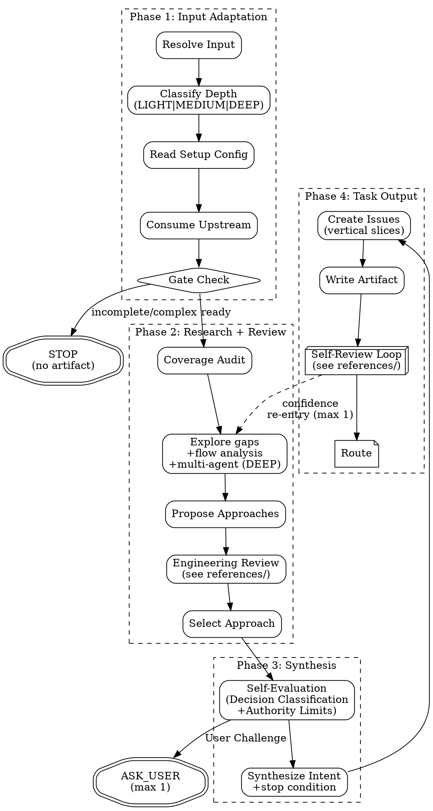

# PGE Plan

Produce one bounded, executable PGE plan artifact at `.pge/tasks-<slug>/plan.md`.

This is a planning skill. It does not execute code, edit implementation files, publish GitHub issues, or invoke `pge-exec`.

## Execution Flow

Follow this flow exactly. Do not skip nodes. Do not reorder phases.



## Anti-Patterns

- **"Let Me Brainstorm Everything First"** — Scale brainstorm to task. If research already recommended, adopt it.
- **"I Should Ask To Be Safe"** — Questions are expensive. Self-evaluate first. Record assumptions instead.
- **"Let Me Plan The Whole System"** — Plan only what was asked. Respect upstream scope.
- **"Issues Should Be Granular"** — Prefer few vertical slices over long micro-task checklists.
- **"Skip The Engineering Review"** — Even simple tasks get a quick scope check.

---

## Phase 1: Input Adaptation

### Resolve Input

Read intent from `ARGUMENTS:` or conversation. Ask only if missing detail is blocking.

### Classify Depth

- **LIGHT** (1-3 files, single module, clear path): Minimal review, 1-2 issues.
- **MEDIUM** (4-8 files, 2-3 modules): Standard review, 2-5 issues.
- **DEEP** (8+ files, cross-module, architectural): Full review, complexity gate, consider phased delivery.

### Read Setup Config

Read `.pge/config/*`. If `docs-policy.md` or `repo-profile.md` exists, treat as project constitution — plan must not contradict it without justification. Missing config: degraded mode for simple tasks.

### Consume Upstream Input

Requires structured upstream input. Does not start from bare prompt.

**Accepted sources:** (1) pge-research brief, (2) Claude plan mode output, (3) brainstorming output, (4) any structured doc with intent/findings/constraints, (5) self-research Agent for simple intents.

**Gate check:**
- Ready: consume.
- Incomplete: STOP. No artifact. Suggest resolving upstream.
- Missing + simple: spawn research Agent.
- Missing + complex: STOP. Suggest `pge-research`.

**Consumption rules:**

| Upstream Content | How to consume | Trust |
|---|---|---|
| Intent / goal | Fill Intent | as-is |
| Findings / evidence | Repo Context | as-is |
| Affected areas | Target Areas | as-is |
| Constraints / non-goals | Non-goals | as-is |
| Options + recommendation | Strong default for approach | strong default |
| Assumptions | Inherit | as-is |
| Open questions (non-blocking) | Risks / Open Questions | pass-through |
| Open questions (blocking) | BLOCK_PLAN | blocker |

---

## Phase 2: Approach Research + Engineering Review

### Coverage Audit

Audit upstream against goal. Mark each requirement: covered / gap to explore / out-of-scope. Do not proceed with silent drops.

### Explore (fill gaps)

Only explore gaps not covered by upstream. Use repo/docs/code before asking user.

- **Multi-agent (DEEP):** Spawn parallel Agents per module gap. Synthesize yourself.
- **Flow analysis (MEDIUM/DEEP, 3+ modules):** Trace data flow end-to-end. Flag interruptions.

### Propose Approaches

Upstream recommended + no contradicting evidence → adopt directly. Otherwise propose 2-3 with tradeoffs.

### Engineering Review

Read `references/engineering-review.md` for full review dimensions. Summary:
- Fix-First principle (repair, don't report)
- Confidence calibration (1-10 score + display rules)
- Scope Challenge (4 questions)
- Architecture Assessment (boundaries, data flow, failure mode registry)
- Test Coverage Pressure (trace happy/edge/error per issue)
- Existing Solutions Check
- Complexity Gate (8+ files → challenge)
- Completeness Score (X/10 per approach)
- Outside Voice (MEDIUM + DEEP — independent challenge Agent)
- Scope Reduction Prohibition (prohibited phrases + 3 valid reasons)

### Select Approach

Commit to one. Record selected/rejected/scope reductions. Override upstream if engineering review finds contradicting evidence.

---

## Phase 3: Plan Synthesis

### Self-Evaluation

**Decision classification:**
- **Mechanical**: one correct answer from code/docs. Decide it. Never ask.
- **Taste**: multiple valid options. Choose, record rationale.
- **User Challenge**: affects goal boundary. ONLY category that may trigger ASK_USER.

**Authority limits** — 3 valid escalation reasons only:
1. Goal boundary ambiguous, code cannot resolve.
2. Missing info, no reasonable default.
3. Dependency conflict makes requirements mutually exclusive.

"Complex", "risky", "non-trivial" are NOT valid reasons.

**Headless mode:** When non-interactive (pipeline/spawned agent/`--headless`), auto-choose lowest-risk for User Challenge decisions, record in Assumptions with LOW confidence.

For each question: record Question, Why it matters, Can repo answer?, Blocking?, Safe assumption?, Risk if unanswered, Decision (SELF_ANSWERED | ASK_USER | ASSUME_AND_RECORD | DEFER_TO_SLICE | BLOCK_PLAN).

### Synthesize Intent

Produce: intent, non-goals, repo context, acceptance criteria, assumptions, **stop condition** (observable "done" state).

**Context budget:** Plan + issues must fit ~50% executor context. >5 detailed issues or 15+ files → split into phased delivery.

---

## Phase 4: Task Output

### Create Numbered Issues

Vertical slices, not micro-tasks. Rules:
- Sequential numbering, no skips
- **Interface-first:** types/contracts before implementations
- **Vertical slices:** each issue cuts all relevant layers. Horizontal only for genuine shared dependencies.

Each issue includes:
- `ID`, `Title`, `Scope`, `Action` (imperative: what to DO)
- `Deliverable` (what must exist when done)
- `Target Areas` (exact paths: Create/Modify)
- `Acceptance Criteria`, `Verification Hint`
- `Verification Type`: AUTOMATED | MANUAL | MIXED
- `Execution Type`: AFK | HITL:verify | HITL:decision | HITL:action
- `Test Expectation`: happy path + edge case + error path (+ integration if boundary)
- `Required Evidence`: what proves done
- `State`: READY_FOR_EXECUTE | NEEDS_INFO | BLOCKED | NEEDS_HUMAN
- `Dependencies`, `Risks`
- `Security`: yes | no (yes if issue touches auth, data access, API boundaries, secrets, or permissions. Triggers stricter Evaluator thresholds.)

### Write Plan Artifact

Write to `.pge/tasks-<slug>/plan.md` (preferred — keeps full pipeline under one task directory) or `.pge/plans/<plan_id>.md` (legacy). ID format: `YYYYMMDD-HHMM-<slug>`.

**Task directory:** pge-research creates `.pge/tasks-<slug>/`. pge-plan writes into it. If the task directory doesn't exist (no prior research), create it. If writing to legacy path, create `.pge/plans/` if needed.

### Self-Review Loop

Read `references/self-review.md` for full protocol (includes `references/multi-round-eval.md` principles). Summary:
- 7 checks: goal-backward, upstream coverage, traceability, placeholder + rationalization scan, consistency, confidence, downstream simulation
- Pressure test: construct one failure scenario per issue after checks pass
- Retry: fix → re-check failed only → max 2 attempts → downgrade to NEEDS_INFO
- Confidence gate: LOW affecting correctness → re-enter Phase 2 Explore (max 1 re-entry)

### Route

- `READY_FOR_EXECUTE`: ≥1 issue ready, no global blocker.
- `NEEDS_INFO`: missing information.
- `BLOCKED`: cannot produce fair plan.
- `NEEDS_HUMAN`: human decision needed.

---

## Handoff To Execute

`pge-exec` reads full plan + `.pge/config/*`. Handoff tells exec: issue order, eligible issues, AFK vs HITL, target areas, acceptance criteria, assumptions to preserve, risks not to ignore.

## Guardrails

Do not: write business code, execute the plan, invoke pge-exec, create run artifacts (`.pge/runs/` or `.pge/tasks-*/runs/`), ask non-blocking questions, ask multiple questions, publish GitHub Issues, use forbidden states.

## Final Response

```md
## PGE Plan Result
- plan_path: .pge/tasks-<slug>/plan.md | .pge/plans/<plan_id>.md (legacy)
- plan_route: READY_FOR_EXECUTE | NEEDS_INFO | BLOCKED | NEEDS_HUMAN
- ready_issues: <ids or None>
- blocked_issues: <ids or None>
- asked_user: yes | no
- assumptions_recorded: yes | no
- engineering_review: completed | skipped — reason
- next_skill: pge-exec | pge-plan (after clarification)
```
