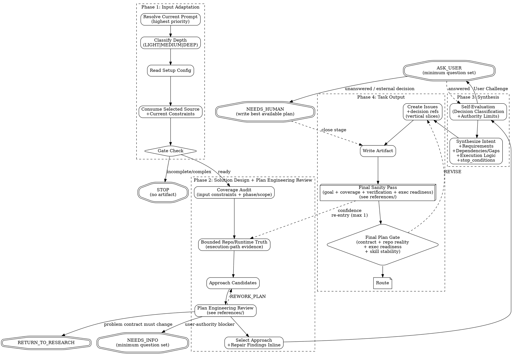

# PGE Plan

Produce one bounded, executable PGE plan contract under `.pge/tasks-<slug>/`: a stable `.pge/tasks-<slug>/plan.md` plus issue-local execution contracts under `.pge/tasks-<slug>/issues/Ixxx.md`. When the plan gate passes with execution allowed, also generate `.pge/tasks-<slug>/workflow-handoff.md` as an optional Dynamic Workflow launch adapter.

Run `pge-plan` in the current main reasoning context. Do not hand core planning, phase/scope interpretation, or semantic ownership decisions to an automatically selected lower-capability planning model. Agents may help with bounded evidence gathering or outside voice review, but main owns the plan contract and final decisions.

This is a planning skill. It does not execute code, edit implementation files, produce implementation pseudocode, publish GitHub issues, invoke `pge-exec`, or launch Dynamic Workflow.

Plan is responsible for **executable solution design**:

```text
intent -> executable approach -> bounded issues -> verification evidence
```

Plan owns intent interpretation inside the inherited problem contract, requirement-boundary confirmation, approach selection, architecture-friction reduction, issue slicing, execution ordering, verification topology, migration/rollout sequencing when relevant, blast-radius minimization, protocol coherence strategy, and execution ergonomics. It must not reopen Research problem discovery, redefine the inherited goal/scope/success shape/non-goals/constraints, or pre-write implementation code.

Plan should reduce execution failure by using existing plan surfaces to expose material ambiguity, stale assumptions, missing validation, forbidden-zone risk, unverifiable claims, or repo mismatches before routing ready. Resolve these through existing fields such as `necessary_context`, `selected_approach`, `issues`, `verification`, `evidence_required`, `terminal_conditions`, `plan_gate_inputs`, or `stop_conditions`; do not add ad hoc protocol fields to encode planning quality goals.

The `plan.md` shape is flexible, but these semantic fields are mandatory:

```text
schema_version
source_contract_check
selected_approach
rejected_approaches
goal
non_goals
necessary_context
issues
target_areas
forbidden_areas
acceptance
verification
evidence_required
terminal_conditions
plan_gate
stop_conditions
route
```

Do not write a long plan to satisfy a template. Write the smallest plan that lets `pge-exec` implement without guessing, while preserving the same semantic target from the user/research input.

For new executable plans, `## issues` in `plan.md` is an Execution Index, not full issue body storage. Each ready issue row must point to a full `issues/Ixxx.md` issue contract. Full issue bodies embedded under `plan.md ## issues` are non-canonical execution input and must be upgraded by `pge-plan` before Final Plan Gate can pass.

Plan specifies implementation path at the contract level, not the coding level. Make direction, requirement boundaries, issue ordering, verification coupling, and proof requirements explicit; do not specify exact code edits, helper functions, abstractions, flags, or test internals unless a public/protocol contract requires named symbols, fields, files, or commands.

`schema_version` is always `plan.v2` for plans produced under this contract.

## Architecture Delta Contract

For MEDIUM/DEEP work, workflow-contract changes, architecture changes, or any plan where a wrong assumption could be executed correctly but wrongly, `pge-plan` must treat the plan as an **Architecture Delta Contract**, not a TODO list.

The contract answers:

```text
current reality -> bounded delta -> target direction
```

Record the contract inside the canonical `.pge/tasks-<slug>/plan.md` using existing plan fields. Do not create a second canonical artifact for this first-class plan model.

The plan must make these dimensions explicit, scaled to task risk:

- **Current reality** — repo/code/runtime/config/artifact facts that the plan relies on, with evidence or source references.
- **Target direction** — the desired architecture, workflow, behavior, or artifact state the current slice moves toward.
- **This delta moves** — the bounded change this plan authorizes.
- **This delta does not move** — adjacent architecture, behavior, workflow, tooling, or validation surfaces deliberately left unchanged.
- **Allowed changes** — target areas and contract surfaces exec may modify.
- **Forbidden zones** — paths, behaviors, route/state/verdict vocabulary, artifact layouts, or responsibilities exec must not touch.
- **Claim/evidence expectations** — plan-relevant claims that need evidence, and what evidence is required for review to trust them.
- **Validation reality** — which checks are cheap execution feedback and which checks are final trust gates such as compile, replay, or equivalent evidence.
- **Stop conditions** — observable conditions that force revise, escalate, reject, clarify, or require a human decision before execution continues.

Plan owns this synthesis. Research supplies intent, discrepancy, evidence, and constraints; plan confirms requirement boundaries, selects the approach, and turns them into an executable Architecture Delta Contract; exec consumes only the passed canonical plan. Do not move this synthesis into research or execution.

Depth scaling:
- LIGHT tasks may collapse this into short statements in `goal`, `non_goals`, `forbidden_areas`, `verification`, and issue behavior contracts.
- MEDIUM/DEEP and workflow-contract plans must expose the dimensions clearly enough that `pge-exec`, Dynamic Workflow, `pge-review`, and Final Plan Gate can detect scope drift, unsupported claims, repo-reality mismatch, and validation-reality confusion.
- MEDIUM/DEEP Architecture Delta Contracts, workflow-contract changes, artifact-schema changes, validation-contract changes, gate/tooling changes, and plans with material forbidden-zone risk must also include `## plan_gate_inputs` using `references/final-plan-gate.md`: declared change types, required claims, evidence schemas, boundary checks, and validation reality.
- If the current slice is only the lightweight Phase 1 of a larger gate/tooling direction, say what later registry/script/schema work is deliberately not moved by this delta.

**Field authority classification:**

Plan inherits authority classification from research and adds its own:

| Authority | Meaning | How exec should treat |
|---|---|---|
| `user_confirmed` | User explicitly stated or confirmed | Authoritative; do not deviate |
| `source_of_truth` | From authoritative upstream source, spec, or referenced document | Inherit as constraint; do not re-litigate |
| `repo_evidence` | Derived from code, docs, config with cited source | High confidence; cite source |
| `inherited_from_research` | Research conclusion with evidence | Inherit; do not re-litigate unless repo contradicts |
| `inferred_by_plan` | Plan inference or design choice | Auditable; exec may flag if implementation contradicts |
| `observed_behavior` | Current repo behavior that may be incidental, not intentional design | **[P0] Not a preservation constraint. Plan must confirm with user or discard before treating as a constraint. Do not inherit as a D-constraint.** |
| `<base authority> / needs_confirmation` | Any claim with base authority `repo_evidence`, `inferred_by_research` mapped to `inherited_from_research`, or another valid authority plus a confirmation suffix | **[P0] Plan must preserve the suffix through mapping, then confirm, lock in acceptance with counterexample tests (`Security: yes`), or route `NEEDS_INFO`. Must not silently ASSUME_AND_RECORD.** |

`/ needs_confirmation` is a suffix, not a standalone authority value. Research may emit `repo_evidence / needs_confirmation` or `inferred_by_research / needs_confirmation`; Plan maps the latter to `inherited_from_research / needs_confirmation`.

Plan must not upgrade `inherited_from_research` or `inferred_by_plan` claims to `user_confirmed` constraints. **[P0] Plan must not upgrade `observed_behavior` or any claim with `/ needs_confirmation` to a preservation constraint without user confirmation.** `RETURN_TO_RESEARCH` is the correct route when plan needs user-confirmed intent that research did not provide.

**Research Contract Override Rule:** When Research has `route: READY_FOR_PLAN`, Plan inherits the Research problem contract as authoritative. Plan may challenge and change `candidate_direction`, selected implementation approach, issue slicing, migration shape, rollout safety, execution topology, and verification strategy. Plan may operationalize Research conclusions into executable acceptance, target areas, issue boundaries, and verification as long as it does not change their semantic meaning.

Plan must not silently override `goal`, `success_shape`, `scope`, `non_goals`, `constraints`, `Implementation Friction.required_plan_adjustment`, or `Progressive Feasibility.first_plannable_objective`. If evidence shows a Research conclusion is wrong, stale, unsafe, or not executable, record the conflict and route to `NEEDS_INFO`, `NEEDS_HUMAN`, or `RETURN_TO_RESEARCH`; do not produce `READY_FOR_EXECUTE` until the problem-contract change is confirmed. Research blocking questions must not become Plan assumptions.

**Reality extraction boundary:** Do not create a separate persisted Reality Extraction artifact. Fold bounded repo/runtime truth extraction into Plan exploration only as needed to design execution path: runtime paths, producer/consumer/validator surfaces, coupling hotspots, verification constraints, migration blockers, rollout/rollback constraints, ownership boundaries, and execution-risk shape.

**Current research contract:** `research.v3` is the only active PGE research contract. If a selected source does not already provide current problem-contract semantics, do not reconstruct them from historical field names; use current source evidence or route `RETURN_TO_RESEARCH` / `NEEDS_INFO`.

## Execution Flow

This flow is the default planning path, not a fixed state-machine ceremony. Preserve the stage ownership and hard route/authorization points, but scale intermediate checks to task risk.



## Anti-Patterns

- **"Let Me Brainstorm Everything First"** — Scale brainstorm to task. If the prompt is plan-ready, plan from it directly. If research already recommended, adopt it.
- **"I Should Ask To Be Safe"** — Questions are expensive. Self-evaluate first. Record assumptions instead. **[P0] Exception: core frictions (safety/correctness/scope boundaries) flagged by Research with `/ needs_confirmation` must be confirmed or acceptance-locked with counterexample tests, not assumed.**
- **"Let Me Plan The Whole System"** — Plan only what was asked. Respect upstream scope.
- **"Let Me Re-Decide The Spec"** — Authoritative upstream decisions are constraints, not fresh options. Plan decides implementation details; it does not re-litigate product behavior, rollout strategy, architecture direction, or scope already settled upstream. **[P0] Exception: observed repo behaviors marked `observed_behavior` or `repo_evidence / needs_confirmation` by Research are not authoritative preservation constraints; confirm or discard.**
- **"Selector Means Ignore The Rest"** — If arguments contain a selector plus extra text, the selector locates an artifact and the remaining text is current user constraint. Consume both.
- **"Issues Should Be Granular"** — Prefer few vertical slices over long micro-task checklists.
- **"Skip Plan Engineering Review"** — Even simple tasks get a compact scope/reuse/verification sanity check.

---

## Phase 1: Input Adaptation

### Resolve Input

Always parse the current prompt first. Current prompt content is the highest-priority input and must never be ignored, even when it also contains a task slug, research path, or other selector. If `ARGUMENTS:` explicitly names a task slug, research path, or other structured upstream input, treat that as the user's selected source and use it without asking again. If the arguments contain both a selector and additional text, treat the selector as the source location and the remaining text as binding current user constraints. Otherwise, on a bare `pge-plan` invocation, discover research artifacts under `.pge/tasks-<slug>/research.md` but do not silently select them. Ask the user to confirm a discovered artifact, choose among multiple artifacts, or choose between a discovered artifact and current conversation context.

Direct prompt planning is a first-class path. A user can invoke `pge-plan <clear intent>` without first running `pge-research`. The plan stage must decide whether that prompt is plan-ready, do the bounded repo exploration needed for planning, and produce `plan.md` when it can fairly define scope, constraints, acceptance, and verification. Route to `NEEDS_INFO` or suggest `pge-research` only when the prompt is too fuzzy, broad, or under-evidenced to plan responsibly.

### Context Intake and Clarification

Plan does not only consume formal research artifacts. It must also consume relevant current context: latest user corrections, interrupted prior attempts, observed failures, pasted logs, challenge/review findings, prior plan-mode notes, and fresh artifacts. Treat that context as input, not as background noise.

Before decomposing into issues, identify the current planning target:

- goal or fix target
- evidence that makes it real
- proposed scope
- explicit non-goals
- uncertainties that would change the plan

Plan may self-research from intent. If the prompt/context is plan-ready but lacks repo facts, do bounded exploration and produce the plan. If the prompt/context identifies a likely problem but the goal, scope, or acceptance is still ambiguous, ask the minimum question set needed for a fair plan. Default to one question for simple direct-prompt planning. The question set should confirm the semantic target, not implementation trivia.

If the user confirms, continue planning. If unanswered and the ambiguity changes the plan, route `NEEDS_HUMAN` or `NEEDS_INFO` instead of inventing a broader fix.

### Classify Depth

- **LIGHT** (1-3 files, single module, clear path): Minimal review, 1-2 issues.
- **MEDIUM** (4-8 files, 2-3 modules): Standard review, 2-5 issues.
- **DEEP** (8+ files, cross-module, architectural): Full review, complexity gate, consider phased delivery.

### Fast Lane (LIGHT with clear intent)

When ALL of these are true:
- Depth = LIGHT (1-3 files, single module)
- No upstream research artifact exists (user came directly to plan)
- Intent is unambiguous (single clear action, not exploratory)
- No security surface

Then:
- Skip Outside Voice (already conditional on MEDIUM+)
- Use LIGHT final sanity pass from `references/self-review.md`: sanity areas 1, 3, and 4, plus area 2 when upstream decisions, non-goals, or source boundaries exist
- Skip pressure test
- Target: 1-2 issues maximum
- Keep the issue surface proportional: do not turn a verification carrier into a new feature, framework, flag, helper layer, or broad validation system unless the current constraints explicitly ask for it
- Expected plan time: under 2 minutes

Fast Lane is the smallest direct prompt path, not the only direct prompt path. MEDIUM and DEEP prompts may also be planned directly when the user gives enough intent, boundaries, and success criteria for Phase 2 exploration and Plan Engineering Review to close the remaining implementation-level gaps.

### Fast Adopt (explicit external plan → PGE contract)

Use this path when the selected source is already an explicit plan — including Claude Code plan mode output, `docs/exec-plans/` documents, gstack/Codex reviewed plans, design execution notes, or a structured design/execution plan — but it is not in canonical `.pge/tasks-<slug>/plan.md` format.

Fast Adopt is allowed for LIGHT, MEDIUM, or DEEP inputs. Depth controls issue count and verification strictness, not whether adoption is available.

The selected source is adoption-ready when its semantics are sufficient to derive the execution contract without inventing scope. The source does not need literal headings or fields; the relevant information may appear in prose, tables, issue lists, review comments, plan-mode output, or other structured notes.

Adoption readiness asks whether Plan can confirm:
- goal and observable success or stop condition
- bounded phase/scope
- implementation decisions and semantic ownership boundaries
- non-goals or exclusions when scope is narrowed
- allowed and forbidden target areas or unambiguous ownership areas
- verification expectations or evidence requirements
- enough ordered work structure to derive executable issues without adding new semantics

These are semantic requirements for input adoption, not required source headings or literal source fields.

When adoption-ready:
- Skip broad option generation and outside-voice approach selection.
- Do not re-decide architecture, rollout strategy, phase boundaries, target ownership, or semantic model.
- Preserve source goal, scope, approach, and reviewed decisions.
- Materialize the source semantics into the canonical plan template, including `forbidden_areas` and `plan_gate`.
- Use `plan_route: READY_FOR_EXECUTE` or `READY_FOR_EXECUTE_WITH_ASSUMPTIONS` only after the Final Plan Gate passes. Use `READY_FOR_EXECUTE_WITH_ASSUMPTIONS` only when assumptions are explicit, mechanical, and non-scope-changing.
- Materialize PGE execution contract fields: issue slices, target areas, acceptance, verification, dependencies, execution type, evidence required, and stop condition.
- Split into the smallest number of execution issues needed for `pge-exec`; issue slicing may decide order and grouping but must not add scope.
- Mark `fast_adopt: true` and record the source path or `claude_plan_mode` source in Metadata.
- Run Coverage Audit, Plan Engineering Review (mandatory for MEDIUM/DEEP plans), and Final Plan Gate against source fidelity: missing semantics, unauthorized expansion, issue traceability, acceptance/verification coverage, repo reality, and execution readiness.

**Fast Adopt validation:**

Fast Adopt must validate that the external plan semantically provides goal, bounded phase/scope, approach or fixed implementation decisions, issues or ordered work, acceptance/verification meaning, and evidence expectations. If the source lacks canonical headings or PGE fields, Fast Adopt may materialize them. If the source lacks required semantics, Fast Adopt must stop with `NEEDS_INFO` or leave Fast Adopt for normal planning when current user intent allows. It must not supplement missing semantics as assumptions. Fast Adopt must not silently replan; it should preserve the external plan's approach and only add missing execution-required fields.

If converting the source requires choosing new scope, adding helpers/flags/cleanup/abstractions, inventing target areas, inventing acceptance criteria, resolving undecided semantic ownership, or changing phase boundaries, Fast Adopt must stop with `NEEDS_INFO` or route to the normal pge-plan path. Do not silently turn adoption into replanning.

Input and output have different requirements: input only needs adoption-ready semantics; output must materialize those semantics into `.pge/tasks-<slug>/plan.md` as the canonical `plan.v2` execution contract.

### Read Setup Config

Read `.pge/config/*`. If `docs-policy.md` or `repo-profile.md` exists, treat as project constitution — plan must not contradict it without justification. Missing config: degraded mode for simple tasks.

### Consume Upstream Input

`pge-plan` consumes a selected source plus any current user constraints, then produces `plan.md`. The selected source can be a direct user prompt, research artifact, user-specified file/slug, structured notes, or clear intent.

If the user invoked `pge-plan <task-slug>` or `pge-plan .pge/tasks-<slug>/research.md`, that explicit selector is consent to consume the matching artifact. If the same invocation includes trailing instructions, those trailing instructions are not commentary; they are current user constraints and outrank derived summaries when they narrow scope, prohibit additions, define allowed files, or change verification expectations. If the user invoked `pge-plan <clear prompt>`, that explicit prompt is consent to plan from the prompt directly unless it conflicts with an explicitly selected artifact. If the user invoked bare `pge-plan`, artifact discovery is only a proposal: confirm before consuming a single discovered research artifact, ask the user to choose when multiple artifacts exist, and ask the user to choose when both a discovered artifact and current context look valid. Direct planning from intent remains supported when the current prompt/context is plan-ready.

### Input Priority Interpretation

Before Coverage Audit, build an internal input-priority interpretation. Use it to decide what must be inherited, what can be treated as evidence, and what must be overridden.

| Input Source | Role | Priority | Handling |
|---|---|---|---|
| Current user prompt / trailing arguments | hard constraint, latest override, or selected scope | highest | reflect in Intent, Non-goals, Target Areas, issue boundaries, and Verification; never ignore |
| `docs/exec-plans/` document explicitly selected or referenced | canonical planning source | high | preserve phase, scope, semantic ownership, non-goals, and success criteria; do not re-decide its authorized boundary |
| Original user-provided source, spec, issue, design doc, or referenced source-of-truth file | source of truth | high | read when referenced by the selected source or current user; preserve requirements, decisions, boundaries, phases, and success criteria |
| Repo code/docs/config | evidence | high | confirm feasibility and stale assumptions; may contradict upstream with cited evidence |
| `pge-research` brief or other summary artifact | derived summary | medium | consume as compressed understanding, but do not let it erase original source constraints or current user constraints |
| Prior notes, old plans, or non-authoritative summaries | context | low | use only when consistent with higher-priority inputs |

When planning from a `docs/exec-plans/` document, boundary fidelity is the primary quality bar. Preserve the document's phase/scope decisions and semantic ownership exactly unless the current user explicitly overrides them or repo evidence proves a contradiction. Do not add helpers, flags, cleanup, validation systems, broader refactors, or "nice" abstractions that the exec plan did not authorize. In domain-specific planning, treat correctness and semantic ownership as higher priority than generic task breakdown polish.

If a derived research artifact names or depends on an original source-of-truth artifact, and the current planning decision depends on scope, boundaries, rollout, verification, phase position, or "only allowed addition" constraints, read the original source too. Do not plan from a derivative summary alone when the summary is incomplete for those decisions.

If priorities conflict:
- Latest explicit user constraints win over older artifacts.
- The current prompt wins over selected artifacts, derived summaries, and prior plans.
- Repo evidence can override an artifact only with a cited contradiction.
- A derived summary cannot override its original source unless it records an explicit user-approved scope decision.
- Record every override in `Decision Overrides`.

**Primary protocol-aligned source:** `pge-research` brief.

**Other supported planning inputs when semantically sufficient:** direct prompt or current conversation context, approved `spark.v1` specs, Claude plan mode output, challenge/review findings, logs, failed attempts, other current-context evidence, structured docs with intent/findings/constraints, and bounded self-research inside `pge-plan` for plan-ready prompts.

An approved `spark.v1` spec is a planning source, not a peer research contract. Plan either translates it into canonical `plan.v2` or routes upstream when goal, scope, success shape, or constraints are still not fair to execute.

**Gate check:**
- Ready: consume.
- Incomplete: STOP. No artifact. Suggest resolving upstream.
- Prompt/context plan-ready + no selected artifact: plan directly. Use Phase 2 exploration to fill repo facts and implementation-level gaps.
- Prompt/context fuzzy or exploratory: STOP. Suggest `pge-research`.
- Missing + simple: use Fast Lane direct planning from clear intent.
- Missing + complex but plan-ready: plan directly with MEDIUM/DEEP review.
- Missing + complex and not plan-ready: STOP. Suggest `pge-research`.
- Bare `pge-plan` invocation with one discovered `.pge/tasks-<slug>/research.md`: ask the user to confirm before consuming it.
- Bare `pge-plan` invocation after research, but no `.pge/tasks-<slug>/research.md` can be discovered: plan directly only if current prompt/context is plan-ready; otherwise ask the user to run `pge-research` first.
- Explicit continuation requested for a prior research task, but `.pge/tasks-<slug>/research.md` is missing: STOP. Report broken handoff instead of silently pretending the research artifact exists.
- A discovered research artifact and the current conversation both look like valid upstream sources: ask the user which one to use instead of guessing.
- Multiple plausible research artifacts and no explicit selector: ask the user which task to continue instead of guessing.

**Source Contract Check:**

When consuming a research brief or structured upstream input, verify before proceeding to approach design:

| Check | Condition | Route |
|---|---|---|
| Intent confirmed | research.v3 `goal` is present and specific, or a non-Research external source has an equivalent current goal | CONTINUE_TO_PLAN |
| Scope explicit | research.v3 `scope`/`non_goals` names boundaries, or a non-Research external source has equivalent current boundaries | CONTINUE_TO_PLAN |
| Success shape usable | `success_shape` or equivalent is observable and plan-convertible | CONTINUE_TO_PLAN |
| Intent not confirmed | goal is still fuzzy, multiple unresolved framings | RETURN_TO_RESEARCH |
| Success shape missing or vague | cannot derive acceptance criteria from it | RETURN_TO_RESEARCH |
| Blocking ambiguity unresolved | ambiguities with `blocks_plan: yes` remain open | NEEDS_INFO |

Route `RETURN_TO_RESEARCH` when intent or success shape is not confirmed and plan cannot fairly produce executable issues without inventing user intent. Route `NEEDS_INFO` when a specific blocking question can be answered by the user directly. `CONTINUE_TO_PLAN` means the input is plan-ready.

**Consumption rules:**

| Upstream Content | How to consume | Trust |
|---|---|---|
| Direct prompt / current context | Intent + Coverage Audit baseline | latest user instruction authoritative |
| Selector plus trailing text | selector locates source; trailing text becomes Current Constraints | trailing text highest priority |
| Original source-of-truth referenced by selected source or current user | Input Priority + Plan Constraints + Coverage Audit | high authority |
| Derived summary of an original source | Repo Context + defaults for missing plan fields | medium; cannot erase original/current constraints |
| Intent / goal | Fill Intent | as-is |
| Findings / evidence | Repo Context | as-is |
| Affected areas | Target Areas | as-is |
| Constraints / non-goals | Non-goals | as-is |
| Structured intent / spec decisions | Intent + Plan Constraints + Decision Coverage | authoritative unless contradicted |
| Clarifying notes / open questions | Coverage Audit + Open Questions; risk notes only when relevant | blocking items stay blocking |
| Zoom-Out Map | Repo Context + Target Areas + Architecture Assessment | preferred compressed system map; do not redo unless insufficient or contradicted |
| Synthesis Summary: Stated / Inferred / Out | Intent, Assumptions, Non-goals | stated/out authoritative; inferred auditable |
| Upstream Requirement Ledger / Spec Coverage | Coverage Audit | authoritative trace input |
| Decision Log / upstream spec decisions | Plan Constraints + Decision Coverage | authoritative |
| Rollout strategy / compare mode / flags / gray rollout | Issue verification strategy + risk notes when relevant | authoritative |
| Monitoring metrics / success-fail counters | Evidence Required + Verification | authoritative |
| Multi-phase structure | Phase Boundary + issue selection | authoritative unless explicitly overridden |
| Upstream risk assessment | Issue-level risk notes when relevant | inherit, do not reinvent |
| Options + recommendation | Approach candidates | advisory input only |
| Assumptions | Inherit | as-is |
| Open questions (non-blocking) | Open Questions; risk notes only when relevant | pass-through |
| Open questions (blocking) | BLOCK_PLAN | blocker |

**pge-research adaptation:**

When the selected source is a `pge-research` brief, identify `schema_version` and consume it through the matching adapter.

**research.v3 (current):**

1. **Route gate.** Continue only when `route: READY_FOR_PLAN`. If route is `NEEDS_USER`, stop with `NEEDS_INFO` and direct the user to answer the research blocking question, then rerun `pge-research`; do not produce a ready plan from a non-ready research artifact. If route is `NEEDS_REPO_EVIDENCE`, route `RETURN_TO_RESEARCH` unless the current user prompt explicitly overrides the selected research artifact and authorizes direct planning from current context. If route is `BLOCKED`, stop and do not produce a plan artifact.
2. **Source Contract Check.** Verify required v3 fields are present and usable, or explicitly `none` / `not_applicable`: `goal`, `success_shape`, `scope`, `non_goals`, `constraints`, relevant user/repo/architecture context, assumptions, `candidate_direction`, `rejected_framings`, blocking and non-blocking questions, route, and route reason. `blocking_questions` must be empty for `READY_FOR_PLAN`, and any conditional gate must have the field Plan must consume. Missing required v3 fields or a non-ready route must not be silently guessed.
3. **Field mapping.** Consume v3 fields as follows: `Spec Discovery.goal` → plan goal; `success_shape` → acceptance baseline; `scope` and `non_goals` → plan scope/non-goals; `constraints` → Plan Constraints/forbidden areas; `Context.assumptions` → assumptions; `relevant_repo_or_architecture_context` → repo context; `Direction.candidate_direction` → approach candidate only; `Direction.rejected_framings` → rejected approach/framing inputs; open questions → open questions, blockers, or risk notes when relevant.
4. **Implementation Friction.** If present, cover `required_plan_adjustment` in constraints, issue scope, rejected approaches, or verification/evidence expectations.
5. **Progressive Feasibility.** If present, plan around `first_plannable_objective` as the current plan target, not the full `direct_goal`. Record `direct_goal` and `deferred_goal_parts` as context, non-goals, or phase boundary for this slice. The current plan must not target `direct_goal` when `first_plannable_objective` exists.
6. **Plan owns approach selection.** `candidate_direction` is not a selected approach. Plan selects the implementation approach through Plan Engineering Review.
7. **Source Authority Check.** When consuming research or upstream input, classify each material claim using the Field authority classification table above before using it as a plan constraint or decision basis. When Research supplies `Optional: Authority Notes`, consume them as the initial authority classification for those claims; map Research `inferred_by_research` to Plan `inherited_from_research`. **[P0] A `/ needs_confirmation` suffix is part of the classification and must be carried through the mapping, not stripped: `inferred_by_research / needs_confirmation` → `inherited_from_research / needs_confirmation`, and `repo_evidence / needs_confirmation` stays `repo_evidence / needs_confirmation`. Any claim still carrying the suffix after mapping must be confirmed, locked into acceptance, or routed `NEEDS_INFO` per the authority table — never silently demoted to a plain inherited constraint.**

**Non-canonical selected sources:**

If the selected source is not `research.v3`, consume only the current semantics it actually provides: goal, success shape, scope, non-goals, constraints, decisions, relevant risk notes, and evidence. Do not treat legacy Research-shaped docs or old handoff-style artifacts as supported Research contracts. If the source cannot stand on its own current semantics, route `RETURN_TO_RESEARCH` or `NEEDS_INFO` instead of reconstructing intent from obsolete Research field names.

**Current constraint extraction:**

Treat these phrases and equivalents as hard constraints:
- "only", "唯一", "just", "no other", "不要", "不加", "不做", "scope is", "must", "must not"
- file-limited instructions such as "X is the only addition point"
- verification-limited instructions such as "use this offline tool as validation"
- no-feature instructions such as "do not add flags/helpers/runtime gates/tests unless required"

For each hard constraint, map it to at least one of: `Plan Constraints`, `Non-goals`, `Target Areas`, `Acceptance Criteria`, `Verification`, or an issue `Scope`. If a hard constraint cannot be honored, route `NEEDS_HUMAN` or record a `Decision Override` with why user confirmation is required.

**Decision authority:**
- Spec-level decisions from upstream are authoritative: product behavior, scope boundary, rollout strategy, monitoring metrics, phase structure, architecture direction, explicit non-goals.
- Implementation-level choices are plan-owned: concrete file ordering, interface boundaries, issue slicing, test commands, local code patterns, and dependency sequencing.
- Override a spec-level decision only when repo evidence contradicts it or requirements conflict. Record the override as Decision / Rationale / Alternatives considered, and mark whether user confirmation is required.
- **[P0] Observed behaviors flagged `observed_behavior` or with `/ needs_confirmation` in Research Authority Notes are NOT authoritative preservation constraints. Confirm with user or discard; do not inherit as D-constraints without evidence they are intentional.**

---

## Phase 2: Solution Design + Plan Engineering Review

### Coverage Audit

Audit inputs against the goal in priority order. Mark each requirement or hard constraint: covered / gap to explore / out-of-scope. Also audit every upstream spec decision: inherited / overridden / missing. Do not proceed with silent drops.

Coverage Audit must include:
- current user constraints from prompt/trailing arguments
- `docs/exec-plans/` phase/scope decisions when that document is selected or referenced
- original source-of-truth requirements and boundaries when available
- research-derived requirements and assumptions
- current-source decisions
- repo evidence that confirms, contradicts, or narrows the above

If `docs/exec-plans/` is the canonical input, audit proposed issues against the source document before writing them. Any issue that introduces unrequested helpers, flags, cleanup, validation expansion, broad refactors, or abstraction work must either cite explicit authorization from the exec plan/current user or be removed.

Spec decisions coverage is mandatory when upstream contains a `Decision Log`, rollout strategy, monitoring metrics, phase structure, risk assessment, or equivalent spec-level decision. Every such decision must appear in `Plan Constraints`, a specific issue's `upstream_decision_refs`, `Verification`, or an explicit override record.

Do not revive obsolete Research compatibility fields during Coverage Audit. If a selected source depends on old Research-only field names instead of expressing current semantics directly, stop and route `RETURN_TO_RESEARCH` or `NEEDS_INFO` rather than carrying those fields forward into the plan.

### Explore (fill gaps)

Only explore gaps not covered by upstream. Use repo/docs/code before asking user.

- **Multi-agent (DEEP):** Spawn parallel Agents per module gap. Synthesize yourself.
- **Flow analysis (MEDIUM/DEEP, 3+ modules):** Trace data flow end-to-end. Flag interruptions.
- **Context quarantine:** When a gap requires broad or cross-module search but planning only needs the answer, consider delegating the search to an Agent. Use direct exploration for narrow gaps where delegation overhead would exceed the context savings. Consume only the Agent's compact conclusion, evidence paths, confidence, and discarded dead ends.

### Propose Approaches

Treat upstream `candidate_direction`, recommendations, and foreign-plan options as candidates, not selected implementation. If one candidate clearly satisfies the inherited problem contract with lowest risk and no contradicting repo evidence, select it through Plan Engineering Review and record why. Otherwise compare 2-3 implementation-level approaches with tradeoffs.

Do not propose alternatives for authoritative problem-contract fields or spec-level decisions. Only propose alternatives for implementation-level choices or for upstream decisions contradicted by repo evidence.

### Plan Engineering Review

Read `references/engineering-review.md` for the detailed review dimensions and `references/engineering-review-gate.md` for the compact Phase 2 reference. `pge-plan` owns when the review runs and how findings affect the plan; those references own the detailed review semantics.

Plan Engineering Review is:
- **Mandatory** for MEDIUM/DEEP plans
- **Optional** for LIGHT plans
- a decision-hardening layer, not an execution authorization gate

Before Final Plan Gate:
- consume review findings into `selected_approach`, `## issues`, issue files, `acceptance`, `verification`, and risk-triggered notes
- run the Inconsistency Grill from `references/engineering-review.md`
- record contradictions and repairs in `Plan Grill Log`
- record any justified upstream override, scope exception, or confirmation-required deviation in `Decision Overrides`

`NEEDS_INFO` means ask the minimum question set needed for a fair plan when user authority is required, then rerun only the affected checks.

### Final Plan Gate

Read `references/plan-gate.md` for the authoritative gate contract. Read `references/final-plan-gate.md` only when structured `## plan_gate_inputs` are required. These references own gate layers, structured inputs, boundary checks, and repair rules.

Within `SKILL.md`, the stable contract is:
- Final Plan Gate is the only execution authorization validator
- run it in the order defined by `references/plan-gate.md`
- use the exact verdict vocabulary from the references
- apply at most one inline repair pass per failed layer, then rerun only the affected layer plus downstream layers
- no ready route without `Verdict: PASS` and `Exec Allowed: yes`

### Review / Gate Result Normalization

All plan-stage reviews and gates use a unified result vocabulary to prevent downstream confusion:

| Surface | Result vocabulary |
|---|---|
| Source Contract Check | `CONTINUE_TO_PLAN` &#124; `RETURN_TO_RESEARCH` &#124; `NEEDS_INFO` &#124; `BLOCKED` |
| Plan Engineering Review | `PASS` &#124; `REWORK_PLAN` &#124; `RETURN_TO_RESEARCH` &#124; `NEEDS_INFO` |
| Final Plan Gate | `PASS` &#124; `REVISE` &#124; `ESCALATE` &#124; `REJECT` |
| Plan-level route | `READY_FOR_EXECUTE` &#124; `READY_FOR_EXECUTE_WITH_ASSUMPTIONS` &#124; `RETURN_TO_RESEARCH` &#124; `NEEDS_INFO` &#124; `BLOCKED` &#124; `NEEDS_HUMAN` |

Do not invent result values outside these vocabularies. Do not use exec-stage or review-stage vocabulary (`SUCCESS`, `PARTIAL`, `BLOCK_SHIP`, `NEEDS_FIX`, `READY_TO_SHIP`) in plan-stage results.

### Additional Review And Gate Handling

- Ready routes must satisfy the downstream `pge-exec` contract. Use the exact Execution Index, issue-file, terminal-condition, forbidden-area, and handoff checks from `references/plan-gate.md` rather than restating them here.
- When a compact per-check record helps, use the `### Quality Check Results` shape from `templates/plan.md`; do not invent alternate schemas or numeric scorecards.
- Optional review dimensions such as Experience Context Check, depth-scaled non-engineering skips, and the Inconsistency Grill are defined in `references/engineering-review.md`.
- Use `Decision Overrides` for explicit upstream overrides, required scope exceptions, or confirmation-required deviations.
- Use `Plan Grill Log` for grill checks, contradictions, resolutions, and source/evidence.

### Coherence Verification for High-Risk Surfaces

When a plan changes any of these surfaces, generated issues must include acceptance criteria or verification that checks producer / consumer / validator / evidence coherence:

- semantic contracts (skill contracts, handoff schemas, artifact layouts)
- route / state / verdict vocabulary
- public APIs or CLI interfaces
- schemas, manifests, or config that other components consume
- shared helpers or behavior with downstream consumers

For each affected surface, the issue's acceptance or verification must identify:
- **Producer**: what writes or defines the value/contract
- **Consumer**: what reads, executes, or depends on it
- **Validator**: what accepts or rejects it (gates, checks, tests)
- **Evidence**: proof that the post-change contract is internally consistent across all three

Grep can support coherence evidence but cannot be the sole proof for semantic-contract correctness. A grep hit confirms a string exists; it does not confirm that the producer's output, the consumer's expectation, and the validator's acceptance criteria still agree after the change.

This guidance does not require inspecting the entire repo. Scope the coherence check to the changed surface and its direct producers, consumers, and validators.

### Verification Coupling And Parallel Safety

Before writing issue dependencies, classify whether planned issues share a verification surface and make ordered execution semantics explicit.

**Execution order semantics:**

- Issue numbering is the baseline recommended execution order.
- `Depends On` records hard prerequisites or stricter sequencing constraints.
- `Verification Coupling` records where verification cannot be trusted in pure issue-ID isolation.
- Every non-independent issue must name the first trustworthy verification point and safe execution strategy.

**Verification coupling** classifies how issues can be verified:

- **independent**: issue can be verified in isolation (tests pass, behavior observable)
- **coupled**: multiple issues must complete before verification is trustworthy
- **serial**: issues must be verified in order (later issues depend on earlier verification)
- **integration-only**: no meaningful verification until final integration point

**Coupling detection:**

- Same build graph, compile unit, generated artifact set, test suite, app startup, or integration command → compile-coupled / verification-coupled.
- Pure docs/text edits or independent scripts outside a shared build graph → not coupled unless their verification command is shared.

For coupled issues, the plan must prevent same-working-tree contamination by doing at least one of:
- add explicit issue dependencies so implementation and verification occur in a safe order,
- require serial integration verification in issue-ID order after the first trustworthy verification point is reachable,
- state that isolated worktrees are required for parallel authoring.

Do not rely on non-overlapping Target Areas alone as proof of parallel safety. If two issues can make the same verification command fail, record the coupling in the issue `Risks`, `Dependencies`, or `Verification Coupling` field and in `Handoff To Execute`. Runtime scheduling still belongs to `pge-exec` / Dynamic Workflow; Plan only emits order, dependency, coupling, and safety semantics.

### Select Approach

Commit to one. Record selected/rejected/scope reductions as Decision / Rationale / Alternatives considered. Override upstream only if Plan Engineering Review finds contradicting evidence or an explicit requirement conflict.

---

## Phase 3: Plan Synthesis

### Self-Evaluation

**Decision classification:**
- **Mechanical**: one correct answer from code/docs. Decide it. Never ask.
- **Taste**: multiple valid options. Choose, record rationale.
- **User Challenge**: affects goal boundary. ONLY category that may trigger ASK_USER.
- **[P0] Core Friction (from Research)**: Research flagged with `/ needs_confirmation`. Must confirm or lock in acceptance with counterexample tests and `Security: yes` tagging. Cannot silently ASSUME_AND_RECORD if failure mode is data corruption/double-publish/stealing active work/irreversibility.

**Authority limits** — valid escalation reasons:
1. Goal boundary ambiguous, code cannot resolve.
2. Missing info, no reasonable default.
3. Dependency conflict makes requirements mutually exclusive.
4. **[P0] Core friction flagged with `/ needs_confirmation` by Research where a wrong default causes safety/correctness failure.**

**[P1] Safety amplifier:** When a design choice's failure mode is data corruption, double-publish, stealing in-flight work, or irreversibility, auto-upgrade from Taste to Core Friction. Either confirm or lock the threshold/predicate/boundary in acceptance with counterexample tests and `Security: yes`.

"Complex", "risky", "non-trivial" are NOT valid reasons by themselves unless they cross into the safety failure modes above.

**Headless mode:** When non-interactive (pipeline/spawned agent/`--headless`), auto-choose lowest-risk for User Challenge decisions, record in Assumptions with LOW confidence. Core Friction and safety-amplified decisions must not auto-choose in headless; route `NEEDS_INFO`.

For each question: record Question, Why it matters, Can repo answer?, Blocking?, Safe assumption?, Risk if unanswered, Decision (SELF_ANSWERED | ASK_USER | ASSUME_AND_RECORD | DEFER_TO_SLICE | BLOCK_PLAN | LOCK_IN_ACCEPTANCE).

### Synthesize Intent

If the upstream source has current `research.v3` fields, carry `goal`, `success_shape`, `scope`, `non_goals`, `constraints`, relevant context, assumptions, open questions, and any conditional gate outputs through as the plan's intent baseline instead of rewriting a weaker intent. Add only execution-level detail: stop condition, code-level acceptance criteria, issue boundaries, and verification expectations.

Current `research.v3` is the only active PGE Research baseline. If the explicitly selected source is not `research.v3`, consume only the current semantics it actually provides and keep it as non-canonical source evidence unless `pge-plan` rewrites it into canonical `plan.v2`. Do not treat legacy Research artifacts or old handoff-style docs as active Research inputs.

Produce: structured intent, plan constraints, non-goals, repo context, acceptance criteria, assumptions, **stop condition** (observable "done" state).

### Success Shape → Acceptance + Verification Trace

Before writing major acceptance criteria, trace each to its source. This proves acceptance is derived from user intent, not invented, and that verification/evidence still points back to the same source.

| Acceptance Criterion | Source | Source Type | Acceptance Trace | Verification / Evidence Trace |
|---------------------|--------|-------------|------------------|-------------------------------|
| <criterion> | <research success_shape / upstream constraint / current prompt / technical approach> | success_shape / upstream / prompt / technical | <why this criterion follows> | <how verification/evidence proves this criterion> |

**Source types:**
- `success_shape`: derived from research `success_shape`, `experience_success_shape`, or `what_would_disappoint`
- `upstream`: derived from upstream contract, spec decision, or constraint
- `prompt`: derived directly from current user prompt when no research exists
- `technical`: added to support the selected approach (must not expand scope)

**Rules:**
- Every major acceptance criterion must trace to at least one source
- Every major acceptance criterion must also point to the verification/evidence that proves it
- Technical acceptance criteria are valid only when they support the selected approach — they must not introduce new features, expand scope, or add requirements the user did not ask for
- If success shape is missing or unusable (vague, contradictory, or cannot derive acceptance), route `RETURN_TO_RESEARCH` or `NEEDS_INFO` — do not silently invent acceptance criteria
- The trace supports both technical success (code works correctly) and human-facing/artifact-facing success (user intent is satisfied)

**Depth scaling:**
- LIGHT plans with 1-2 obvious criteria from a clear prompt: a single sentence trace is sufficient (e.g., "All criteria derive directly from the user prompt requesting X, and the verification/evidence section proves those criteria directly.")
- MEDIUM/DEEP plans: use the trace table for major criteria

**Context budget:** Plan + issues should fit comfortably inside the executor's useful context, with ~50% as an operational ceiling for normal work. >5 detailed issues or 15+ files → split into phased delivery. Prefer fewer vertical slices with complete acceptance criteria over one large plan that forces `pge-exec` to carry stale research, dead ends, and irrelevant raw output.

If upstream defines a multi-phase plan, inherit the phase structure. Produce issues only for the current phase unless the user explicitly asked to plan all phases. Record the phase boundary and what remains deferred.

### Scope Compression For Constrained Tasks

When current constraints specify a unique allowed addition point or prohibit extra machinery, treat that as a hard issue-boundary rule:
- Target Areas must include only the replacement area and the allowed addition point unless repo evidence proves another file is required.
- Non-goals must explicitly list prohibited additions such as new flags, helper files, runtime gates, broad abstractions, or unrelated tests.
- Verification must explain whether the allowed addition point is a verification carrier, not a new product feature.
- Any extra touched file requires a Decision Override with rationale and user confirmation if it changes scope.

---

## Phase 4: Task Output

### Create Numbered Issues

Vertical slices, not micro-tasks. Rules:
- Sequential numbering, no skips. Issue numbering is the baseline recommended execution order for ready work.
- **Interface-first:** types/contracts before implementations
- **Vertical slices:** each issue cuts all relevant layers. Horizontal only for genuine shared dependencies.
- **Closed-loop execution unit:** each ready issue must be independently actionable from `goal`, `plan_context`, `change`, `target_areas`, `recommended_approach`, `forbidden`, and `validation`. If the issue cannot be verified independently, record the exact verification coupling, first trustworthy verification point, and safe execution strategy in the index or optional risk-triggered context.
- **Split / merge pressure:** split oversized issues that hide multiple outcomes or failure modes; merge over-thin issues that only add a field, rename, placeholder, or check without producing a verifiable issue-local outcome.

`plan.md ## issues` contains only the Execution Index. Each index row includes:
- `ID` (baseline recommended execution order)
- `File`
- `Title`
- `State`: READY_FOR_EXECUTE | NEEDS_INFO | BLOCKED | NEEDS_HUMAN
- `Depends On` (hard dependency constraints)
- `Verification Coupling`: none | independent | compile-coupled with <issue IDs> | shared verification with <issue IDs> | integration-only until <verification point> | isolated worktrees required | serial verification required
- `Execution Type`: AFK | HITL:verify | HITL:decision | HITL:action
- `Security`: yes | no
- optional compact scheduling hints that must not contradict issue numbering, `Depends On`, or `Verification Coupling`

Each full issue file under `issues/Ixxx.md` includes:
- `goal`
- `plan_context` (semantic plan intent, decision, phase, or slice only)
- `change`
- `target_areas`
- `recommended_approach`
- `forbidden`
- `validation`

Optional issue fields may be added only when they reduce execution ambiguity or are risk-triggered: stop-if conditions, source refs, risk notes, key interfaces, trigger/output predicates for conditional behavior, verification coupling details, performance checks, simplification checks, or deeper behavior context. They are not part of the default Generator hot path.

Do not embed full issue files under `plan.md ## issues`. If the selected source contains embedded issue bodies, write the compact index in `plan.md` and move the full execution contracts into `issues/Ixxx.md`.

When issues are compile-coupled or share a verification surface, `Dependencies`, `Risks`, and `Verification Coupling` must make the safe execution strategy explicit. If safe parallel execution requires isolated worktrees, say so; otherwise require serial verification. Do not leave this for `pge-exec` to infer from Target Areas alone.

### Write Plan Artifact

The stable plan artifact MUST be written to `.pge/tasks-<slug>/plan.md`, and full issue contracts MUST be written to `.pge/tasks-<slug>/issues/Ixxx.md`. This `.pge/` task directory is canonical. Notes outside `.pge/` are non-authoritative and must not replace the required pipeline artifacts. ID format: `YYYYMMDD-HHMM-<slug>`.

Use `templates/plan.md` as a contract scaffold, not a fixed prose shape. Required semantics are binding; optional sections should appear only when they help `pge-exec` execute, help Dynamic Workflow interpret the same plan, or help review detect scope drift.

**Task directory:** pge-research creates `.pge/tasks-<slug>/`. pge-plan writes into it. If research was skipped, pge-plan creates the task directory and then writes `plan.md` there:

```bash
mkdir -p .pge/tasks-<slug>/
mkdir -p .pge/tasks-<slug>/issues/
```

### Write Workflow Handoff Adapter

When the final route is `READY_FOR_EXECUTE` or `READY_FOR_EXECUTE_WITH_ASSUMPTIONS`, the Final Plan Gate verdict is `PASS`, and `exec_allowed: yes`, render `templates/workflow-handoff.md` to `.pge/tasks-<slug>/workflow-handoff.md` by replacing only `<slug>`.

Do not parse issues, copy acceptance criteria, generate a workflow graph, create a task tree, define subagent roles, or create workflow runtime state. `workflow-handoff.md` is a launch adapter for Dynamic Workflow, not a second plan or execution contract. It must reference `.pge/tasks-<slug>/plan.md` as the source of truth, name `.pge/tasks-<slug>/workflow-result.md` as evidence backflow, and preserve plan-derived issue-number order, hard dependencies, verification coupling, first trustworthy verification points, and parallel/serial safety semantics without becoming a scheduler spec.

Do not generate `workflow-handoff.md` when the plan route is `RETURN_TO_RESEARCH`, `NEEDS_INFO`, `BLOCKED`, or `NEEDS_HUMAN`, when the Final Plan Gate did not pass, when `exec_allowed: no`, or when no issue files were written.

After rendering, perform a lightweight adapter check:
- `.pge/tasks-<slug>/workflow-handoff.md` exists.
- It contains `@.pge/tasks-<slug>/plan.md`.
- It contains `.pge/tasks-<slug>/workflow-result.md`.
- It does not copy issue details, acceptance criteria, or verification details from the plan.
- It preserves issue-number baseline order, hard `Depends On` semantics, and non-independent `Verification Coupling` semantics.
- It does not define a reusable workflow graph, phase graph, task DAG, dependency JSON, task tree, or subagent topology.
- Its result requirements include `Provenance`.
- Its result requirements include `Adversarial review`.
- Its status mapping does not introduce new PGE route vocabulary.
- It contains `Pattern / Budget Hints`.
- It does not default to recurring `/loop` behavior for one-shot implementation plans.
- Any native code-review mention is optional supporting evidence only and explicitly does not create a shipping route or required dependency.

### Final Sanity Pass

Read `references/self-review.md` for the focused sanity pass. Summary:
- Confirm goal-backward fit: the issues, acceptance, and stop condition still satisfy the inherited problem contract.
- Confirm coverage: current prompt constraints, upstream decisions, non-goals, target areas, and forbidden areas are not silently dropped.
- Confirm verification and evidence: every acceptance criterion has a proving check or required evidence, and weak proof is repaired before Final Plan Gate.
- Confirm exec/workflow readiness: issue contracts are concrete enough for `pge-exec` or Dynamic Workflow to start without guessing.
- Confirm workflow handoff readiness for executable plans: the adapter exists only for ready plans, points to the canonical plan, and does not become a second plan.

Fix failures inline once and rerun only the failed sanity area. If a failure would change goal, scope, success shape, or user authority, route `NEEDS_INFO` or `RETURN_TO_RESEARCH` instead of turning the sanity pass into another planning loop.

### Route

Plan-level routes (final plan output):

- `READY_FOR_EXECUTE`: ≥1 issue ready, no global blocker.
- `READY_FOR_EXECUTE_WITH_ASSUMPTIONS`: used by `pge-plan` fast-adopt when a complete external plan requires explicit mechanical assumptions.
- `RETURN_TO_RESEARCH`: intent or success shape is not confirmed; plan cannot fairly produce executable issues without inventing user intent. Route back to `pge-research`.
- `NEEDS_INFO`: missing information that the user can answer directly.
- `BLOCKED`: cannot produce fair plan.
- `NEEDS_HUMAN`: human decision needed.

Ready routes require Final Plan Gate `PASS` and `exec_allowed: yes`. If the gate returns:

- `REVISE`: repair the plan inline and rerun failed gate layers before final route; if repair cannot complete in this planning turn, route `BLOCKED` with the required repair.
- `ESCALATE`: route `NEEDS_HUMAN` or `NEEDS_INFO` and mark `exec_allowed: no`.
- `REJECT`: route `BLOCKED` or `RETURN_TO_RESEARCH` and mark `exec_allowed: no`.

`.pge/tasks-<slug>/plan.md` is the frozen canonical execution contract only when `plan_gate.verdict: PASS` and `plan_route` is ready. Do not create a separate `canonical-plan.md`; separate draft/frozen plan files would create a second truth surface.

New plan artifacts use `## issues` as an index plus `## forbidden_areas`, `## plan_gate`, `## stop_conditions`, and `## route` with a `plan_route:` value. Non-canonical sources must be rewritten to these headings and issue files before `pge-exec`; exec should not interpret alias headings or embedded issue bodies.

Plans must also include `## terminal_conditions` for known clarification or stop cases: missing evidence, ambiguous selector, stale artifact, plan-changing context, unsafe scope expansion, unverified repo reality, unavailable required checks, and human-only decisions. These are not runtime exceptions. Each condition must either be self-resolved from evidence, confirmed through the normalized minimum-question clarification path, or mapped to one gate verdict plus one plan route. If no terminal conditions exist, write the canonical `none | PASS | READY_FOR_EXECUTE | yes` row.

Plan Engineering Review results (Phase 2 internal decision-hardening):

- `PASS`: selected approach, slicing, verification, and risk handling are hard enough for synthesis.
- `REWORK_PLAN`: fixable solution, scope, coverage, or verification weakness found; fix inline and re-run affected checks.
- `RETURN_TO_RESEARCH`: goal/scope/success shape or a Research-required adjustment is genuinely not executable without changing the problem contract; escalates to plan-level `RETURN_TO_RESEARCH`.
- `NEEDS_INFO`: specific user-authority blocking clarification; escalates to plan-level `NEEDS_INFO` if user input is required.
- `SKIP_NOT_APPLICABLE`: available only inside per-dimension or non-engineering check records; it is not the overall Plan Engineering Review result.

### Completion gate

Do NOT declare the plan complete, summarize completion, or change routes until ALL are true:

1. The plan artifact exists at `.pge/tasks-<slug>/plan.md` and satisfies the required plan contract semantics
2. For ready routes, the workflow handoff adapter has been rendered and checked
3. You are about to output the Final Response block exactly once

If the user redirects to execution or implementation mid-run, close the stage first by writing the best available plan artifact with route `NEEDS_INFO`, `BLOCKED`, or `NEEDS_HUMAN` instead of silently exiting.

---

## Handoff To Execute

`pge-exec <task-slug>` or `pge-exec .pge/tasks-<slug>/plan.md` reads the plan index + `.pge/config/*`, builds a shared plan context packet, then lazy-loads selected `issues/Ixxx.md` files to construct compact per-issue execution packs. Handoff tells exec: issue order, issue file paths, eligible issues, AFK vs HITL, goal, plan context, change, target areas, recommended approach, forbidden boundaries, validation, upstream decisions to preserve, and assumptions to preserve. Risk notes and detailed checklists are added only when the issue surface needs them. Do not require exec to reread broad research logs when the plan already records the necessary conclusion and evidence.

Optional Dynamic Workflow backend: `workflow-handoff.md` lets Claude Code Dynamic Workflow read the same canonical plan and own orchestration, parallelism, bounded local repair, verification, and result production. The launch prompt should only point at `.pge/tasks-<slug>/workflow-handoff.md`; the adapter contains the interpretation rules. Dynamic Workflow must write `.pge/tasks-<slug>/workflow-result.md` with provenance and issue/acceptance evidence for the next selected review, replan, ship, or handoff step. `workflow-result.md` is not a `pge-exec` repair artifact unless a future explicit plan adds that contract.

## Guardrails

Do not: write business code, write implementation pseudocode or function bodies, execute the plan, invoke pge-exec, launch Dynamic Workflow, create run artifacts under `.pge/tasks-*/runs/`, create workflow result artifacts, ask non-blocking questions, publish GitHub Issues, use forbidden states.

## Final Response

```md
## PGE Plan Result
- plan_path: .pge/tasks-<slug>/plan.md
- issue_files: .pge/tasks-<slug>/issues/Ixxx.md count=<n>
- workflow_handoff_path: .pge/tasks-<slug>/workflow-handoff.md | not_generated
- plan_route: READY_FOR_EXECUTE | READY_FOR_EXECUTE_WITH_ASSUMPTIONS | RETURN_TO_RESEARCH | NEEDS_INFO | BLOCKED | NEEDS_HUMAN
- ready_issues: <ids or None>
- blocked_issues: <ids or None>
- asked_user: yes | no
- assumptions_recorded: yes | no
- plan_engineering_review: completed (result: PASS|REWORK_PLAN|RETURN_TO_RESEARCH|NEEDS_INFO) | compact | not_applicable — reason
- plan_gate: PASS | REVISE | ESCALATE | REJECT
- exec_allowed: yes | no
- next_skill: pge-exec <task-slug> | pge-exec .pge/tasks-<slug>/plan.md | Dynamic Workflow @.pge/tasks-<slug>/workflow-handoff.md | pge-research <task-slug> (if RETURN_TO_RESEARCH) | pge-plan (after clarification)
```
