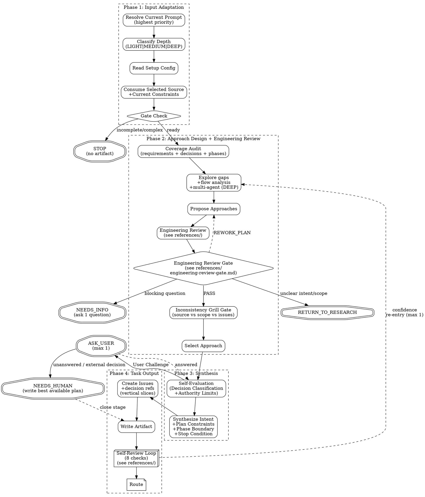

# PGE Plan

Produce one bounded, executable PGE plan artifact at `.pge/tasks-<slug>/plan.md`.

Run `pge-plan` in the current main reasoning context. Do not hand core planning, phase/scope interpretation, or semantic ownership decisions to an automatically selected lower-capability planning model. Agents may help with bounded evidence gathering or outside voice review, but main owns the plan contract and final decisions.

This is a planning skill. It does not execute code, edit implementation files, produce implementation pseudocode, publish GitHub issues, or invoke `pge-exec`.

Plan is responsible for **contract alignment**:

```text
my issues = executable translation of research/user intent and success criteria
```

The artifact shape is flexible, but these semantic fields are mandatory:

```text
schema_version
source_contract_check
selected_approach
rejected_approaches
goal
non_goals
issues
target_areas
acceptance
verification
evidence_required
risks
```

Do not write a long plan to satisfy a template. Write the smallest plan that lets `pge-exec` implement without guessing, while preserving the same semantic target from the user/research input.

`schema_version` is always `plan.v2` for plans produced under this contract.

**Field authority classification:**

Plan inherits authority classification from research and adds its own:

| Authority | Meaning | How exec should treat |
|---|---|---|
| `user_confirmed` | User explicitly stated or confirmed | Authoritative; do not deviate |
| `upstream_authoritative` | From authoritative upstream source or research | Inherit; do not re-litigate |
| `repo_evidence` | Derived from code, docs, config | High confidence; cite source |
| `inferred` | Plan inference or design choice | Auditable; exec may flag if implementation contradicts |

Plan must not upgrade `inferred` research findings to `user_confirmed` plan decisions. `RETURN_TO_RESEARCH` is the correct route when plan needs user-confirmed intent that research did not provide.

**Compatibility adapter rule:** Legacy `plan_delta` maps to `planning_handoff` with downgraded authority. Legacy `Options` and `Recommendation` become approach candidates only. Neither may become selected approach without current plan engineering review.

## Execution Flow

Follow this flow exactly. Do not skip nodes. Do not reorder phases.



## Anti-Patterns

- **"Let Me Brainstorm Everything First"** — Scale brainstorm to task. If the prompt is plan-ready, plan from it directly. If research already recommended, adopt it.
- **"I Should Ask To Be Safe"** — Questions are expensive. Self-evaluate first. Record assumptions instead.
- **"Let Me Plan The Whole System"** — Plan only what was asked. Respect upstream scope.
- **"Let Me Re-Decide The Spec"** — Authoritative upstream decisions are constraints, not fresh options. Plan decides implementation details; it does not re-litigate product behavior, rollout strategy, architecture direction, or scope already settled upstream.
- **"Selector Means Ignore The Rest"** — If arguments contain a selector plus extra text, the selector locates an artifact and the remaining text is current user constraint. Consume both.
- **"Issues Should Be Granular"** — Prefer few vertical slices over long micro-task checklists.
- **"Skip The Engineering Review"** — Even simple tasks get a quick scope check.

---

## Phase 1: Input Adaptation

### Resolve Input

Always parse the current prompt first. Current prompt content is the highest-priority input and must never be ignored, even when it also contains a task slug, research path, or other selector. If `ARGUMENTS:` explicitly names a task slug, research path, or other structured upstream input, treat that as the user's selected source and use it without asking again. If the arguments contain both a selector and additional text, treat the selector as the source location and the remaining text as binding current user constraints. Otherwise, on a bare `pge-plan` invocation, discover research artifacts under `.pge/tasks-<slug>/research.md` but do not silently select them. Ask the user to confirm a discovered artifact, choose among multiple artifacts, or choose between a discovered artifact and current conversation context.

Direct prompt planning is a first-class path. A user can invoke `pge-plan <clear intent>` without first running `pge-research`. The plan stage must decide whether that prompt is plan-ready, do the bounded repo exploration needed for planning, and produce `plan.md` when it can fairly define scope, constraints, acceptance, and verification. Route to `NEEDS_INFO` or suggest `pge-research` only when the prompt is too fuzzy, broad, or under-evidenced to plan responsibly.

### Context Intake and Clarification

Plan does not only consume formal research artifacts. It must also consume relevant current context: latest user corrections, interrupted prior attempts, observed failures, pasted logs, challenge/review findings, prior plan-mode notes, and fresh artifacts. Treat that context as input, not as background noise.

Before decomposing into issues, identify the current planning target:

- goal or fix target
- evidence that makes it real
- proposed scope
- explicit non-goals
- uncertainties that would change the plan

Plan may self-research from intent. If the prompt/context is plan-ready but lacks repo facts, do bounded exploration and produce the plan. If the prompt/context identifies a likely problem but the goal, scope, or acceptance is still ambiguous, ask one clarifying question before writing `plan.md`. The question should confirm the semantic target, not implementation trivia.

If the user confirms, continue planning. If unanswered and the ambiguity changes the plan, route `NEEDS_HUMAN` or `NEEDS_INFO` instead of inventing a broader fix.

### Classify Depth

- **LIGHT** (1-3 files, single module, clear path): Minimal review, 1-2 issues.
- **MEDIUM** (4-8 files, 2-3 modules): Standard review, 2-5 issues.
- **DEEP** (8+ files, cross-module, architectural): Full review, complexity gate, consider phased delivery.

### Fast Lane (LIGHT with clear intent)

When ALL of these are true:
- Depth = LIGHT (1-3 files, single module)
- No upstream research artifact exists (user came directly to plan)
- Intent is unambiguous (single clear action, not exploratory)
- No security surface

Then:
- Skip Outside Voice (already conditional on MEDIUM+)
- Use LIGHT self-review from `references/self-review.md`: checks 1, 5, 8 plus check 4 when upstream has a Decision Log or spec-level decisions
- Skip pressure test
- Target: 1-2 issues maximum
- Keep the issue surface proportional: do not turn a verification carrier into a new feature, framework, flag, helper layer, or broad validation system unless the current constraints explicitly ask for it
- Expected plan time: under 2 minutes

Fast Lane is the smallest direct prompt path, not the only direct prompt path. MEDIUM and DEEP prompts may also be planned directly when the user gives enough intent, boundaries, and success criteria for Phase 2 research and engineering review to close the remaining implementation-level gaps.

### Fast Adopt (explicit external plan → PGE contract)

Use this path when the selected source is already an explicit plan — including Claude Code plan mode output, `docs/exec-plan/` documents, gstack/Codex reviewed plans, design execution notes, or a structured design/execution plan — but it is not in canonical `.pge/tasks-<slug>/plan.md` format.

Fast Adopt is allowed for LIGHT, MEDIUM, or DEEP inputs. Depth controls issue count and verification strictness, not whether adoption is available.

The selected source is adoption-ready only when it already contains:
- goal and observable success or stop condition
- bounded phase/scope
- implementation decisions and semantic ownership boundaries
- non-goals or exclusions when scope is narrowed
- target modules/files or unambiguous ownership areas
- verification expectations or evidence requirements
- enough ordered work structure to derive executable issues without inventing scope

When adoption-ready:
- Skip broad option generation and outside-voice approach selection.
- Do not re-decide architecture, rollout strategy, phase boundaries, target ownership, or semantic model.
- Preserve source goal, scope, approach, and reviewed decisions.
- Convert the source into the canonical plan template with `plan_route: READY_FOR_EXECUTE` or `READY_FOR_EXECUTE_WITH_ASSUMPTIONS`. Use `READY_FOR_EXECUTE_WITH_ASSUMPTIONS` only when assumptions are explicit, mechanical, and non-scope-changing.
- Materialize PGE execution contract fields: issue slices, target areas, acceptance, verification, dependencies, execution type, evidence required, and stop condition.
- Split into the smallest number of execution issues needed for `pge-exec`; issue slicing may decide order and grouping but must not add scope.
- Mark `fast_adopt: true` and record the source path or `claude_plan_mode` source in Metadata.
- Run Coverage Audit and Inconsistency Grill Gate only against source fidelity: missing fields, unauthorized expansion, issue traceability, acceptance/verification coverage.

If converting the source requires choosing new scope, adding helpers/flags/cleanup/abstractions, inventing target areas, inventing acceptance criteria, resolving semantic ownership, or changing phase boundaries, Fast Adopt must stop with `NEEDS_INFO` or route to the normal pge-plan path. Do not silently turn adoption into replanning.

### Read Setup Config

Read `.pge/config/*`. If `docs-policy.md` or `repo-profile.md` exists, treat as project constitution — plan must not contradict it without justification. Missing config: degraded mode for simple tasks.

### Consume Upstream Input

`pge-plan` consumes a selected source plus any current user constraints, then produces `plan.md`. The selected source can be a direct user prompt, research artifact, user-specified file/slug, structured notes, or clear intent.

If the user invoked `pge-plan <task-slug>` or `pge-plan .pge/tasks-<slug>/research.md`, that explicit selector is consent to consume the matching artifact. If the same invocation includes trailing instructions, those trailing instructions are not commentary; they are current user constraints and outrank derived summaries when they narrow scope, prohibit additions, define allowed files, or change verification expectations. If the user invoked `pge-plan <clear prompt>`, that explicit prompt is consent to plan from the prompt directly unless it conflicts with an explicitly selected artifact. If the user invoked bare `pge-plan`, artifact discovery is only a proposal: confirm before consuming a single discovered research artifact, ask the user to choose when multiple artifacts exist, and ask the user to choose when both a discovered artifact and current context look valid. Direct planning from intent remains supported when the current prompt/context is plan-ready.

### Input Priority Interpretation

Before Coverage Audit, build an internal input-priority interpretation. Use it to decide what must be inherited, what can be treated as evidence, and what must be overridden.

| Input Source | Role | Priority | Handling |
|---|---|---|---|
| Current user prompt / trailing arguments | hard constraint, latest override, or selected scope | highest | reflect in Intent, Non-goals, Target Areas, issue boundaries, and Verification; never ignore |
| `docs/exec-plan/` document explicitly selected or referenced | canonical planning source | high | preserve phase, scope, semantic ownership, non-goals, and success criteria; do not re-decide its authorized boundary |
| Original user-provided source, spec, issue, design doc, or referenced source-of-truth file | source of truth | high | read when referenced by the selected source or current user; preserve requirements, decisions, boundaries, phases, and success criteria |
| Repo code/docs/config | evidence | high | confirm feasibility and stale assumptions; may contradict upstream with cited evidence |
| `pge-research` brief or other summary artifact | derived summary | medium | consume as compressed understanding, but do not let it erase original source constraints or current user constraints |
| Prior notes, old plans, or non-authoritative summaries | context | low | use only when consistent with higher-priority inputs |

When planning from a `docs/exec-plan/` document, boundary fidelity is the primary quality bar. Preserve the document's phase/scope decisions and semantic ownership exactly unless the current user explicitly overrides them or repo evidence proves a contradiction. Do not add helpers, flags, cleanup, validation systems, broader refactors, or "nice" abstractions that the exec plan did not authorize. In domain-specific planning, treat correctness and semantic ownership as higher priority than generic task breakdown polish.

If a derived research artifact names or depends on an original source-of-truth artifact, and the current planning decision depends on scope, boundaries, rollout, verification, phase position, or "only allowed addition" constraints, read the original source too. Do not plan from a derivative summary alone when the summary is incomplete for those decisions.

If priorities conflict:
- Latest explicit user constraints win over older artifacts.
- The current prompt wins over selected artifacts, derived summaries, and prior plans.
- Repo evidence can override an artifact only with a cited contradiction.
- A derived summary cannot override its original source unless it records an explicit user-approved scope decision.
- Record every override in `Decision Overrides`.

**Accepted sources:** (1) direct prompt or current conversation context, (2) pge-research brief, (3) Claude plan mode output, (4) brainstorming output, (5) challenge/review findings, logs, failed attempts, or other current-context evidence, (6) any structured doc with intent/findings/constraints, (7) bounded self-research inside pge-plan for plan-ready prompts.

**Gate check:**
- Ready: consume.
- Incomplete: STOP. No artifact. Suggest resolving upstream.
- Prompt/context plan-ready + no selected artifact: plan directly. Use Phase 2 exploration to fill repo facts and implementation-level gaps.
- Prompt/context fuzzy or exploratory: STOP. Suggest `pge-research`.
- Missing + simple: use Fast Lane direct planning from clear intent.
- Missing + complex but plan-ready: plan directly with MEDIUM/DEEP review.
- Missing + complex and not plan-ready: STOP. Suggest `pge-research`.
- Bare `pge-plan` invocation with one discovered `.pge/tasks-<slug>/research.md`: ask the user to confirm before consuming it.
- Bare `pge-plan` invocation after research, but no `.pge/tasks-<slug>/research.md` can be discovered: plan directly only if current prompt/context is plan-ready; otherwise ask the user to run `pge-research` first.
- Explicit continuation requested for a prior research task, but `.pge/tasks-<slug>/research.md` is missing: STOP. Report broken handoff instead of silently pretending the research artifact exists.
- A discovered research artifact and the current conversation both look like valid upstream sources: ask the user which one to use instead of guessing.
- Multiple plausible research artifacts and no explicit selector: ask the user which task to continue instead of guessing.

**Source Contract Check:**

When consuming a research brief or structured upstream input, verify before proceeding to approach design:

| Check | Condition | Route |
|---|---|---|
| Intent confirmed | confirmed_intent or equivalent is present and specific | CONTINUE_TO_PLAN |
| Scope explicit | scope_contract or equivalent names in/out/deferred | CONTINUE_TO_PLAN |
| Success shape usable | success_shape or equivalent is observable and plan-convertible | CONTINUE_TO_PLAN |
| Intent not confirmed | goal is still fuzzy, multiple unresolved framings | RETURN_TO_RESEARCH |
| Success shape missing or vague | cannot derive acceptance criteria from it | RETURN_TO_RESEARCH |
| Blocking ambiguity unresolved | ambiguities with `blocks_plan: yes` remain open | NEEDS_INFO |

Route `RETURN_TO_RESEARCH` when intent or success shape is not confirmed and plan cannot fairly produce executable issues without inventing user intent. Route `NEEDS_INFO` when a specific blocking question can be answered by the user directly. `CONTINUE_TO_PLAN` means the input is plan-ready.

**Consumption rules:**

| Upstream Content | How to consume | Trust |
|---|---|---|
| Direct prompt / current context | Intent + Coverage Audit baseline | latest user instruction authoritative |
| Selector plus trailing text | selector locates source; trailing text becomes Current Constraints | trailing text highest priority |
| Original source-of-truth referenced by selected source or current user | Input Priority + Plan Constraints + Coverage Audit | high authority |
| Derived summary of an original source | Repo Context + defaults for missing plan fields | medium; cannot erase original/current constraints |
| Intent / goal | Fill Intent | as-is |
| Findings / evidence | Repo Context | as-is |
| Affected areas | Target Areas | as-is |
| Constraints / non-goals | Non-goals | as-is |
| Structured Intent fields | Intent | authoritative unless contradicted |
| Intent Lock / Intent Spec | Intent + Stop Condition + Acceptance Criteria | authoritative when challenge passed |
| Clarify / Grill-With-Me Log | Coverage Audit + Risks / Open Questions | confirms plan-changing ambiguity was resolved or remains blocking |
| Zoom-Out Map | Repo Context + Target Areas + Architecture Assessment | preferred compressed system map; do not redo unless insufficient or contradicted |
| Research Value Proof | Gate Check + Coverage Audit | required evidence that research adds planning value; weak/missing proof triggers extra scrutiny |
| Plan Delta / planning_handoff | Plan Constraints + Target Areas + Acceptance Criteria + Verification + Non-goals | compatibility adapter only; legacy `plan_delta` maps to `planning_handoff` with downgraded authority — must not become selected approach without engineering review |
| Synthesis Summary: Stated / Inferred / Out | Intent, Assumptions, Non-goals | stated/out authoritative; inferred auditable |
| Upstream Requirement Ledger / Spec Coverage | Coverage Audit | authoritative trace input |
| Decision Log / upstream spec decisions | Plan Constraints + Decision Coverage | authoritative |
| Rollout strategy / compare mode / flags / gray rollout | Issue verification strategy + risks | authoritative |
| Monitoring metrics / success-fail counters | Required Evidence + Verification | authoritative |
| Multi-phase structure | Phase Boundary + issue selection | authoritative unless explicitly overridden |
| Upstream risk assessment | Issue-level Risks | inherit, do not reinvent |
| Options + recommendation | Approach candidates (downgraded authority) | compatibility input only |
| Assumptions | Inherit | as-is |
| Open questions (non-blocking) | Risks / Open Questions | pass-through |
| Open questions (blocking) | BLOCK_PLAN | blocker |

**pge-research v2 adaptation:**

When the selected source is a `pge-research` brief with v2 contract fields (`schema_version`, `intent_framings`, `confirmed_intent`, `scope_contract`, `success_shape`, `upstream_contract`, `evidence`, `ambiguities`, `planning_handoff`, `route`), consume those semantics explicitly:

1. **Source Contract Check.** Before planning, verify: intent confirmed? scope explicit? success shape usable? If not → route `RETURN_TO_RESEARCH` or `NEEDS_INFO`. Do not silently do full intent research when the source is not plan-ready.
2. **Confirmed intent becomes the plan's goal baseline.** Carry problem, goal, scope, non-goals, success shape, and "plan would be wrong if..." forward. Do not weaken them into a generic summary.
3. **Planning handoff is boundary-preserving input.** Consume `planning_handoff` (facts plan must preserve, constraints plan must not violate, known invalid directions, likely affected areas, verification risks, unresolved blockers) as constraints on plan design. Do not treat it as a hidden approach recommendation.
4. **Research Value Proof must have a concrete delta.** If missing or empty, treat the research as a weak derived summary and run a stronger coverage/intent audit before trusting its framing. Do not blindly adopt an unproven research brief.
5. **Zoom-Out Map limits re-exploration.** Use it as the system map when present. Re-read only the files needed to validate stale, low-confidence, or plan-changing claims.
6. **Plan owns approach selection.** Research may provide intent framings, evidence, constraints, and known invalid directions as approach inputs. Plan selects the implementation approach through engineering review. Research recommendation of problem framing is informational, not a selected approach.

Legacy compatibility: if an older research brief uses `plan_delta`, `Options`, and `Recommendation` instead of v2 fields, consume them as compatibility input only:
- `plan_delta` maps to `planning_handoff` with downgraded authority
- `Options` and `Recommendation` become approach candidates, not selected approach
- Neither may become the selected approach without current plan engineering review
- Fall back to legacy fields (`Intent`, `Findings`, `Affected Areas`) and record that v2 contract was unavailable

**Current constraint extraction:**

Treat these phrases and equivalents as hard constraints:
- "only", "唯一", "just", "no other", "不要", "不加", "不做", "scope is", "must", "must not"
- file-limited instructions such as "X is the only addition point"
- verification-limited instructions such as "use this offline tool as validation"
- no-feature instructions such as "do not add flags/helpers/runtime gates/tests unless required"

For each hard constraint, map it to at least one of: `Plan Constraints`, `Non-goals`, `Target Areas`, `Acceptance Criteria`, `Verification`, or an issue `Scope`. If a hard constraint cannot be honored, route `NEEDS_HUMAN` or record a `Decision Override` with why user confirmation is required.

**Decision authority:**
- Spec-level decisions from upstream are authoritative: product behavior, scope boundary, rollout strategy, monitoring metrics, phase structure, architecture direction, explicit non-goals.
- Implementation-level choices are plan-owned: concrete file ordering, interface boundaries, issue slicing, test commands, local code patterns, and dependency sequencing.
- Override a spec-level decision only when repo evidence contradicts it or requirements conflict. Record the override as Decision / Rationale / Alternatives considered, and mark whether user confirmation is required.

---

## Phase 2: Approach Design + Engineering Review

### Coverage Audit

Audit inputs against the goal in priority order. Mark each requirement or hard constraint: covered / gap to explore / out-of-scope. Also audit every upstream spec decision: inherited / overridden / missing. Do not proceed with silent drops.

Coverage Audit must include:
- current user constraints from prompt/trailing arguments
- `docs/exec-plan/` phase/scope decisions when that document is selected or referenced
- original source-of-truth requirements and boundaries when available
- research-derived requirements and assumptions
- `Intent Spec`, `Research Value Proof`, and `Plan Delta` items when present
- repo evidence that confirms, contradicts, or narrows the above

If `docs/exec-plan/` is the canonical input, audit proposed issues against the source document before writing them. Any issue that introduces unrequested helpers, flags, cleanup, validation expansion, broad refactors, or abstraction work must either cite explicit authorization from the exec plan/current user or be removed.

Spec decisions coverage is mandatory when upstream contains a `Decision Log`, rollout strategy, monitoring metrics, phase structure, risk assessment, or equivalent spec-level decision. Every such decision must appear in `Plan Constraints`, a specific issue's `upstream_decision_refs`, `Verification`, or an explicit override record.

Planning handoff coverage is mandatory when upstream contains a `planning_handoff` section (or legacy `Plan Delta` / `plan_delta` field). Every facts/constraints/invalid-directions/risks/blockers item must be covered, rejected with rationale, or escalated. Legacy `plan_delta` is consumed as compatibility input with downgraded authority.

### Explore (fill gaps)

Only explore gaps not covered by upstream. Use repo/docs/code before asking user.

- **Multi-agent (DEEP):** Spawn parallel Agents per module gap. Synthesize yourself.
- **Flow analysis (MEDIUM/DEEP, 3+ modules):** Trace data flow end-to-end. Flag interruptions.
- **Context quarantine:** When a gap requires broad or cross-module search but planning only needs the answer, consider delegating the search to an Agent. Use direct exploration for narrow gaps where delegation overhead would exceed the context savings. Consume only the Agent's compact conclusion, evidence paths, confidence, and discarded dead ends.

### Propose Approaches

Upstream recommended + no contradicting evidence → adopt directly. Otherwise propose 2-3 with tradeoffs.

Do not propose alternatives for authoritative spec-level decisions. Only propose alternatives for implementation-level choices or for upstream decisions contradicted by repo evidence.

### Engineering Review

Read `references/engineering-review.md` for full review dimensions. Summary:
- Fix-First principle (repair, don't report)
- Confidence calibration (1-10 score + display rules)
- Scope Challenge (4 questions)
- Architecture Assessment (boundaries, data flow, failure mode registry)
- Test Coverage Pressure (trace happy/edge/error per issue)
- Existing Solutions Check
- Complexity Gate (8+ files → challenge)
- Completeness Score (X/10 per approach)
- Outside Voice (MEDIUM + DEEP — independent challenge Agent)
- Scope Reduction Prohibition (prohibited phrases + 3 valid reasons)

### Engineering Review Gate

Read `references/engineering-review-gate.md` for the authoritative gate contract. This section is only the entry summary; do not duplicate or override the detailed gate rules here.

The gate runs after engineering review dimensions and before approach selection. It is plan-owned and does not route through research unless intent/scope/success shape is genuinely unclear.

Minimum invariant: the Engineering Review Gate always runs Step 0 Scope Challenge. LIGHT tasks get the minimal Step 0 engineering check; they do not skip the whole gate.

The gate checks, scaled by depth:
- scope discipline and existing-code reuse
- architecture fit when applicable
- code quality for DEEP work
- test coverage and failure modes when applicable
- verification-story quality at all depths
- performance risk for DEEP work
- semantic evidence rows when grep/manual checks verify claims

**Engineering Review Gate verdict:** `PASS | REWORK_PLAN | RETURN_TO_RESEARCH | NEEDS_INFO`

- `PASS` → proceed to approach selection and synthesis.
- `REWORK_PLAN` → fix findings inline, re-run affected checks before proceeding.
- `RETURN_TO_RESEARCH` → intent/scope/success shape genuinely unclear; route back to `pge-research`.
- `NEEDS_INFO` → ask one blocking question, then re-run gate.

`SKIP_NOT_APPLICABLE` remains valid in the normalized quality-gate result shape, but only for individual gate dimensions or non-engineering gates. The engineering review gate itself always runs Step 0 and therefore does not use `SKIP_NOT_APPLICABLE` as its overall verdict.

The gate verdict is recorded in the plan artifact under `### Engineering Review Gate`.

### Quality Gate Result Shape

All plan quality gates use the same compact result shape. Fill only fields that carry useful evidence for the current gate; do not turn this into template bureaucracy.

```
gate: <gate name>
status: PASS | REWORK_PLAN | RETURN_TO_RESEARCH | NEEDS_INFO | SKIP_NOT_APPLICABLE
reason: <one sentence explaining the verdict>
evidence: <file:line citations or semantic evidence rows>
required_plan_changes: <specific changes needed if REWORK_PLAN, or "none">
skip_reason: <required when status is SKIP_NOT_APPLICABLE>
audit_note: <required for automatic decisions — what was decided and why>
rating_before: <1-10 quality rating before gate ran>
rating_after: <1-10 quality rating after gate fixes applied>
ten_out_of_ten_bar: <what would make this a 10/10 — aspirational target>
```

**Field rules:**
- `status` may be `SKIP_NOT_APPLICABLE` for an individual dimension or a non-engineering gate. The overall Engineering Review Gate verdict still uses `PASS | REWORK_PLAN | RETURN_TO_RESEARCH | NEEDS_INFO`.
- `skip_reason` is mandatory when `status` is `SKIP_NOT_APPLICABLE`. Omit otherwise.
- `audit_note` is mandatory for any automatic decision (gate self-resolved without user input). Omit when user explicitly chose the outcome.
- `required_plan_changes` lists concrete fixes when `status` is `REWORK_PLAN`. Set to "none" for other statuses.
- `rating_before` / `rating_after` are 1-10 integers. `rating_after` may equal `rating_before` when no fixes were applied.
- `ten_out_of_ten_bar` is a single sentence describing the aspirational quality ceiling for this gate's dimension.

### Experience Context Gate

`pge-plan` must explicitly consume the research-side `experience_design_context` surface when the task is human-facing or artifact-facing.

**Inputs:**
- `experience_scope`
- `skip_reason`
- `audience`
- `artifact_purpose`
- `experience_success_shape`
- `what_would_disappoint`
- optional constraints/references such as tone, design-system conventions, screenshots/mockups, and relevant fallback states

**What this gate checks:**
- whether the plan recognized that experience quality is part of success
- whether research supplied enough problem-side context for planning to preserve
- whether acceptance, verification, and evidence reflect that context instead of silently dropping it

**Gate outcomes:**
- `PASS` — experience context exists and the plan consumes it clearly in acceptance / verification / evidence
- `SKIP_NOT_APPLICABLE` — the task is purely internal or research already recorded `experience_scope: none` with an adequate `skip_reason`
- `RETURN_TO_RESEARCH` — audience, experience success shape, or disappointment risk is unclear enough that the problem contract itself is not settled
- `REWORK_PLAN` — research context is clear, but the plan failed to consume it in acceptance / verification / evidence
- `NEEDS_INFO` — one specific human answer is still required and neither repo evidence nor research can resolve it

**Boundary rule:** unclear audience/success should route `RETURN_TO_RESEARCH` only when it changes the problem contract. If the problem contract is already clear and only the plan failed to reflect it, use `REWORK_PLAN`.

### Depth-Scaled Gate Selection

Which gates run depends on the classified depth:

| Depth | Gates Applied | Skip Policy |
|-------|--------------|-------------|
| LIGHT | Engineering Review Gate (Step 0 + verification-story check) + Experience Context Gate when applicable | Experience Context Gate may `SKIP_NOT_APPLICABLE` for clearly internal tasks. |
| MEDIUM | Engineering Review Gate (MEDIUM dimensions) + Experience Context Gate when applicable | Skipped non-engineering gates require `skip_reason`. |
| DEEP | Engineering Review Gate plus all applicable non-engineering gates | Non-engineering gates may `SKIP_NOT_APPLICABLE` only with explicit reason. |

LIGHT tasks must not pay DEEP ceremony. DEEP tasks must not skip gates without evidence that the dimension is irrelevant.

### Route Mapping

Gate verdicts map to plan routing. No gate may invent route vocabulary outside these values:

| Verdict | When to use | Route effect |
|---------|-------------|--------------|
| `PASS` | All applicable dimensions clear | Proceed to approach selection |
| `REWORK_PLAN` | Solution, verification, acceptance, or coverage is weak but problem is clear | Fix inline, re-run affected checks |
| `RETURN_TO_RESEARCH` | Problem contract (intent, scope, success shape) is unclear — not for weak solutions | Escalate to plan-level `RETURN_TO_RESEARCH` |
| `NEEDS_INFO` | Specific blocking question the user can answer | Ask one question, re-run gate |
| `SKIP_NOT_APPLICABLE` | Specific non-engineering gate or individual dimension does not fairly apply in the current context | Record `skip_reason`, run the remaining applicable review path |

**Boundary rule:** `RETURN_TO_RESEARCH` is reserved for unclear problem contracts. If the problem is clear but the solution/verification/acceptance is weak, the correct verdict is `REWORK_PLAN`. Gates must not conflate "hard to solve" with "unclear intent."

### Inconsistency Grill Gate

Before selecting the approach and writing issues, actively grill the plan input against the emerging plan. This is not generic brainstorming and not permission to re-decide upstream scope. Its job is to find contradictions early.

Ask these checks in order:
- Does the proposed approach preserve every authoritative phase/scope decision, especially from `docs/exec-plan/`?
- Does any issue introduce helpers, flags, cleanup, validation expansion, broad refactors, or abstractions that the source did not authorize?
- Does the issue split move semantic ownership away from the module or phase named by the source?
- Do acceptance and verification prove the requested behavior, or only prove that tasks were completed?
- Is any inferred requirement being treated as stated fact?
- Is any current user constraint missing from `Plan Constraints`, `Non-goals`, `Target Areas`, issue scope, or `Verification`?

Resolve each inconsistency before synthesis:
- If code/docs answer it, self-answer with evidence.
- If it is only an implementation detail, choose the repo-conventional default and record the assumption.
- If it changes goal, phase, scope, semantic ownership, acceptance, or safety, ask the user one blocking question or route `NEEDS_INFO`.
- If the inconsistency comes from unrequested expansion, remove the expansion.

Record the result as `Plan Grill Log`: `check`, `finding`, `resolution`, and `source/evidence`. Empty logs are suspicious for MEDIUM/DEEP plans and for any plan sourced from `docs/exec-plan/`.

### Coherence Verification for High-Risk Surfaces

When a plan changes any of these surfaces, generated issues must include acceptance criteria or verification that checks producer / consumer / validator / evidence coherence:

- semantic contracts (skill contracts, handoff schemas, artifact layouts)
- route / state / verdict vocabulary
- public APIs or CLI interfaces
- schemas, manifests, or config that other components consume
- shared helpers or behavior with downstream consumers

For each affected surface, the issue's acceptance or verification must identify:
- **Producer**: what writes or defines the value/contract
- **Consumer**: what reads, executes, or depends on it
- **Validator**: what accepts or rejects it (gates, checks, tests)
- **Evidence**: proof that the post-change contract is internally consistent across all three

Grep can support coherence evidence but cannot be the sole proof for semantic-contract correctness. A grep hit confirms a string exists; it does not confirm that the producer's output, the consumer's expectation, and the validator's acceptance criteria still agree after the change.

This guidance does not require inspecting the entire repo. Scope the coherence check to the changed surface and its direct producers, consumers, and validators.

### Select Approach

Commit to one. Record selected/rejected/scope reductions as Decision / Rationale / Alternatives considered. Override upstream only if engineering review finds contradicting evidence or an explicit requirement conflict.

---

## Phase 3: Plan Synthesis

### Self-Evaluation

**Decision classification:**
- **Mechanical**: one correct answer from code/docs. Decide it. Never ask.
- **Taste**: multiple valid options. Choose, record rationale.
- **User Challenge**: affects goal boundary. ONLY category that may trigger ASK_USER.

**Authority limits** — 3 valid escalation reasons only:
1. Goal boundary ambiguous, code cannot resolve.
2. Missing info, no reasonable default.
3. Dependency conflict makes requirements mutually exclusive.

"Complex", "risky", "non-trivial" are NOT valid reasons.

**Headless mode:** When non-interactive (pipeline/spawned agent/`--headless`), auto-choose lowest-risk for User Challenge decisions, record in Assumptions with LOW confidence.

For each question: record Question, Why it matters, Can repo answer?, Blocking?, Safe assumption?, Risk if unanswered, Decision (SELF_ANSWERED | ASK_USER | ASSUME_AND_RECORD | DEFER_TO_SLICE | BLOCK_PLAN).

### Synthesize Intent

If the upstream source has structured `pge-research` v2 fields or the minimum research contract fields, carry `Intent Spec` / `intent_spec` through as the plan's intent baseline instead of rewriting a weaker intent. Add only execution-level detail: stop condition, code-level acceptance criteria, issue boundaries, and verification expectations. Use `Intent Lock`, `clarify_status`, and the `Clarify / Grill-With-Me Log` to preserve what was explicitly asked, what was inferred, and what was clarified.

If the upstream source only has legacy `Intent` fields, carry them through as before.

Produce: structured intent, plan constraints, non-goals, repo context, acceptance criteria, assumptions, **stop condition** (observable "done" state).

### Success Shape → Acceptance + Verification Trace

Before writing major acceptance criteria, trace each to its source. This proves acceptance is derived from user intent, not invented, and that verification/evidence still points back to the same source.

| Acceptance Criterion | Source | Source Type | Acceptance Trace | Verification / Evidence Trace |
|---------------------|--------|-------------|------------------|-------------------------------|
| <criterion> | <research success_shape / upstream constraint / current prompt / technical approach> | success_shape / upstream / prompt / technical | <why this criterion follows> | <how verification/evidence proves this criterion> |

**Source types:**
- `success_shape`: derived from research `success_shape`, `experience_success_shape`, or `what_would_disappoint`
- `upstream`: derived from upstream contract, spec decision, or constraint
- `prompt`: derived directly from current user prompt when no research exists
- `technical`: added to support the selected approach (must not expand scope)

**Rules:**
- Every major acceptance criterion must trace to at least one source
- Every major acceptance criterion must also point to the verification/evidence that proves it
- Technical acceptance criteria are valid only when they support the selected approach — they must not introduce new features, expand scope, or add requirements the user did not ask for
- If success shape is missing or unusable (vague, contradictory, or cannot derive acceptance), route `RETURN_TO_RESEARCH` or `NEEDS_INFO` — do not silently invent acceptance criteria
- The trace supports both technical success (code works correctly) and human-facing/artifact-facing success (user intent is satisfied)

**Depth scaling:**
- LIGHT plans with 1-2 obvious criteria from a clear prompt: a single sentence trace is sufficient (e.g., "All criteria derive directly from the user prompt requesting X, and the verification/evidence section proves those criteria directly.")
- MEDIUM/DEEP plans: use the trace table for major criteria

**Context budget:** Plan + issues should fit comfortably inside the executor's useful context, with ~50% as an operational ceiling for normal work. >5 detailed issues or 15+ files → split into phased delivery. Prefer fewer vertical slices with complete acceptance criteria over one large plan that forces `pge-exec` to carry stale research, dead ends, and irrelevant raw output.

If upstream defines a multi-phase plan, inherit the phase structure. Produce issues only for the current phase unless the user explicitly asked to plan all phases. Record the phase boundary and what remains deferred.

### Scope Compression For Constrained Tasks

When current constraints specify a unique allowed addition point or prohibit extra machinery, treat that as a hard issue-boundary rule:
- Target Areas must include only the replacement area and the allowed addition point unless repo evidence proves another file is required.
- Non-goals must explicitly list prohibited additions such as new flags, helper files, runtime gates, broad abstractions, or unrelated tests.
- Verification must explain whether the allowed addition point is a verification carrier, not a new product feature.
- Any extra touched file requires a Decision Override with rationale and user confirmation if it changes scope.

---

## Phase 4: Task Output

### Create Numbered Issues

Vertical slices, not micro-tasks. Rules:
- Sequential numbering, no skips
- **Interface-first:** types/contracts before implementations
- **Vertical slices:** each issue cuts all relevant layers. Horizontal only for genuine shared dependencies.

Each issue includes:
- `ID`, `Title`, `Scope`, `Action` (imperative: what to DO)
- `upstream_decision_refs` (decision IDs or "none"; referenced decisions must not be changed by exec)
- `Deliverable` (what must exist when done)
- `Target Areas` (exact paths: Create/Modify)
- `Acceptance Criteria`, `Verification Hint`
- `Verification Type`: AUTOMATED | MANUAL | MIXED
- `Execution Type`: AFK | HITL:verify | HITL:decision | HITL:action
- `Test Expectation`: happy path + edge case + error path (+ integration if boundary)
- `Required Evidence`: what proves done
- `State`: READY_FOR_EXECUTE | NEEDS_INFO | BLOCKED | NEEDS_HUMAN
- `Dependencies`, `Risks`
- `Security`: yes | no (yes if issue touches auth, data access, API boundaries, secrets, or permissions. Triggers stricter Evaluator thresholds.)

### Write Plan Artifact

The plan artifact MUST be written only to `.pge/tasks-<slug>/plan.md`. This `.pge/` path is canonical. Notes outside `.pge/` are non-authoritative and must not replace the required pipeline artifact. ID format: `YYYYMMDD-HHMM-<slug>`.

Use `templates/plan.md` as a contract scaffold, not a fixed prose shape. Required semantics are binding; optional sections should appear only when they help `pge-exec` execute or help review detect scope drift.

**Task directory:** pge-research creates `.pge/tasks-<slug>/`. pge-plan writes into it. If research was skipped, pge-plan creates the task directory and then writes `plan.md` there:

```bash
mkdir -p .pge/tasks-<slug>/
```

### Self-Review Loop

Read `references/self-review.md` for full protocol (includes `references/multi-round-eval.md` principles). Summary:
- 8 checks: goal-backward, upstream coverage, traceability, spec decision coverage, placeholder + rationalization scan, consistency, confidence, downstream simulation
- Pressure test: construct one failure scenario per issue after checks pass
- Retry: fix → re-check failed only → max 2 attempts → downgrade to NEEDS_INFO
- Confidence gate: LOW affecting correctness → re-enter Phase 2 Explore (max 1 re-entry)

### Route

Plan-level routes (final plan output):

- `READY_FOR_EXECUTE`: ≥1 issue ready, no global blocker.
- `READY_FOR_EXECUTE_WITH_ASSUMPTIONS`: used by `pge-plan` fast-adopt when a complete external plan requires explicit mechanical assumptions.
- `RETURN_TO_RESEARCH`: intent or success shape is not confirmed; plan cannot fairly produce executable issues without inventing user intent. Route back to `pge-research`.
- `NEEDS_INFO`: missing information that the user can answer directly.
- `BLOCKED`: cannot produce fair plan.
- `NEEDS_HUMAN`: human decision needed.

Engineering Review Gate verdicts (Phase 2 internal, control flow before approach selection):

- `PASS`: gate cleared, proceed to approach selection.
- `REWORK_PLAN`: fixable issues found; fix inline and re-run affected checks.
- `RETURN_TO_RESEARCH`: intent/scope/success shape genuinely unclear; escalates to plan-level `RETURN_TO_RESEARCH`.
- `NEEDS_INFO`: specific blocking question; escalates to plan-level `NEEDS_INFO` if user input required.
- `SKIP_NOT_APPLICABLE`: available only inside per-dimension or non-engineering quality-gate records; it is not the overall Engineering Review Gate verdict.

### Completion gate

Do NOT declare the plan complete, summarize completion, or change routes until BOTH are true:

1. The plan artifact exists at `.pge/tasks-<slug>/plan.md` and satisfies the required plan contract semantics
2. You are about to output the Final Response block exactly once

If the user redirects to execution or implementation mid-run, close the stage first by writing the best available plan artifact with route `NEEDS_INFO`, `BLOCKED`, or `NEEDS_HUMAN` instead of silently exiting.

---

## Handoff To Execute

`pge-exec <task-slug>` or `pge-exec .pge/tasks-<slug>/plan.md` reads full plan + `.pge/config/*`, then builds a compact per-issue execution pack. Handoff tells exec: issue order, eligible issues, AFK vs HITL, target areas, acceptance criteria, upstream decisions to preserve, assumptions to preserve, risks not to ignore. Do not require exec to reread broad research logs when the plan already records the necessary conclusion and evidence.

## Guardrails

Do not: write business code, write implementation pseudocode or function bodies, execute the plan, invoke pge-exec, create run artifacts under `.pge/tasks-*/runs/`, ask non-blocking questions, ask multiple questions, publish GitHub Issues, use forbidden states.

## Final Response

```md
## PGE Plan Result
- plan_path: .pge/tasks-<slug>/plan.md
- plan_route: READY_FOR_EXECUTE | READY_FOR_EXECUTE_WITH_ASSUMPTIONS | RETURN_TO_RESEARCH | NEEDS_INFO | BLOCKED | NEEDS_HUMAN
- ready_issues: <ids or None>
- blocked_issues: <ids or None>
- asked_user: yes | no
- assumptions_recorded: yes | no
- engineering_review: completed (gate: PASS|REWORK_PLAN|RETURN_TO_RESEARCH|NEEDS_INFO) | skipped — reason
- next_skill: pge-exec <task-slug> | pge-exec .pge/tasks-<slug>/plan.md | pge-research <task-slug> (if RETURN_TO_RESEARCH) | pge-plan (after clarification)
```
