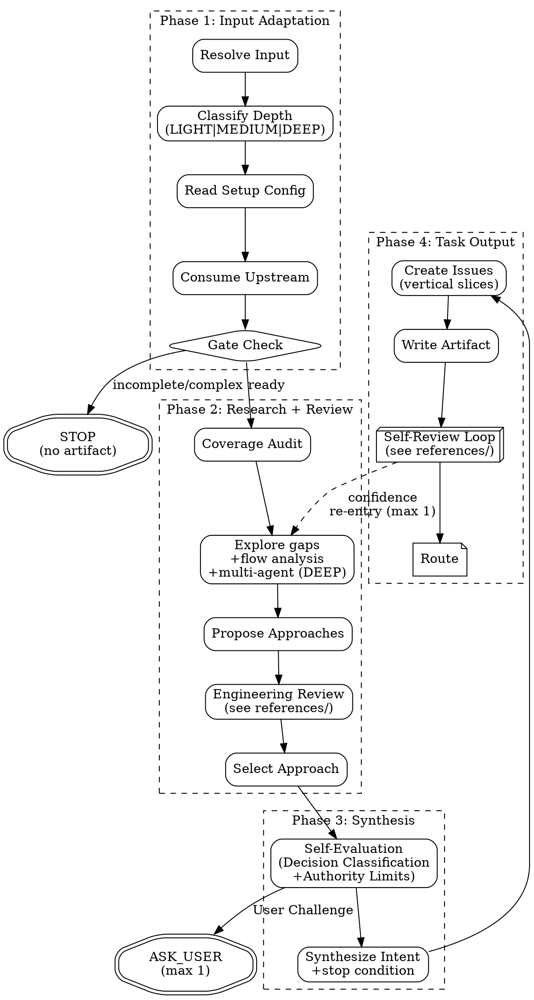

# PGE Plan

Produce one bounded, executable PGE plan artifact at `.pge/tasks-<slug>/plan.md`.

This is a planning skill. It does not execute code, edit implementation files, produce implementation pseudocode, publish GitHub issues, or invoke `pge-exec`.

## Execution Flow

Follow this flow exactly. Do not skip nodes. Do not reorder phases.



## Anti-Patterns

- **"Let Me Brainstorm Everything First"** — Scale brainstorm to task. If research already recommended, adopt it.
- **"I Should Ask To Be Safe"** — Questions are expensive. Self-evaluate first. Record assumptions instead.
- **"Let Me Plan The Whole System"** — Plan only what was asked. Respect upstream scope.
- **"Issues Should Be Granular"** — Prefer few vertical slices over long micro-task checklists.
- **"Skip The Engineering Review"** — Even simple tasks get a quick scope check.

---

## Phase 1: Input Adaptation

### Resolve Input

If `ARGUMENTS:` explicitly names a task slug, research path, or other structured upstream input, treat that as the user's selected source and use it without asking again. Otherwise, on a bare `pge-plan` invocation, discover research artifacts under `.pge/tasks-<slug>/research.md` but do not silently select them. Ask the user to confirm a discovered artifact, choose among multiple artifacts, or choose between a discovered artifact and current conversation context. Only fall back to direct planning from conversation intent when no research artifact exists and the intent is lightweight enough to plan fairly.

### Classify Depth

- **LIGHT** (1-3 files, single module, clear path): Minimal review, 1-2 issues.
- **MEDIUM** (4-8 files, 2-3 modules): Standard review, 2-5 issues.
- **DEEP** (8+ files, cross-module, architectural): Full review, complexity gate, consider phased delivery.

### Fast Lane (LIGHT with clear intent)

When ALL of these are true:
- Depth = LIGHT (1-3 files, single module)
- No upstream research artifact exists (user came directly to plan)
- Intent is unambiguous (single clear action, not exploratory)
- No security surface

Then:
- Skip Outside Voice (already conditional on MEDIUM+)
- Use 3-check self-review (checks 1, 4, 7 only — see `references/self-review.md` Depth Scaling)
- Skip pressure test
- Target: 1-2 issues maximum
- Expected plan time: under 2 minutes

### Read Setup Config

Read `.pge/config/*`. If `docs-policy.md` or `repo-profile.md` exists, treat as project constitution — plan must not contradict it without justification. Missing config: degraded mode for simple tasks.

### Consume Upstream Input

`pge-plan` consumes a selected upstream source, then produces `plan.md`. The selected source can be a research artifact, a user-specified file/slug, structured notes, or a lightweight clear intent.

If the user invoked `pge-plan <task-slug>` or `pge-plan .pge/tasks-<slug>/research.md`, that explicit selector is consent to consume the matching artifact. If the user invoked bare `pge-plan`, artifact discovery is only a proposal: confirm before consuming a single discovered research artifact, ask the user to choose when multiple artifacts exist, and ask the user to choose when both a discovered artifact and current context look valid. Direct planning from intent remains supported when no research artifact exists and the intent is clear enough for Fast Lane.

**Accepted sources:** (1) pge-research brief, (2) Claude plan mode output, (3) brainstorming output, (4) any structured doc with intent/findings/constraints, (5) self-research Agent for simple intents.

**Gate check:**
- Ready: consume.
- Incomplete: STOP. No artifact. Suggest resolving upstream.
- Missing + simple: use Fast Lane direct planning from clear intent.
- Missing + complex: STOP. Suggest `pge-research`.
- Bare `pge-plan` invocation with one discovered `.pge/tasks-<slug>/research.md`: ask the user to confirm before consuming it.
- Bare `pge-plan` invocation after research, but no `.pge/tasks-<slug>/research.md` can be discovered: fall back to Fast Lane direct planning only for clear lightweight intent; otherwise ask the user to run `pge-research` first.
- Explicit continuation requested for a prior research task, but `.pge/tasks-<slug>/research.md` is missing: STOP. Report broken handoff instead of silently pretending the research artifact exists.
- A discovered research artifact and the current conversation both look like valid upstream sources: ask the user which one to use instead of guessing.
- Multiple plausible research artifacts and no explicit selector: ask the user which task to continue instead of guessing.

**Consumption rules:**

| Upstream Content | How to consume | Trust |
|---|---|---|
| Intent / goal | Fill Intent | as-is |
| Findings / evidence | Repo Context | as-is |
| Affected areas | Target Areas | as-is |
| Constraints / non-goals | Non-goals | as-is |
| Options + recommendation | Strong default for approach | strong default |
| Assumptions | Inherit | as-is |
| Open questions (non-blocking) | Risks / Open Questions | pass-through |
| Open questions (blocking) | BLOCK_PLAN | blocker |

---

## Phase 2: Approach Research + Engineering Review

### Coverage Audit

Audit upstream against goal. Mark each requirement: covered / gap to explore / out-of-scope. Do not proceed with silent drops.

### Explore (fill gaps)

Only explore gaps not covered by upstream. Use repo/docs/code before asking user.

- **Multi-agent (DEEP):** Spawn parallel Agents per module gap. Synthesize yourself.
- **Flow analysis (MEDIUM/DEEP, 3+ modules):** Trace data flow end-to-end. Flag interruptions.
- **Context quarantine:** When a gap requires broad or cross-module search but planning only needs the answer, consider delegating the search to an Agent. Use direct exploration for narrow gaps where delegation overhead would exceed the context savings. Consume only the Agent's compact conclusion, evidence paths, confidence, and discarded dead ends.

### Propose Approaches

Upstream recommended + no contradicting evidence → adopt directly. Otherwise propose 2-3 with tradeoffs.

### Engineering Review

Read `references/engineering-review.md` for full review dimensions. Summary:
- Fix-First principle (repair, don't report)
- Confidence calibration (1-10 score + display rules)
- Scope Challenge (4 questions)
- Architecture Assessment (boundaries, data flow, failure mode registry)
- Test Coverage Pressure (trace happy/edge/error per issue)
- Existing Solutions Check
- Complexity Gate (8+ files → challenge)
- Completeness Score (X/10 per approach)
- Outside Voice (MEDIUM + DEEP — independent challenge Agent)
- Scope Reduction Prohibition (prohibited phrases + 3 valid reasons)

### Select Approach

Commit to one. Record selected/rejected/scope reductions. Override upstream if engineering review finds contradicting evidence.

---

## Phase 3: Plan Synthesis

### Self-Evaluation

**Decision classification:**
- **Mechanical**: one correct answer from code/docs. Decide it. Never ask.
- **Taste**: multiple valid options. Choose, record rationale.
- **User Challenge**: affects goal boundary. ONLY category that may trigger ASK_USER.

**Authority limits** — 3 valid escalation reasons only:
1. Goal boundary ambiguous, code cannot resolve.
2. Missing info, no reasonable default.
3. Dependency conflict makes requirements mutually exclusive.

"Complex", "risky", "non-trivial" are NOT valid reasons.

**Headless mode:** When non-interactive (pipeline/spawned agent/`--headless`), auto-choose lowest-risk for User Challenge decisions, record in Assumptions with LOW confidence.

For each question: record Question, Why it matters, Can repo answer?, Blocking?, Safe assumption?, Risk if unanswered, Decision (SELF_ANSWERED | ASK_USER | ASSUME_AND_RECORD | DEFER_TO_SLICE | BLOCK_PLAN).

### Synthesize Intent

Produce: intent, non-goals, repo context, acceptance criteria, assumptions, **stop condition** (observable "done" state).

**Context budget:** Plan + issues should fit comfortably inside the executor's useful context, with ~50% as an operational ceiling for normal work. >5 detailed issues or 15+ files → split into phased delivery. Prefer fewer vertical slices with complete acceptance criteria over one large plan that forces `pge-exec` to carry stale research, dead ends, and irrelevant raw output.

---

## Phase 4: Task Output

### Create Numbered Issues

Vertical slices, not micro-tasks. Rules:
- Sequential numbering, no skips
- **Interface-first:** types/contracts before implementations
- **Vertical slices:** each issue cuts all relevant layers. Horizontal only for genuine shared dependencies.

Each issue includes:
- `ID`, `Title`, `Scope`, `Action` (imperative: what to DO)
- `Deliverable` (what must exist when done)
- `Target Areas` (exact paths: Create/Modify)
- `Acceptance Criteria`, `Verification Hint`
- `Verification Type`: AUTOMATED | MANUAL | MIXED
- `Execution Type`: AFK | HITL:verify | HITL:decision | HITL:action
- `Test Expectation`: happy path + edge case + error path (+ integration if boundary)
- `Required Evidence`: what proves done
- `State`: READY_FOR_EXECUTE | NEEDS_INFO | BLOCKED | NEEDS_HUMAN
- `Dependencies`, `Risks`
- `Security`: yes | no (yes if issue touches auth, data access, API boundaries, secrets, or permissions. Triggers stricter Evaluator thresholds.)

### Write Plan Artifact

The plan artifact MUST be written only to `.pge/tasks-<slug>/plan.md`. This `.pge/` path is canonical. Notes outside `.pge/` are non-authoritative and must not replace the required pipeline artifact. ID format: `YYYYMMDD-HHMM-<slug>`.

**Task directory:** pge-research creates `.pge/tasks-<slug>/`. pge-plan writes into it. If research was skipped, pge-plan creates the task directory and then writes `plan.md` there:

```bash
mkdir -p .pge/tasks-<slug>/
```

### Self-Review Loop

Read `references/self-review.md` for full protocol (includes `references/multi-round-eval.md` principles). Summary:
- 7 checks: goal-backward, upstream coverage, traceability, placeholder + rationalization scan, consistency, confidence, downstream simulation
- Pressure test: construct one failure scenario per issue after checks pass
- Retry: fix → re-check failed only → max 2 attempts → downgrade to NEEDS_INFO
- Confidence gate: LOW affecting correctness → re-enter Phase 2 Explore (max 1 re-entry)

### Route

- `READY_FOR_EXECUTE`: ≥1 issue ready, no global blocker.
- `NEEDS_INFO`: missing information.
- `BLOCKED`: cannot produce fair plan.
- `NEEDS_HUMAN`: human decision needed.

### Completion gate

Do NOT declare the plan complete, summarize completion, or change routes until BOTH are true:

1. The plan artifact exists at `.pge/tasks-<slug>/plan.md` and follows the template structure
2. You are about to output the Final Response block exactly once

If the user redirects to execution or implementation mid-run, close the stage first by writing the best available plan artifact with route `NEEDS_INFO`, `BLOCKED`, or `NEEDS_HUMAN` instead of silently exiting.

---

## Handoff To Execute

`pge-exec <task-slug>` or `pge-exec .pge/tasks-<slug>/plan.md` reads full plan + `.pge/config/*`, then builds a compact per-issue execution pack. Handoff tells exec: issue order, eligible issues, AFK vs HITL, target areas, acceptance criteria, assumptions to preserve, risks not to ignore. Do not require exec to reread broad research logs when the plan already records the necessary conclusion and evidence.

## Guardrails

Do not: write business code, write implementation pseudocode or function bodies, execute the plan, invoke pge-exec, create run artifacts under `.pge/tasks-*/runs/`, ask non-blocking questions, ask multiple questions, publish GitHub Issues, use forbidden states.

## Final Response

```md
## PGE Plan Result
- plan_path: .pge/tasks-<slug>/plan.md
- plan_route: READY_FOR_EXECUTE | NEEDS_INFO | BLOCKED | NEEDS_HUMAN
- ready_issues: <ids or None>
- blocked_issues: <ids or None>
- asked_user: yes | no
- assumptions_recorded: yes | no
- engineering_review: completed | skipped — reason
- next_skill: pge-exec <task-slug> | pge-exec .pge/tasks-<slug>/plan.md | pge-plan (after clarification)
```
