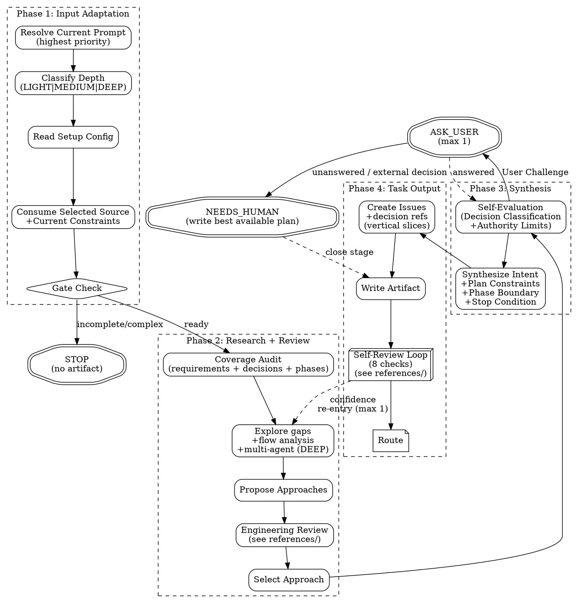

# PGE Plan

Produce one bounded, executable PGE plan artifact at `.pge/tasks-<slug>/plan.md`.

This is a planning skill. It does not execute code, edit implementation files, produce implementation pseudocode, publish GitHub issues, or invoke `pge-exec`.

## Execution Flow

Follow this flow exactly. Do not skip nodes. Do not reorder phases.



## Anti-Patterns

- **"Let Me Brainstorm Everything First"** — Scale brainstorm to task. If the prompt is plan-ready, plan from it directly. If research already recommended, adopt it.
- **"I Should Ask To Be Safe"** — Questions are expensive. Self-evaluate first. Record assumptions instead.
- **"Let Me Plan The Whole System"** — Plan only what was asked. Respect upstream scope.
- **"Let Me Re-Decide The Spec"** — Authoritative upstream decisions are constraints, not fresh options. Plan decides implementation details; it does not re-litigate product behavior, rollout strategy, architecture direction, or scope already settled upstream.
- **"Selector Means Ignore The Rest"** — If arguments contain a selector plus extra text, the selector locates an artifact and the remaining text is current user constraint. Consume both.
- **"Issues Should Be Granular"** — Prefer few vertical slices over long micro-task checklists.
- **"Skip The Engineering Review"** — Even simple tasks get a quick scope check.

---

## Phase 1: Input Adaptation

### Resolve Input

Always parse the current prompt first. Current prompt content is the highest-priority input and must never be ignored, even when it also contains a task slug, research path, or other selector. If `ARGUMENTS:` explicitly names a task slug, research path, or other structured upstream input, treat that as the user's selected source and use it without asking again. If the arguments contain both a selector and additional text, treat the selector as the source location and the remaining text as binding current user constraints. Otherwise, on a bare `pge-plan` invocation, discover research artifacts under `.pge/tasks-<slug>/research.md` but do not silently select them. Ask the user to confirm a discovered artifact, choose among multiple artifacts, or choose between a discovered artifact and current conversation context.

Direct prompt planning is a first-class path. A user can invoke `pge-plan <clear intent>` without first running `pge-research`. The plan stage must decide whether that prompt is plan-ready, do the bounded repo exploration needed for planning, and produce `plan.md` when it can fairly define scope, constraints, acceptance, and verification. Route to `NEEDS_INFO` or suggest `pge-research` only when the prompt is too fuzzy, broad, or under-evidenced to plan responsibly.

### Classify Depth

- **LIGHT** (1-3 files, single module, clear path): Minimal review, 1-2 issues.
- **MEDIUM** (4-8 files, 2-3 modules): Standard review, 2-5 issues.
- **DEEP** (8+ files, cross-module, architectural): Full review, complexity gate, consider phased delivery.

### Fast Lane (LIGHT with clear intent)

When ALL of these are true:
- Depth = LIGHT (1-3 files, single module)
- No upstream research artifact exists (user came directly to plan)
- Intent is unambiguous (single clear action, not exploratory)
- No security surface

Then:
- Skip Outside Voice (already conditional on MEDIUM+)
- Use LIGHT self-review from `references/self-review.md`: checks 1, 5, 8 plus check 4 when upstream has a Decision Log or spec-level decisions
- Skip pressure test
- Target: 1-2 issues maximum
- Keep the issue surface proportional: do not turn a verification carrier into a new feature, framework, flag, helper layer, or broad validation system unless the current constraints explicitly ask for it
- Expected plan time: under 2 minutes

Fast Lane is the smallest direct prompt path, not the only direct prompt path. MEDIUM and DEEP prompts may also be planned directly when the user gives enough intent, boundaries, and success criteria for Phase 2 research and engineering review to close the remaining implementation-level gaps.

### Read Setup Config

Read `.pge/config/*`. If `docs-policy.md` or `repo-profile.md` exists, treat as project constitution — plan must not contradict it without justification. Missing config: degraded mode for simple tasks.

### Consume Upstream Input

`pge-plan` consumes a selected source plus any current user constraints, then produces `plan.md`. The selected source can be a direct user prompt, research artifact, user-specified file/slug, structured notes, or clear intent.

If the user invoked `pge-plan <task-slug>` or `pge-plan .pge/tasks-<slug>/research.md`, that explicit selector is consent to consume the matching artifact. If the same invocation includes trailing instructions, those trailing instructions are not commentary; they are current user constraints and outrank derived summaries when they narrow scope, prohibit additions, define allowed files, or change verification expectations. If the user invoked `pge-plan <clear prompt>`, that explicit prompt is consent to plan from the prompt directly unless it conflicts with an explicitly selected artifact. If the user invoked bare `pge-plan`, artifact discovery is only a proposal: confirm before consuming a single discovered research artifact, ask the user to choose when multiple artifacts exist, and ask the user to choose when both a discovered artifact and current context look valid. Direct planning from intent remains supported when the current prompt/context is plan-ready.

### Input Priority Interpretation

Before Coverage Audit, build an internal input-priority interpretation. Use it to decide what must be inherited, what can be treated as evidence, and what must be overridden.

| Input Source | Role | Priority | Handling |
|---|---|---|---|
| Current user prompt / trailing arguments | hard constraint, latest override, or selected scope | highest | reflect in Intent, Non-goals, Target Areas, issue boundaries, and Verification; never ignore |
| Original user-provided source, spec, issue, design doc, or referenced source-of-truth file | source of truth | high | read when referenced by the selected source or current user; preserve requirements, decisions, boundaries, phases, and success criteria |
| Repo code/docs/config | evidence | high | confirm feasibility and stale assumptions; may contradict upstream with cited evidence |
| `pge-research` brief or other summary artifact | derived summary | medium | consume as compressed understanding, but do not let it erase original source constraints or current user constraints |
| Prior notes, old plans, or non-authoritative summaries | context | low | use only when consistent with higher-priority inputs |

If a derived research artifact names or depends on an original source-of-truth artifact, and the current planning decision depends on scope, boundaries, rollout, verification, phase position, or "only allowed addition" constraints, read the original source too. Do not plan from a derivative summary alone when the summary is incomplete for those decisions.

If priorities conflict:
- Latest explicit user constraints win over older artifacts.
- The current prompt wins over selected artifacts, derived summaries, and prior plans.
- Repo evidence can override an artifact only with a cited contradiction.
- A derived summary cannot override its original source unless it records an explicit user-approved scope decision.
- Record every override in `Decision Overrides`.

**Accepted sources:** (1) direct prompt or current conversation context, (2) pge-research brief, (3) Claude plan mode output, (4) brainstorming output, (5) any structured doc with intent/findings/constraints, (6) bounded self-research inside pge-plan for plan-ready prompts.

**Gate check:**
- Ready: consume.
- Incomplete: STOP. No artifact. Suggest resolving upstream.
- Prompt/context plan-ready + no selected artifact: plan directly. Use Phase 2 exploration to fill repo facts and implementation-level gaps.
- Prompt/context fuzzy or exploratory: STOP. Suggest `pge-research`.
- Missing + simple: use Fast Lane direct planning from clear intent.
- Missing + complex but plan-ready: plan directly with MEDIUM/DEEP review.
- Missing + complex and not plan-ready: STOP. Suggest `pge-research`.
- Bare `pge-plan` invocation with one discovered `.pge/tasks-<slug>/research.md`: ask the user to confirm before consuming it.
- Bare `pge-plan` invocation after research, but no `.pge/tasks-<slug>/research.md` can be discovered: plan directly only if current prompt/context is plan-ready; otherwise ask the user to run `pge-research` first.
- Explicit continuation requested for a prior research task, but `.pge/tasks-<slug>/research.md` is missing: STOP. Report broken handoff instead of silently pretending the research artifact exists.
- A discovered research artifact and the current conversation both look like valid upstream sources: ask the user which one to use instead of guessing.
- Multiple plausible research artifacts and no explicit selector: ask the user which task to continue instead of guessing.

**Consumption rules:**

| Upstream Content | How to consume | Trust |
|---|---|---|
| Direct prompt / current context | Intent + Coverage Audit baseline | latest user instruction authoritative |
| Selector plus trailing text | selector locates source; trailing text becomes Current Constraints | trailing text highest priority |
| Original source-of-truth referenced by selected source or current user | Input Priority + Plan Constraints + Coverage Audit | high authority |
| Derived summary of an original source | Repo Context + defaults for missing plan fields | medium; cannot erase original/current constraints |
| Intent / goal | Fill Intent | as-is |
| Findings / evidence | Repo Context | as-is |
| Affected areas | Target Areas | as-is |
| Constraints / non-goals | Non-goals | as-is |
| Structured Intent fields | Intent | authoritative unless contradicted |
| Synthesis Summary: Stated / Inferred / Out | Intent, Assumptions, Non-goals | stated/out authoritative; inferred auditable |
| Upstream Requirement Ledger / Spec Coverage | Coverage Audit | authoritative trace input |
| Decision Log / upstream spec decisions | Plan Constraints + Decision Coverage | authoritative |
| Rollout strategy / compare mode / flags / gray rollout | Issue verification strategy + risks | authoritative |
| Monitoring metrics / success-fail counters | Required Evidence + Verification | authoritative |
| Multi-phase structure | Phase Boundary + issue selection | authoritative unless explicitly overridden |
| Upstream risk assessment | Issue-level Risks | inherit, do not reinvent |
| Options + recommendation | Strong default for approach | strong default |
| Assumptions | Inherit | as-is |
| Open questions (non-blocking) | Risks / Open Questions | pass-through |
| Open questions (blocking) | BLOCK_PLAN | blocker |

**Current constraint extraction:**

Treat these phrases and equivalents as hard constraints:
- "only", "唯一", "just", "no other", "不要", "不加", "不做", "scope is", "must", "must not"
- file-limited instructions such as "X is the only addition point"
- verification-limited instructions such as "use this offline tool as validation"
- no-feature instructions such as "do not add flags/helpers/runtime gates/tests unless required"

For each hard constraint, map it to at least one of: `Plan Constraints`, `Non-goals`, `Target Areas`, `Acceptance Criteria`, `Verification`, or an issue `Scope`. If a hard constraint cannot be honored, route `NEEDS_HUMAN` or record a `Decision Override` with why user confirmation is required.

**Decision authority:**
- Spec-level decisions from upstream are authoritative: product behavior, scope boundary, rollout strategy, monitoring metrics, phase structure, architecture direction, explicit non-goals.
- Implementation-level choices are plan-owned: concrete file ordering, interface boundaries, issue slicing, test commands, local code patterns, and dependency sequencing.
- Override a spec-level decision only when repo evidence contradicts it or requirements conflict. Record the override as Decision / Rationale / Alternatives considered, and mark whether user confirmation is required.

---

## Phase 2: Approach Research + Engineering Review

### Coverage Audit

Audit inputs against the goal in priority order. Mark each requirement or hard constraint: covered / gap to explore / out-of-scope. Also audit every upstream spec decision: inherited / overridden / missing. Do not proceed with silent drops.

Coverage Audit must include:
- current user constraints from prompt/trailing arguments
- original source-of-truth requirements and boundaries when available
- research-derived requirements and assumptions
- repo evidence that confirms, contradicts, or narrows the above

Spec decisions coverage is mandatory when upstream contains a `Decision Log`, rollout strategy, monitoring metrics, phase structure, risk assessment, or equivalent spec-level decision. Every such decision must appear in `Plan Constraints`, a specific issue's `upstream_decision_refs`, `Verification`, or an explicit override record.

### Explore (fill gaps)

Only explore gaps not covered by upstream. Use repo/docs/code before asking user.

- **Multi-agent (DEEP):** Spawn parallel Agents per module gap. Synthesize yourself.
- **Flow analysis (MEDIUM/DEEP, 3+ modules):** Trace data flow end-to-end. Flag interruptions.
- **Context quarantine:** When a gap requires broad or cross-module search but planning only needs the answer, consider delegating the search to an Agent. Use direct exploration for narrow gaps where delegation overhead would exceed the context savings. Consume only the Agent's compact conclusion, evidence paths, confidence, and discarded dead ends.

### Propose Approaches

Upstream recommended + no contradicting evidence → adopt directly. Otherwise propose 2-3 with tradeoffs.

Do not propose alternatives for authoritative spec-level decisions. Only propose alternatives for implementation-level choices or for upstream decisions contradicted by repo evidence.

### Engineering Review

Read `references/engineering-review.md` for full review dimensions. Summary:
- Fix-First principle (repair, don't report)
- Confidence calibration (1-10 score + display rules)
- Scope Challenge (4 questions)
- Architecture Assessment (boundaries, data flow, failure mode registry)
- Test Coverage Pressure (trace happy/edge/error per issue)
- Existing Solutions Check
- Complexity Gate (8+ files → challenge)
- Completeness Score (X/10 per approach)
- Outside Voice (MEDIUM + DEEP — independent challenge Agent)
- Scope Reduction Prohibition (prohibited phrases + 3 valid reasons)

### Select Approach

Commit to one. Record selected/rejected/scope reductions as Decision / Rationale / Alternatives considered. Override upstream only if engineering review finds contradicting evidence or an explicit requirement conflict.

---

## Phase 3: Plan Synthesis

### Self-Evaluation

**Decision classification:**
- **Mechanical**: one correct answer from code/docs. Decide it. Never ask.
- **Taste**: multiple valid options. Choose, record rationale.
- **User Challenge**: affects goal boundary. ONLY category that may trigger ASK_USER.

**Authority limits** — 3 valid escalation reasons only:
1. Goal boundary ambiguous, code cannot resolve.
2. Missing info, no reasonable default.
3. Dependency conflict makes requirements mutually exclusive.

"Complex", "risky", "non-trivial" are NOT valid reasons.

**Headless mode:** When non-interactive (pipeline/spawned agent/`--headless`), auto-choose lowest-risk for User Challenge decisions, record in Assumptions with LOW confidence.

For each question: record Question, Why it matters, Can repo answer?, Blocking?, Safe assumption?, Risk if unanswered, Decision (SELF_ANSWERED | ASK_USER | ASSUME_AND_RECORD | DEFER_TO_SLICE | BLOCK_PLAN).

### Synthesize Intent

If the upstream source has the structured `pge-research` Intent fields, carry them through instead of rewriting a weaker intent. Add only execution-level detail: stop condition, code-level acceptance criteria, issue boundaries, and verification expectations.

Produce: structured intent, plan constraints, non-goals, repo context, acceptance criteria, assumptions, **stop condition** (observable "done" state).

**Context budget:** Plan + issues should fit comfortably inside the executor's useful context, with ~50% as an operational ceiling for normal work. >5 detailed issues or 15+ files → split into phased delivery. Prefer fewer vertical slices with complete acceptance criteria over one large plan that forces `pge-exec` to carry stale research, dead ends, and irrelevant raw output.

If upstream defines a multi-phase plan, inherit the phase structure. Produce issues only for the current phase unless the user explicitly asked to plan all phases. Record the phase boundary and what remains deferred.

### Scope Compression For Constrained Tasks

When current constraints specify a unique allowed addition point or prohibit extra machinery, treat that as a hard issue-boundary rule:
- Target Areas must include only the replacement area and the allowed addition point unless repo evidence proves another file is required.
- Non-goals must explicitly list prohibited additions such as new flags, helper files, runtime gates, broad abstractions, or unrelated tests.
- Verification must explain whether the allowed addition point is a verification carrier, not a new product feature.
- Any extra touched file requires a Decision Override with rationale and user confirmation if it changes scope.

---

## Phase 4: Task Output

### Create Numbered Issues

Vertical slices, not micro-tasks. Rules:
- Sequential numbering, no skips
- **Interface-first:** types/contracts before implementations
- **Vertical slices:** each issue cuts all relevant layers. Horizontal only for genuine shared dependencies.

Each issue includes:
- `ID`, `Title`, `Scope`, `Action` (imperative: what to DO)
- `upstream_decision_refs` (decision IDs or "none"; referenced decisions must not be changed by exec)
- `Deliverable` (what must exist when done)
- `Target Areas` (exact paths: Create/Modify)
- `Acceptance Criteria`, `Verification Hint`
- `Verification Type`: AUTOMATED | MANUAL | MIXED
- `Execution Type`: AFK | HITL:verify | HITL:decision | HITL:action
- `Test Expectation`: happy path + edge case + error path (+ integration if boundary)
- `Required Evidence`: what proves done
- `State`: READY_FOR_EXECUTE | NEEDS_INFO | BLOCKED | NEEDS_HUMAN
- `Dependencies`, `Risks`
- `Security`: yes | no (yes if issue touches auth, data access, API boundaries, secrets, or permissions. Triggers stricter Evaluator thresholds.)

### Write Plan Artifact

The plan artifact MUST be written only to `.pge/tasks-<slug>/plan.md`. This `.pge/` path is canonical. Notes outside `.pge/` are non-authoritative and must not replace the required pipeline artifact. ID format: `YYYYMMDD-HHMM-<slug>`.

**Task directory:** pge-research creates `.pge/tasks-<slug>/`. pge-plan writes into it. If research was skipped, pge-plan creates the task directory and then writes `plan.md` there:

```bash
mkdir -p .pge/tasks-<slug>/
```

### Self-Review Loop

Read `references/self-review.md` for full protocol (includes `references/multi-round-eval.md` principles). Summary:
- 8 checks: goal-backward, upstream coverage, traceability, spec decision coverage, placeholder + rationalization scan, consistency, confidence, downstream simulation
- Pressure test: construct one failure scenario per issue after checks pass
- Retry: fix → re-check failed only → max 2 attempts → downgrade to NEEDS_INFO
- Confidence gate: LOW affecting correctness → re-enter Phase 2 Explore (max 1 re-entry)

### Route

- `READY_FOR_EXECUTE`: ≥1 issue ready, no global blocker.
- `NEEDS_INFO`: missing information.
- `BLOCKED`: cannot produce fair plan.
- `NEEDS_HUMAN`: human decision needed.

### Completion gate

Do NOT declare the plan complete, summarize completion, or change routes until BOTH are true:

1. The plan artifact exists at `.pge/tasks-<slug>/plan.md` and follows the template structure
2. You are about to output the Final Response block exactly once

If the user redirects to execution or implementation mid-run, close the stage first by writing the best available plan artifact with route `NEEDS_INFO`, `BLOCKED`, or `NEEDS_HUMAN` instead of silently exiting.

---

## Handoff To Execute

`pge-exec <task-slug>` or `pge-exec .pge/tasks-<slug>/plan.md` reads full plan + `.pge/config/*`, then builds a compact per-issue execution pack. Handoff tells exec: issue order, eligible issues, AFK vs HITL, target areas, acceptance criteria, upstream decisions to preserve, assumptions to preserve, risks not to ignore. Do not require exec to reread broad research logs when the plan already records the necessary conclusion and evidence.

## Guardrails

Do not: write business code, write implementation pseudocode or function bodies, execute the plan, invoke pge-exec, create run artifacts under `.pge/tasks-*/runs/`, ask non-blocking questions, ask multiple questions, publish GitHub Issues, use forbidden states.

## Final Response

```md
## PGE Plan Result
- plan_path: .pge/tasks-<slug>/plan.md
- plan_route: READY_FOR_EXECUTE | NEEDS_INFO | BLOCKED | NEEDS_HUMAN
- ready_issues: <ids or None>
- blocked_issues: <ids or None>
- asked_user: yes | no
- assumptions_recorded: yes | no
- engineering_review: completed | skipped — reason
- next_skill: pge-exec <task-slug> | pge-exec .pge/tasks-<slug>/plan.md | pge-plan (after clarification)
```
