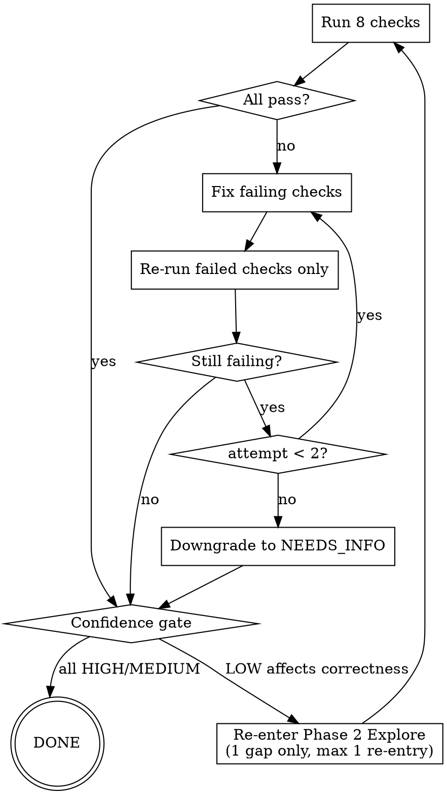

# Self-Review Loop Reference

Loaded by pge-plan Phase 4. This is the primary quality gate for stable execution.

## Depth Scaling

Self-review scales with plan depth (from Phase 1 classification):

- **LIGHT** (1-2 issues, single module): Run checks 1, 5, 8 plus check 4 when upstream has a Decision Log or spec-level decisions. Skip pressure test. Max 1 retry attempt.
- **MEDIUM** (3-5 issues): Run all 8 checks. Run pressure test. Max 2 retry attempts.
- **DEEP** (5+ issues, cross-module): Run all 8 checks. Run pressure test. Max 2 retry attempts + confidence gate re-entry.

## Flow

## 8 Review Checks

Run all 8, record pass/fail per check:

1. **Goal-backward verification** — state the goal, work backward: what must be true when done? What artifacts must exist? What wiring connects them? Do the issues produce all of these?

2. **Upstream coverage** — does the plan address everything the upstream input asked for?

3. **Traceability** — for each current prompt constraint and requirement/finding in upstream, which plan section or issue covers it? No silent drops. Current prompt constraints have the highest priority and must not be hidden inside assumptions.

4. **Spec decision coverage** — for every upstream spec-level decision, is it inherited, mapped to `Plan Constraints`, referenced by issue `upstream_decision_refs`, represented in verification, or explicitly overridden with Decision / Rationale / Alternatives considered? No silent drops of rollout strategy, monitoring metrics, phase boundaries, architecture direction, risk assessment, or non-goals.

5. **Placeholder + rationalization scan** — search for:
   - Obvious placeholders: TBD, TODO, "implement later", "fill in details"
   - Soft-language evasions: "Add appropriate error handling", "add validation", "handle edge cases", "similar to Issue N" without repeating context
   - Pseudo-specific vagueness: "update relevant files", "ensure proper behavior", "configure as needed"
   
   After fixing, verify the replacement is concrete and actionable — not a synonym of the prohibited phrase.

6. **Consistency check** — target areas, acceptance criteria, issue scopes, and upstream decision refs must align.

7. **Confidence check** — any LOW-confidence assumption affecting correctness? Verify or flag.

8. **Downstream simulation** — for each issue, imagine Generator receiving it:
   - Can Generator start working immediately, or does it need to guess something?
   - Is the Action imperative and unambiguous? Could two different engineers interpret it differently?
   - Are Target Areas specific enough (exact file paths, not "relevant modules")?
   - Does Test Expectation tell Generator what to test, or just "write appropriate tests"?
   
   If Generator would need to make any non-trivial judgment call that the plan could have resolved, the issue is underspecified. Fix it.

## Pressure Test (after checks pass)

After all required checks pass, apply one round of adversarial pressure:

**"Where will this plan fail?"** — For each issue, construct one scenario where execution goes wrong despite the plan being "correct":
- A naming mismatch between what the plan says and what the code actually calls it
- An implicit dependency the plan doesn't mention
- A test that would pass trivially without actually verifying behavior
- An acceptance criterion that could be satisfied by a degenerate implementation

If you find a real vulnerability, fix the relevant issue. If all scenarios are contrived, the plan is solid.

## Retry Protocol

- Run all 8 checks. Record pass/fail.
- If all pass: proceed to pressure test, then confidence gate.
- If any fail: fix inline. Re-run ONLY the failed checks.
- If still failing: attempt again (max 2 attempts per failing check).
- After 2 failed attempts: structural issue. Downgrade affected issues to NEEDS_INFO.
- Never loop more than 2 times total.

## Confidence Gate

If check 7 finds LOW-confidence assumption affecting correctness of a READY_FOR_EXECUTE issue:
- Re-enter Phase 2 Explore for that specific gap only.
- Maximum 1 re-entry.
- If still LOW after re-entry: downgrade issue to NEEDS_INFO.

## Common Rationalization Table

These are ways plans disguise incompleteness. If you catch yourself writing any of these, stop and be specific:

| What you wrote | What it actually means | Fix |
|---|---|---|
| "Add appropriate error handling" | You don't know what errors occur | Read the code, name the specific errors |
| "Similar to Issue N" | You're avoiding repeating context | Copy the relevant details inline |
| "Update relevant files" | You don't know which files | Run grep/find, list exact paths |
| "Ensure proper behavior" | You can't define what "proper" means | Write a concrete acceptance criterion |
| "Handle edge cases" | You haven't identified the edge cases | List them: empty input, null, overflow, concurrent access |
| "Configure as needed" | You don't know the configuration | Read the config file, specify exact keys/values |

## No Placeholders Rule

These are plan failures — never write them:
- "TBD", "TODO", "implement later", "fill in details"
- "Add appropriate error handling" / "add validation"
- "Similar to Issue N" without repeating the relevant context
- Acceptance criteria that cannot be verified ("works correctly", "handles edge cases")
- Vague scope ("update relevant files")
