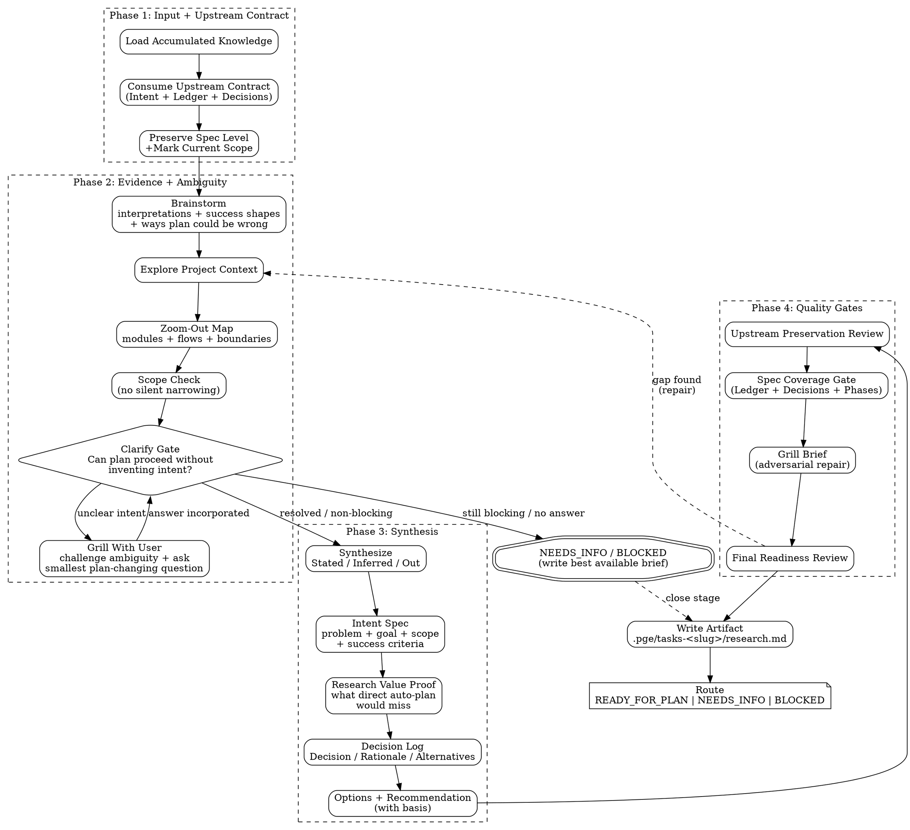

# PGE Research

Turn a vague or ambiguous intent into a structured research brief through evidence-driven exploration. Start by understanding the user's intent, then use repo evidence to resolve ambiguity, zoom out to the relevant system shape, and write the brief for planning.

Research is responsible for **intent alignment**:

```text
my understanding of the goal = the user's real goal
```

The artifact shape is flexible, but these semantic fields are mandatory:

```text
intent_spec
clarify_status
plan_delta
blockers
evidence
```

Do not pad the brief to satisfy a template. A short brief is valid when it preserves the user's intent, names what is out of scope, exposes plan-changing ambiguity, and gives planning enough evidence to avoid guessing.

`pge-research` has three built-in capabilities:

- **brainstorm** — native research behavior that generates plausible interpretations, success shapes, approaches, and failure modes before locking onto one reading of the prompt.
- **clarify / grill-with-me** — when intent is unclear, challenge the user's wording with evidence-backed questions until the goal, scope, and success criteria are clear enough to specify.
- **zoom-out** — map the relevant modules, flows, boundaries, and ownership at the smallest abstraction level that lets planning proceed without re-exploring.

These are not borrowed rituals, separate stages, or commands to invoke. They are the minimum behavior required for research to produce a better plan input than direct auto-planning from the prompt.

If intent is unclear, do not quietly continue. Enter a lightweight grill-with-me loop: state your current interpretation, challenge the ambiguity, ask the smallest plan-changing question, incorporate the answer, and repeat until the intent can be specified or the route is `NEEDS_INFO`.

<HARD-GATE>
Do NOT produce plans, numbered issues, implementation code, function bodies, pseudocode, field rewiring, fallback behavior decisions, or invoke `pge-plan`. This applies even when the task feels simple. Your only output artifact is a research brief written to the task directory.
</HARD-GATE>

## Execution Flow

Follow this flow exactly. Do not skip gates. Repair the brief before routing `READY_FOR_PLAN`.



## Anti-Pattern: "This Is Too Simple To Need Research"

Simple tasks are where hidden assumptions waste the most time. A small request often looks obvious until you read the code and discover naming mismatches, local conventions, or nearby constraints. The research can be short, but you still need to ground it in the repo before handing anything to planning.

## Anti-Pattern: "Let Me Just Ask The User"

Asking the user is the most expensive operation in this system. Every question interrupts flow and adds latency. Before you ask anything, you should have already read the relevant code, checked docs and config, considered reasonable defaults, and decided whether one more file would answer it. If you can answer it yourself by reading one more file, do that instead.

## Anti-Pattern: "Research Without Intent Alignment"

Do not let repo exploration replace understanding the user's goal. Research that lists files and findings but cannot state the user's real desired change, success criteria, non-goals, and what would make the plan wrong is not ready. Planning directly from the user prompt should not outperform research. If research does not change or sharpen what planning should do, the research has failed.

Research must include a value proof in whatever form is shortest: what would a direct auto-plan likely miss, and what did research add that changes planning? If the answer is "nothing," skip the performance theater and route `NEEDS_INFO` or produce a minimal brief that says research added no delta.

If the user's intent is unclear, research must challenge and clarify it with the user before claiming `READY_FOR_PLAN`. Do not present inferred intent as a spec.

## Anti-Pattern: "Let Me Map The Entire Codebase"

You are not writing documentation. Explore only what is relevant to the intent. Stop when your findings stabilize — when reading one more file would not change your recommendation. A focused 10-file exploration that produces clear findings beats a 50-file survey that produces vague ones.

## Anti-Pattern: "Keep Every Dead End In Main Context"

Exploration has context cost. Before loading broad evidence, ask: "Will downstream planning need this raw output, or only the conclusion?" If only the conclusion matters and the search is broad enough that delegation will reduce main-context noise, use a bounded Agent to quarantine the search. The Agent may read many files and discard dead ends; the research brief should receive only the conclusion, source paths, confidence, and caveats.

## Anti-Pattern: "Let Me Quietly Turn This Into A Plan"

Research is not planning with softer nouns. Do not start decomposing implementation work into slices, drafting numbered issues, or mentally committing to an execution order. Your job is to leave the next stage with sharper understanding, not to smuggle planning decisions into the brief.

## Capability: Upstream Contract Preservation

Research can start from a fresh prompt or from an existing handoff, exec plan, design doc, issue, prior research, or spec-like artifact. When upstream input exists, research must preserve that contract before adding new findings. The goal is capability, not case-specific patching: PGE research should be able to consume prior work without information loss.

## Anti-Pattern: "Let Me Shrink The Spec Into My Favorite Subproblem"

When the user provides an upstream handoff, exec plan, design doc, issue, or existing spec, that document is part of the input contract. Do not reduce a broad upstream design into a small local code question unless the user explicitly asked for that narrowing. Research must preserve the upstream intent, value, larger-plan position, requirements, phases, constraints, and success criteria, then explain any proposed narrowing as a scope decision.

## Anti-Pattern: "Summarize The Spec Into A Fragment"

Do not read a long upstream spec and keep only the parts that look immediately implementable. First preserve its decisions, phases, constraints, acceptance criteria, and explicit non-goals. Planning should be able to produce executable issues from the brief without re-reading the original spec. If that is not true, the brief is not ready.

## Anti-Pattern: "Intent = What To Do"

Intent is not just the task label. A usable intent explains the problem with the current state, the value of the target state, why this step/scope is the right next move, where it fits in the larger plan, what observable success looks like, and what is out of scope. If those fields are unknown, record that explicitly instead of pretending the task is clear.

## Anti-Pattern: "Let Me Be Helpful And Draft The Code"

Do not output implementation-shaped research. No function bodies, no method-level pseudocode, no exact field rewiring, no fallback logic, no "just sketching" the final code. If a detail has not been confirmed from the repo, record it as an assumption or open question. If a detail belongs to planning, record it as a planning note, not as code.

## Checklist

You MUST create a task for each of these items and complete them in order:

1. **Resolve stage input and current context** — consume the explicit research prompt plus relevant current conversation, recent user corrections, observed failures, pasted logs, selected artifacts, and fresh outputs from prior stages. Current user text outranks older artifacts. If context changes the intent or fix target, capture that before exploring.
2. **Load accumulated knowledge** — read `.pge/config/repo-profile.md` if exists (contains learnings from prior runs: conventions, constraints, patterns). Also search ALL `.pge/tasks-*/runs/*/learnings.md` for patterns relevant to current intent using keyword grep. Prioritize recent learnings (check dates in `[from: ...]` tags). Learnings older than 30 days: verify against current code before relying on them.
3. **Consume upstream specs** — if the user provided a handoff, exec plan, design doc, issue, or spec-like artifact, read it fully, extract decisions, preserve spec level, and mark current scope before exploring implementation details
4. **Explore project context** — check files, docs, and recent commits related to the intent
5. **Check scope first** — narrow or decompose over-scoped work before researching details, but never silently shrink an upstream spec
6. **Brainstorm intent** — as native research behavior, list plausible interpretations of the user's request, success shapes, non-goals, and what would make a plan wrong; do not choose until repo evidence supports it
7. **Zoom out only as far as needed** — map relevant modules, flows, boundaries, callers/callees, ownership, and terminology; stop before it becomes a generic architecture survey
8. **Scan for ambiguity** — across scope, affected areas, constraints, existing patterns, terminology, and acceptance
9. **Clarify / grill-with-me gate** — decide whether planning can proceed without inventing user intent; if not, challenge the ambiguity and ask the smallest plan-changing question before routing `NEEDS_INFO`
10. **Separate stated/inferred/out** — distinguish what the user/upstream explicitly said, what you inferred, and what is excluded
11. **Self-resolve** — answer what you can from code, docs, defaults, and prior learnings before asking
12. **Ask only when needed** — one at a time, grounded in evidence, and only when it improves correctness more than it adds clarification overhead
13. **Form options** — propose 1-3 approaches with evidence, tradeoffs, and recommendation only after the direction is clear enough
14. **Produce intent spec** — convert clarified intent into a spec-level statement of problem, goal, scope, success criteria, non-goals, and acceptance seeds
15. **Challenge intent spec** — verify the spec against user answers, repo evidence, upstream constraints, and rejected interpretations; repair or ask again if it does not hold
16. **Prove research value** — record what a direct auto-plan would likely miss and what research added to intent, scope, code reality, or acceptance
17. **Record plan delta** — capture what research changes for planning: what plan should do, avoid, verify, or ask because of the research
18. **Record decisions** — for resolved unknowns or design choices, capture Decision / Rationale / Alternatives considered so planning inherits the reasoning, not just facts
19. **Review upstream preservation** — run the upstream preservation checklist before writing the brief
20. **Check spec coverage** — compare the brief against the original intent or upstream spec; READY_FOR_PLAN is forbidden if material requirements disappeared without an explicit scope decision
21. **Grill the brief** — adversarial self-challenge: cross-check terminology against code, pressure-test evidence and assumptions, detect scope drift
22. **Final readiness review** — run the plan-readiness checklist and repair any failure before routing READY_FOR_PLAN
23. **Write research artifact** — save `research.md` to the task directory
24. **Transition to planning** — report route and point to `pge-plan`

## The Process

**Stage input + context intake:**

Research does not only consume the explicit command arguments. It must also consume relevant current context: the latest user wording, user corrections, interrupted prior attempts, challenge/review findings, logs, pasted plans, and any artifact the user is clearly referring to. This context may define the real intent even when no formal research artifact exists.

If that context already contains a candidate problem or fix target, restate it internally before exploring. If the target could mean multiple plans, ask one clarifying question after checking the repo evidence that can resolve it.

**Early-exit for trivial tasks:**

If after context intake, accumulated knowledge, upstream-spec consumption, and initial repo exploration, the intent maps to a single obvious file change with no ambiguity, no competing approaches, no upstream spec to preserve, and existing patterns clearly show how to do it — write a minimal brief immediately and skip the full exploration. A 2-line config change doesn't need 6-lens ambiguity scanning. Record: "Early exit — trivial task, single file, pattern clear from <file:line>."

**Consume upstream specs:**

Before exploring implementation details, identify whether the user supplied a structured upstream source. Examples: handoff, exec plan, design doc, PRD, issue, architecture note, prior research, or pasted plan.

If an upstream source exists:

1. **Read the full upstream source** — do not skim only headings or the first actionable paragraph. Record its path or conversation source in the brief.
2. **Extract decisions and contract shape** — classify authority and capture the problem, goal, larger-plan position, why this step/why now, success condition, boundaries, decisions already made, phases, requirements, constraints, acceptance criteria, named components, and explicit non-goals.
3. **Verify against the repo** — check enough code/docs to confirm whether the upstream source still matches reality. Mark stale or contradicted items instead of silently dropping them.
4. **Preserve spec level** — keep broad specs broad, phased specs phased, and behavior requirements as behavior requirements. Do not downgrade a system-level migration into one local replacement unless the user explicitly asked for that scope.
5. **Mark current scope** — for each upstream item, map it to covered, narrowed, deferred, contradicted, or missing. If narrowing is recommended, explain why this scope is the right next step and what remains outside it.

Do not convert the upstream source into a loose set of "options" until the contract is preserved. Options compare ways to satisfy the spec; they must not replace the spec.

Planning should be able to produce executable issues from the brief without re-reading the original upstream spec. If the original is still required to understand scope, value, or acceptance, the brief is incomplete.

**Does not re-litigate:** decisions already made by an authoritative upstream source flow through unchanged unless repo evidence contradicts them or the user reopens them. Research may flag risks and stale assumptions, but it must not re-argue product behavior or scope that the upstream source already settled.

**Upstream preservation review checklist:**

- [ ] Every authoritative upstream source is listed in `Upstream Input`
- [ ] Every material requirement, phase, constraint, acceptance criterion, named component, and non-goal has an ID in `Upstream Requirement Ledger`
- [ ] Each upstream item is mapped to covered, narrowed, deferred, contradicted, or missing
- [ ] Any narrowed/deferred item includes why and whether user confirmation is required
- [ ] Authoritative upstream decisions are not re-litigated as fresh options
- [ ] The brief preserves spec level: system-level remains system-level, phased remains phased, behavior requirement remains behavior requirement

**Understanding the intent:**

Check out the current project state first. Read `.pge/config/*` if it exists, especially `repo-profile.md` and `docs-policy.md`. Then look at `CLAUDE.md`, `README.md`, and the code directly related to the intent. Recent commits touching relevant areas often reveal constraints that docs miss.

Research starts with intent, not files. Before the code pulls you into local details, write a working intent alignment note:

- what the user explicitly asked for
- the likely real goal or pain behind it
- the observable success shape
- what should stay out of scope
- which interpretation would lead to a different plan

Then use code and docs to confirm, reject, or sharpen that note.

**Brainstorming is research:**

Use brainstorming to expand before narrowing. This is not an optional ceremony and not a separate command. It is how research avoids silently choosing the first interpretation of the user's words. Generate 2-4 plausible readings or approaches when the prompt is fuzzy, broad, value-laden, or likely to map to multiple code paths. For each one, note:

- what user intent it assumes
- what code reality would make it viable
- what would make it the wrong plan
- what evidence would distinguish it from the other readings

Do not pass all brainstormed possibilities downstream as equal options. By the time research routes `READY_FOR_PLAN`, the brief should recommend a direction or route `NEEDS_INFO` if user authority is required.

For simple tasks, brainstorm can be compact: one chosen reading and one rejected reading is enough if it proves you checked the plan-changing ambiguity.

**Zooming out inside research:**

Use zoom-out to understand the relevant system, not the whole repo. Planning needs the smallest map that explains:

- entrypoints and consumers
- modules and boundaries likely affected
- data/control flow through the current behavior
- terminology the code uses for the user's words
- risky seams and verification hotspots

If a zoom-out map does not change the plan, shrink it. If pge-plan would need to reread files to understand where work belongs, expand it.

Before asking detailed questions, assess scope. If the intent actually describes multiple independent subsystems, or work that clearly wants decomposition before planning, flag that immediately. Narrow it or decompose it before you spend effort researching details.

If the user explicitly signals uncertainty about the goal or scope — for example "not sure", "messy", "rethink", or "full replacement or refinement" — treat that as intent ambiguity. In that case, prefer one goal-sharpening question before you spend time comparing implementation directions.

For appropriately-scoped work, keep exploring until you can explain what the user's words map to in this codebase, what areas are likely affected, and what constraints are already visible.

If the task spans multiple independent modules, use `Agent` to explore them in parallel. For single-module work, explore directly.

**Context quarantine rule:** Consider an Agent only when exploration is broad, cross-cutting, or likely to produce many dead ends whose raw output will not be needed again. For coherent single-module work, explore directly even if it takes a few reads. Agent reports must be compact: conclusion, evidence paths, confidence, and dead ends that should not be retried. Do not paste bulk tool output into the research brief.

**Resolving ambiguity from the repo:**

Use six lenses while you explore:

- **Scope** — what to do, what not to do, where the boundaries are
- **Affected areas** — which modules, files, or interfaces will be touched
- **Constraints** — technical limits, compatibility requirements, performance needs
- **Existing patterns** — how similar things are already done here
- **Terminology** — what the user's words actually map to in the code
- **Acceptance** — how you would know the work is done correctly

Reframe ambiguous instructions as success criteria. If the user says "make it robust," translate that into observable checks such as "handles missing config without crashing" or "preserves existing API response shape." If you cannot make a success condition testable, record it as an open question.

Most ambiguity resolves itself once you read the code. If the code or docs answer a question, record it as a finding with a `file:line` source. If a reasonable default exists, use it and record it as an assumption with rationale. If something is uncertain but won't change the plan, note it as a non-blocking open question. Only carry a question forward when the answer would materially change planning.

**Clarify gate:**

Before routing `READY_FOR_PLAN`, ask:

```text
Can pge-plan fairly create executable issues without inventing user intent?
```

If no, ask the smallest blocking question set or route `NEEDS_INFO`. Blocking questions are limited to three and must affect goal, scope, acceptance, compatibility, or safety. Do not ask questions about details planning can choose by repo convention.

When intent is unclear, use a grill-with-me style:

1. State the current interpretation in one sentence.
2. Name the ambiguity that would change the plan.
3. Give the smallest useful choice set, with a recommended default when evidence supports one.
4. Ask exactly one question.
5. After the answer, update the Intent Spec and reassess whether more clarification is still plan-changing.

Do not bundle a questionnaire. Do not ask implementation trivia. Do not continue to `READY_FOR_PLAN` until the intent spec can survive the challenge below.

**Intent spec challenge:**

Before `READY_FOR_PLAN`, challenge the produced intent spec:

- Does it preserve the user's explicit words and not replace them with repo-shaped convenience?
- Does it explain the problem, target goal, scope, non-goals, and observable success?
- Does it identify what would make a plan wrong?
- Are inferred parts marked as inferred or confirmed by the user/repo?
- Would the user recognize this as the thing they meant?

If any answer is no and the repo cannot resolve it, ask the user or route `NEEDS_INFO`.

Keep findings, assumptions, and open questions separate. Findings are what is true in the repo. Assumptions are what is probably safe. Open questions are what planning still cannot fairly decide alone.

Every finding and option must carry a basis:
- `direct`: source from code, docs, upstream artifact, command output, or explicit user statement
- `external`: named outside precedent or reference
- `reasoned`: first-principles inference from known constraints

Prefer `direct`. Do not let `reasoned` basis masquerade as user intent.

For assumptions, include a validation strategy. If the assumption would materially change the plan and cannot be validated cheaply, ask the user or route `NEEDS_INFO`.

**Decision log:**

When research resolves an unknown, narrows scope, chooses a recommended direction, or preserves an upstream design decision, record it as:

- **Decision** — what is now settled for planning
- **Rationale** — why this decision follows from user intent, upstream contract, repo evidence, or constraints
- **Alternatives considered** — what else was considered and why it was not chosen

Use this for decisions, not every factual finding. Research may make bounded decisions when repo evidence and upstream intent are strong enough. Do not make product or requirement decisions that still require user authority; those stay as `NEEDS_INFO`.

**Plan delta:**

Research must prove it was useful. Record what planning should do differently because research ran:

- constraints plan must preserve
- target areas plan should include
- approaches plan should avoid
- acceptance seeds exec must prove
- unresolved questions that block or shape planning

If the plan delta is empty, the brief is not ready. Fix the intent alignment note, zoom-out map, findings, or recommendation.

**Research value proof:**

Before READY_FOR_PLAN, prove the research earned its place in the workflow. Compare against a direct auto-plan from the initial prompt:

- What would direct planning likely assume?
- Which assumption did research confirm, reject, or refine?
- Which code reality changes the plan?
- Which acceptance criterion or non-goal is now clearer?
- Which question did research avoid by self-resolving from evidence?

This is not a long essay. It is a short proof that research reduced downstream wrongness. If it cannot be filled with concrete deltas, the route should not be `READY_FOR_PLAN` unless the task is explicitly marked as trivial early-exit.

**Minimum contract, flexible shape:**

The brief may use tables, bullets, prose, or a compact key/value block. The required semantics are:

- `intent_spec`: user words, inferred/confirmed goal, success criteria, non-goals, and "plan would be wrong if..."
- `clarify_status`: whether planning can proceed without inventing intent; any blockers; questions asked or self-resolved.
- `plan_delta`: what planning must include, avoid, verify, or escalate because research ran.
- `blockers`: unresolved goal/scope/acceptance/safety gaps, or `none`.
- `evidence`: repo/user/upstream facts that support the above, with basis and source when available.

Optional sections such as Brainstorm, Clarify Log, Zoom-Out Map, Decision Log, Options, Research Value Proof, and Quality Gates should appear only when they reduce uncertainty or preserve a material decision. They may be compressed into the required fields for simple tasks.

**Exploring approaches:**

Once you understand the landscape, propose 1-3 approaches with tradeoffs. Present options conversationally, but anchor them in evidence. Lead with your recommended option and explain why.

Simple tasks can have one option and "proceed." Don't manufacture extra approaches just to satisfy a pattern.

**Asking questions:**

The workflow shape here follows brainstorming: ask one question at a time, keep the conversation moving, and use questions to refine understanding before handing off to planning. The questioning style itself should feel closer to grill-with-docs: challenge vague language, press on unclear intent, and do not let soft words stand in for real decisions.

Correctness matters more than clarification volume, but unnecessary clarification is still waste. Ask only when a question materially improves the correctness of what planning will inherit, and only after the repo has given you everything it can.

Do not ask repo questions the code can answer for you. Do not ask implementation-detail questions that planning can decide later. Do not ask preference questions just because uncertainty exists — uncertainty alone is not enough.

Ask one question at a time. Prefer multiple choice when possible. If a topic needs more exploration, break it into multiple questions rather than bundling them into one big prompt.

Limit `NEEDS CLARIFICATION` to at most three blocking questions. If more than three uncertainties appear, group them into the smallest decision set, resolve non-blocking items through assumptions with validation, and ask only the questions that change planning correctness.

Focus questions on understanding intent, constraints, and success criteria. If the user's goal is still fuzzy, ask one goal-sharpening question before you ask direction or tradeoff questions.

Treat explicit user uncertainty as a trigger, not as a footnote. When the user says they are unsure whether the problem calls for replacement, refinement, expansion, or narrowing, do not silently choose one and move on.

Every useful question should come with what you found, why it matters, the smallest useful choice set, and your recommendation. Sometimes that is a yes/no on your recommendation. Sometimes it is 2 options. Only show 3 when 3 paths are genuinely viable. If the repo already makes the direction clear, do not ask a question just to confirm what you already know.

A strong early answer often resolves several related questions. Reassess after each answer: some follow-ups will disappear, some will shrink, and some will turn into repo questions you can answer yourself.

Stop asking when the intent is clear enough to plan fairly, or when further questions are no longer improving correctness in a meaningful way.

If critical ambiguity remains and neither the repo nor the user can resolve it fairly, return `NEEDS_INFO` or `BLOCKED` rather than passing the ambiguity downstream.

Pure semantic clarification — "what do you mean by X?" — can be asked directly without research backing.

**Working in existing codebases:**

Explore the current structure before drawing conclusions. Follow existing patterns unless there is strong evidence they are the problem.

Where existing code has issues that materially affect the work — unclear ownership, tangled responsibilities, naming drift, duplicated flows — call them out in the research. But do not turn research into a wishlist of unrelated cleanup. Stay focused on what serves the current intent.

If a local inconsistency looks ugly but doesn't change the research outcome, leave it alone. If it changes the likely approach, the risk, or the affected areas, it belongs in the brief.

**Spec coverage gate:**

Before the brief can route `READY_FOR_PLAN`, compare the written brief against the original request and any upstream requirement ledger.

The brief is coverage-complete only when every material upstream item is represented in at least one of:

- Intent
- Findings
- Synthesis Summary
- Affected Areas
- Constraints
- Decision Log
- Options
- Recommendation
- Open Questions
- Explicit Scope Decision

If a material upstream item is missing, the route is not `READY_FOR_PLAN`. Fix the brief or route `NEEDS_INFO`.

If research recommends narrowing the upstream scope, the narrowed scope must be explicit:

- what is being narrowed
- why narrowing is justified by repo evidence
- what remains deferred
- whether user confirmation is required before planning

If narrowing changes the value proposition or position in the larger plan, ask the user or route `NEEDS_INFO`. Do not quietly pass a smaller problem to planning.

**Spec coverage checklist:**

- [ ] Each `Upstream Requirement Ledger` row appears in the `Spec Coverage` table
- [ ] `coverage: complete` is used only when no material upstream item is missing
- [ ] Missing items route `NEEDS_INFO` or appear as explicit Open Questions
- [ ] Deferred items have a reason and downstream handling
- [ ] Contradicted items cite repo evidence
- [ ] `READY_FOR_PLAN` is not used when the brief covers only a fragment of the upstream spec

If no upstream source exists, run the same checklist against the original user request.

Before writing the artifact, prepare a synthesis summary:
- **Stated**: explicit user/upstream decisions and constraints
- **Inferred**: agent inferences needed to connect gaps
- **Out**: rejected, deferred, or explicitly excluded scope, with why

This summary is the last honesty check before planning. If important content sits in `Inferred`, do not present it as fact.

**Grill the brief (adversarial self-challenge):**

Before writing the artifact, switch to adversarial mode. You are no longer the researcher — you are the skeptic trying to break the research. This is the matt-skill grill-with-docs pattern adapted for research output.

Challenge each finding:

1. **Terminology cross-check** — for every domain term in your findings, verify it matches what the code actually calls it. If you wrote "the auth middleware handles sessions" — go read the middleware file and confirm it's actually called that, does that, and nothing else. Mismatched terminology between brief and code is the #1 source of downstream plan failures.

2. **Evidence pressure** — for each finding marked as fact, can you point to a specific `file:line`? If not, downgrade to assumption. Findings without source references are opinions, not evidence.

3. **Assumption stress-test** — for each assumption, construct one scenario where it's wrong. If that scenario is plausible and would change the recommendation, the assumption needs verification or the brief needs a conditional.

4. **Option viability check** — for each proposed option, identify one concrete reason it might fail in *this* codebase (not in theory). Check: does the pattern you're recommending actually work with the existing abstractions, or are you assuming a cleaner codebase than exists?

5. **Scope drift detection** — compare your findings against the original intent. Did you quietly expand or narrow the scope during exploration? If the brief answers a different question than what was asked, fix it.

6. **Spec coverage check** — if an upstream spec, handoff, or exec plan existed, walk its requirement ledger line by line. Did the brief preserve the phases, constraints, acceptance criteria, and larger-plan position? If any item disappeared, restore it or mark it as an explicit scope decision.

7. **Missing perspective** — what would someone who maintains this code daily say about your findings? Is there an obvious constraint you missed because you only read the happy path?

8. **Downstream simulation** — imagine pge-plan receiving this brief. Can it produce a plan without re-exploring anything? If plan would need to re-read files you already read, your findings are incomplete. If plan would need to guess which approach to take, your options section is unclear. If plan would unknowingly implement only 10% of the upstream spec, your coverage gate failed.

Fix every issue you find. If the grill reveals a finding was wrong, remove or correct it — don't leave it with a caveat. If it reveals a gap, go read one more file to fill it. The grill is a repair pass, not a findings report. One round is enough — don't loop.

**Final readiness review checklist:**

Before writing `research.md`, verify:

- [ ] Intent contract answers problem, goal, larger-plan position, why-now/scope fit, observable success, and out-of-scope items
- [ ] Intent alignment distinguishes explicit ask, interpreted goal, success shape, non-goals, and plan-changing ambiguity
- [ ] Brainstorm records the chosen interpretation and any plausible rejected interpretation that would change the plan; omit only when the task is trivial and ambiguity-free
- [ ] Clarify status says whether planning can proceed without inventing intent
- [ ] Unclear intent triggered grill-with-me clarification rather than silent assumptions
- [ ] Intent Spec is challenged and survives against user words, repo evidence, and rejected interpretations
- [ ] Zoom-out information covers relevant modules, flows, boundaries, terminology, and verification hotspots when planning needs it
- [ ] `Synthesis Summary` separates Stated, Inferred, and Out
- [ ] Every finding has a basis: `direct`, `external`, or `reasoned`
- [ ] `reasoned` items are not presented as user intent or repo fact
- [ ] Every assumption has a validation strategy
- [ ] Every option has evidence, tradeoff, and a repo-specific failure mode
- [ ] Material decisions are captured as Decision / Rationale / Alternatives considered
- [ ] Recommendation follows from evidence, not preference
- [ ] Research Value Proof identifies what direct auto-planning would likely miss or states a justified trivial early-exit
- [ ] Plan Delta is non-empty and explains how research changes planning
- [ ] Blocking `NEEDS CLARIFICATION` questions are limited to three or fewer
- [ ] Open questions are marked `blocks_plan: yes | no`
- [ ] pge-plan can create executable issues without rereading upstream docs

If any item fails, repair the brief first. If repair requires user input, route `NEEDS_INFO`.

## After the Research

**Documentation:**

The research artifact MUST be written only to `.pge/tasks-<slug>/research.md`. This `.pge/` path is canonical. Notes outside `.pge/` are non-authoritative and must not replace the required pipeline artifact.

Create the task directory before writing:

```bash
mkdir -p .pge/tasks-<slug>/
```

Write the research artifact to:

```text
.pge/tasks-<slug>/research.md
```

Use `templates/brief.md` as a scaffold, not a fixed form. The required semantic fields must be present, but optional sections may be omitted or compressed when they do not add planning value.

**Failure paths:**

Not every research run succeeds.

- If critical ambiguity remains and you still cannot plan fairly after repo exploration and intent clarification, set `research_route: BLOCKED`
- If the task appears infeasible from repo evidence, set `research_route: BLOCKED` and explain why in the brief
- If the user says "stop" or redirects to implementation/planning mid-run, write the best brief you can to `.pge/tasks-<slug>/research.md` and set `research_route: NEEDS_INFO` or `BLOCKED` instead of silently exiting

**Completion gate:**

Do NOT declare the research complete, summarize completion, or change routes until BOTH are true:

1. `.pge/tasks-<slug>/research.md` exists and satisfies the required research contract semantics from `templates/brief.md`
2. You are about to output the Final Response block exactly once

If you are interrupted or the user changes direction, close the stage first by writing the best available brief. Research may end in `READY_FOR_PLAN`, `NEEDS_INFO`, or `BLOCKED`, but it must not end without a written artifact.

**Transition to planning:**

After writing the brief, output the Final Response block and explicitly tell the user to invoke `pge-plan <task-slug>` or `pge-plan .pge/tasks-<slug>/research.md` next. Do NOT auto-invoke `pge-plan`. Do NOT produce a plan yourself, and do NOT start decomposing the work "just to be helpful." Each pipeline stage is a separate skill invocation and the user decides when to advance.

## Key Principles

- **One question at a time** — don't overwhelm the user with bundles
- **Multiple choice preferred** — easier to answer than open-ended when possible
- **Code is truth** — prefer observed repo evidence over assumptions
- **Correctness beats clarification** — ask when it materially improves correctness
- **Defaults beat interruptions** — a reasonable assumption is often better than a question
- **Explore alternatives** — propose options when multiple real paths exist
- **Stay focused** — depth on what matters, not breadth on everything

## Research Brief Template

Use the contract scaffold at `templates/brief.md`. Preserve required field semantics; scale the prose shape to the task.

## Final Response

```md
## PGE Research Result
- task_dir: .pge/tasks-<slug>/
- research_path: .pge/tasks-<slug>/research.md
- research_route: READY_FOR_PLAN | NEEDS_INFO | BLOCKED
- options_count: <N>
- recommended: <Option name>
- questions_asked: <0-3>
- next_skill: pge-plan <task-slug> | pge-plan .pge/tasks-<slug>/research.md
```
